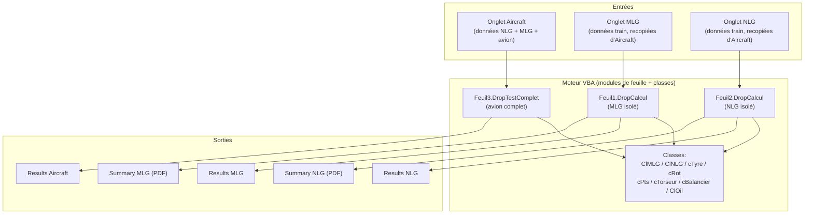
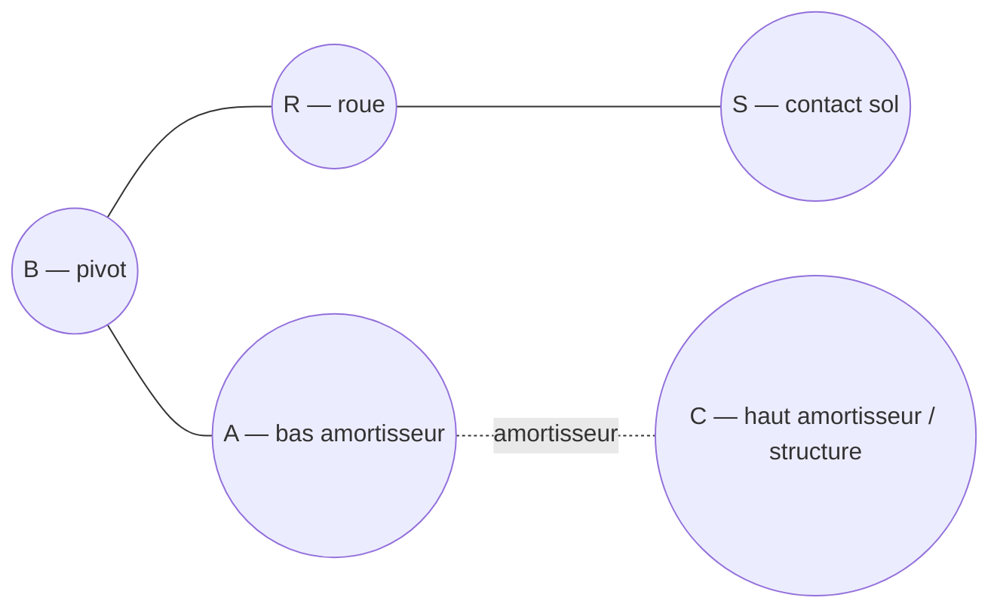
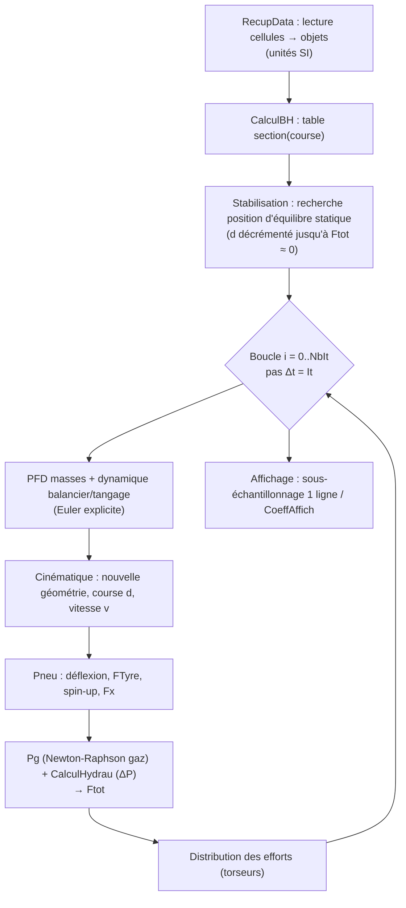
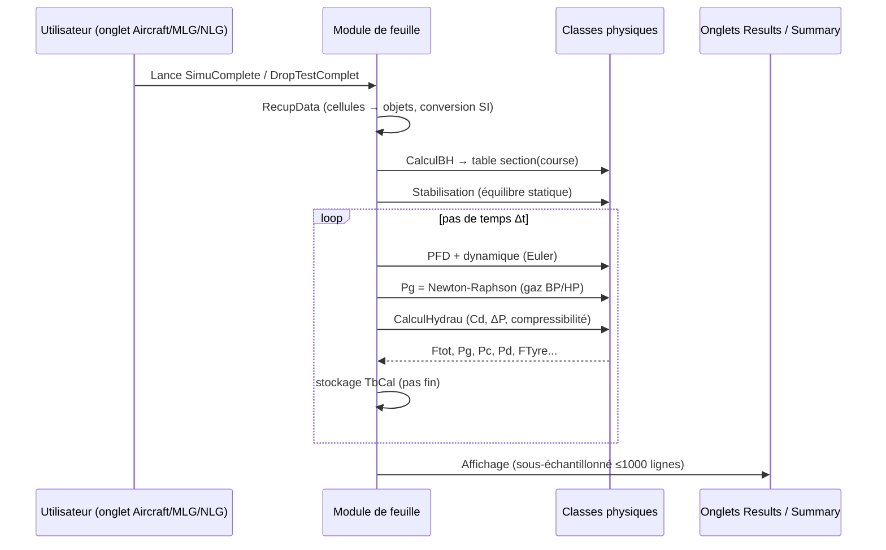

# État des lieux — Classeur `DROSIM_SA61` (Simulation de drop test avion complet)

> Document d'analyse détaillée du fichier `DROSIM_SA61-_#Simulation drop test avion complet.xlsm`.
> Objectif : décrire le fonctionnement du classeur, le rôle de chaque module/classe VBA, l'algorithme de simulation et reconstruire les lois physiques (mécanique, hydraulique, pneumatique) qui sous-tendent le calcul.
>
> Le code VBA a été extrait du binaire `xl/vbaProject.bin` (20 modules, ~6000 lignes) et analysé module par module. Les copies lisibles se trouvent dans `_extract/vba_clean/`.

## Addendum projet Python (état courant)

Ce document reste centré sur l'analyse du classeur VBA historique.

Dans l'application Python SimuLanding:
- le profil par défaut StraitStrut est aligné sur la référence projet
    "Strait Strut Reference";
- la non-régression StraitStrut est pilotée par le golden projet;
- les exports Excel (`Results_NLG`, `Results_MLG`) sont conservés comme
    références historiques d'analyse et de comparaison ponctuelle.

---

## 1. Objectif et périmètre

Le classeur est un **simulateur d'atterrissage (drop test)** dont le but est de **dimensionner les lois hydrauliques et le ressort gaz** des amortisseurs de trains d'atterrissage. Il traite deux architectures d'amortisseur et trois niveaux de simulation :

| Niveau | Onglet de pilotage | Module VBA | Description physique |
|--------|--------------------|------------|----------------------|
| Train avant **NLG** seul | `NLG` | `Feuil2` | Amortisseur **télescopique droit** (l'axe amortisseur = axe de la jambe) |
| Train principal **MLG** seul | `MLG` | `Feuil1` | Amortisseur sur **balancier** (bras tirant articulé) |
| **Avion complet** | `Aircraft` | `Feuil3` | Corps rigide (pilonnement + tangage) reposant sur N trains NLG et N trains MLG |

Les résultats détaillés sont écrits dans les onglets `Results Aircraft`, `Results MLG`, `Results NLG`, et les synthèses formatées client dans `Summary MLG` / `Summary NLG`.

L'ensemble repose sur une **intégration temporelle explicite (schéma d'Euler)** à pas fin, avec sous-échantillonnage de l'affichage pour limiter à ≈1000 lignes.

---

## 2. Architecture du classeur

### 2.1 Onglets et flux de données



- L'onglet **`Aircraft`** est la source de vérité des données : ses lignes ≥ 23 définissent intégralement les deux trains. Les onglets `MLG` et `NLG` récupèrent ces données pour les simulations isolées.
- Chaque module de feuille lit les cellules via `RecupData` (mapping cellule → propriété d'objet), exécute le calcul, puis écrit les résultats via `Affichage`.

### 2.2 Repères géométriques

Le code manipule plusieurs repères, transformés par la classe `cRot` et les méthodes `changementOrigine*` de `cPts` :

| Repère | Origine | Usage |
|--------|---------|-------|
| `Rsol` | Sol (point de contact) | Repère galiléen de calcul des PFD |
| `Rlg` | Jambe de train | Calcul des efforts internes amortisseur / bagues |
| `RAir` | Centre de gravité avion | Bras de levier pour le tangage |
| `RsolNLG`, `RsolMLG` | Contact de chaque train | Gestion multi-train de l'avion complet |

Les axes sont notés $X$ (longitudinal, sens de roulage), $Y$ (transversal), $Z$ (vertical). Les torseurs (`cTorseur`) portent une résultante $(X,Y,Z)$ et un moment $(L,M,N)$.

---

## 3. Organisation du code VBA

### 3.1 Modules de feuille (orchestration)

| Module | Rôle | Procédures clés |
|--------|------|-----------------|
| `Feuil1` (MLG) | Pilote la simulation du train principal isolé | `SimuComplete`, `DropCalcul`, `RecupData`, `CalculHydrau`, `CalculBH`, `DeterPosBalA/R`, `Affichage` |
| `Feuil2` (NLG) | Pilote la simulation du train avant isolé | `SimuComplete`, `DropCalcul`, `RecupData`, `CalculHydrau`, `CalculBH`, `Affichage` |
| `Feuil3` (Aircraft) | Pilote la simulation de l'avion complet | `DropTestComplet`, `RecupData`, `CalculHydrauNLG`, `CalculHydrauMLG`, `DeterPosBalA/R`, `ChangementRepereNLGNouvellepositionRoue`, `AffichageTest` |
| `Feuil6`, `Feuil7` | Modules de feuille mineurs (peu de code) | — |
| `Module1` | Utilitaire | `Interpolation` (interpolation linéaire dans un tableau 2 colonnes) |

### 3.2 Modules de classe (modèle physique)

| Classe | Représente | Contenu principal |
|--------|-----------|-------------------|
| `ClMLG` | Amortisseur du train **balancier** | Géométrie (diamètres, course), gaz double chambre, sections, pressions, efforts, frictions |
| `ClNLG` | Amortisseur du train **télescopique** | Idem, avec modèle de friction joint + bagues plus détaillé |
| `cTyre` | Pneumatique | Rayon, table déflexion-charge, adhérence μ(glissement), spin-up, springback |
| `cRot` | Changements de repère | Matrices de rotation (Rodrigues) pitch/roll, rotation incrémentale `RotSol` |
| `cPts` | Point géométrique | Coordonnées dans les 5 repères + changements d'origine |
| `cTorseur` | Torseur d'effort | Résultante + moment dans `Rsol` et `Rlg` |
| `cBalancier` | État du balancier | Angles $\theta_A,\theta_R$, vitesse $\omega_y$, accélération $\alpha_y$, inertie $J_{yy}$, longueurs des bras |
| `cMasse` | Masse ponctuelle | Accélération / vitesse / déplacement (sol & local) |
| `ClOil` | Fluide hydraulique (H5606) | Masse volumique $\rho$, module de compressibilité (bulk) $B$, viscosité $\nu$, température |

Les classes sont essentiellement des **objets de données encapsulés** (propriétés `Get`/`Let`), à l'exception des propriétés **calculées** (sections, pressions, efforts) qui portent la physique.

---

## 4. Modèle physique

Cette section reconstruit les lois implémentées. Les notations correspondent aux variables du code (indiquées en `police fixe`).

### 4.1 Sections hydrauliques de l'amortisseur

À partir des diamètres `Dpis` (piston), `Dbh` (chambre / bottom-hole), `Dt` (tige), `Dp` (compensation) :

$$
S_c = \frac{\pi}{4}\left(D_{pis}^2 - D_{bh}^2\right),\quad
S_d = \frac{\pi}{4}\left(D_{pis}^2 - D_{t}^2\right),\quad
S_{bh} = \frac{\pi}{4}D_{bh}^2,\quad
S_t = \frac{\pi}{4}D_{t}^2
$$

où $S_c$ = section de **compression**, $S_d$ = section de **détente**, $S_{bh}$ = section du trou central, $S_t$ = section de tige. (`ClMLG.Sc`, `Sd`, `Sbh`, `St`.)

### 4.2 Ressort gaz à double chambre (pneumatique)

L'amortisseur possède **deux chambres de gaz** : basse pression (BP, indice `bp`) et haute pression (HP, indice `hp`). Chaque chambre suit une **loi polytropique** :

$$
P\,V^{\gamma} = P_{init}\,V_{init}^{\gamma}
$$

avec $\gamma = 1$ pour une évolution **isotherme** et $\gamma = 1{,}4$ pour une évolution **adiabatique** (les deux familles de courbes sont tracées dans `Summary`). L'exposant est porté par `MLG.Gamma`.

La pression gaz `Pg` n'est pas explicite : elle résulte d'un **système non linéaire à 3 inconnues** $(x_0, x_1, x_2) = (\Delta V_{bp},\ \Delta V_{hp},\ P_g)$ résolu par **Newton-Raphson** (boucle de 4 itérations, propriété `ClMLG.Pg`). Le système couple :

1. **Conservation de volume** (le déplacement de tige $d\,S_t$ chasse le volume des deux gaz, corrigé de la compressibilité de l'huile) :

$$
d\,S_t - \frac{V_h\,P}{B}\;-\;\Delta V_{bp}\;-\;\Delta V_{hp}\cdot\underbrace{\frac{1}{\pi}\left(\arctan\!\big(k(P-P_{init,hp})\big)+\frac{\pi}{2}\right)}_{\text{activation progressive HP}} = 0
$$

   Le terme en $\arctan$ est une **fonction de commutation lissée** : la chambre HP ne participe qu'au-delà de sa pression de tarage $P_{init,hp}$. Le coefficient de raideur de la commutation vaut $k = 0{,}02$ pour le MLG et $k = 20$ pour le NLG.

2. **Loi polytropique chambre BP** : $\;P\,(V_{init,bp}-\Delta V_{bp})^{\gamma} - P_{init,bp}\,V_{init,bp}^{\gamma} = 0$
3. **Loi polytropique chambre HP** : $\;P\,(V_{init,hp}-\Delta V_{hp})^{\gamma} - P_{init,hp}\,V_{init,hp}^{\gamma} = 0$

La matrice jacobienne est formée analytiquement, inversée via `MInverse`/`MDeterm` (Excel), et la solution mise à jour. La précision résiduelle est stockée dans `mPrecision`.

> **Interprétation physique** : tant que $P_g < P_{init,hp}$, seule la chambre BP se comprime (raideur faible) ; au-delà, la chambre HP entre en jeu et raidit fortement la loi d'effort. C'est un **ressort gaz à deux étages** typique des amortisseurs « two-stage ».

### 4.3 Pertes de charge hydrauliques (amortissement)

Le débit forcé à travers l'orifice principal pendant la **compression** vaut :

$$
Q_c = S_c\,v
$$

où $v$ = vitesse d'enfoncement (`MLG.v`). La perte de charge suit la **loi d'orifice (Bernoulli)** :

$$
\boxed{\ \Delta P = \tfrac{1}{2}\,\rho\left(\frac{Q}{S\,C_d}\right)^{2}\operatorname{sgn}(Q)\ }
$$

Le **coefficient de décharge** $C_d$ n'est pas constant : il est calculé par des **corrélations empiriques** dépendant du nombre de Reynolds, avec un diamètre équivalent $D_{eq} = \sqrt{\pi\,S_{bh}/4}$ et $Re = \dfrac{|Q|\,D_{eq}}{S_{bh}\,\nu}$ :

$$
C_d =
\begin{cases}
\left(2{,}28 + \dfrac{64\,s}{Re\,D_{eq}}\right)^{-1/2} & \text{si } \dfrac{Re\,D_{eq}}{s} < 50 \quad (\text{régime visqueux})\\[2ex]
\left(1{,}5 + 13{,}74\sqrt{\dfrac{s}{Re\,D_{eq}}}\right)^{-1/2} & \text{sinon} \quad (\text{régime turbulent})
\end{cases}
$$

où $s$ est une longueur caractéristique de l'orifice (≈ 0,003 m pour le BH, ≈ 0,001 m pour le diaphragme). Ces corrélations traduisent la transition laminaire/turbulent de l'écoulement à travers un orifice court.

**Couplage à la compressibilité de l'huile.** En compression, le code ne se contente pas de la formule directe : il résout par **Newton-Raphson** le couple $(P_c, Q_c)$ pour tenir compte de la compressibilité du fluide (module $B$ = `H5606.Bulk`) :

$$
\begin{cases}
Q_c - S_c\,v + \dfrac{S_c\,(c-d)}{B}\cdot\dfrac{P_c - P_c^{\,(t-1)}}{\Delta t} = 0 & \text{(continuité avec volume compressible)}\\[1.5ex]
(P_c - P_g) - \dfrac{1}{2}\rho\left(\dfrac{Q_c}{S_{bh}\,C_d}\right)^2 \operatorname{sgn}(Q_c) = 0 & \text{(loi d'orifice)}
\end{cases}
$$

En **détente**, la perte de charge `DeltaPd` est la somme des pertes à travers le **trou du diaphragme** (`STrouDiap`) et les **trous du piston** (`STrouPis`), montés en série, chacun avec son propre $C_d$.

### 4.4 Section variable de metering (broche / rainures)

L'aire de passage `SecBh` varie avec la course pour moduler l'amortissement. Elle est tabulée par `CalculBH` à partir de la géométrie des **rainures** usinées : l'aire de recouvrement de deux cercles (rayon de chambre $r_1$, rayon de rainure $r_2$, entre-distance $e$) est l'**aire de la lentille** (lens / intersection de deux disques) :

$$
A = r_1^{2}\arccos\!\left(\frac{e^2+r_1^2-r_2^2}{2\,e\,r_1}\right)
+ r_2^{2}\arccos\!\left(\frac{e^2+r_2^2-r_1^2}{2\,e\,r_2}\right)
- \tfrac{1}{2}\sqrt{(-e+r_1+r_2)(e+r_1-r_2)(e-r_1+r_2)(e+r_1+r_2)}
$$

avec une **rampe de progressivité** linéaire en entrée/sortie de chaque rainure (sur une longueur $L = \big\lfloor\sqrt{r_2^2-(r_2-(r_1-p))^2}\big\rfloor$, $p$ = profondeur). L'aire totale est la somme sur toutes les rainures, tabulée tous les millimètres de course.

### 4.5 Efforts dans l'amortisseur

Les pressions chaînées :

$$
P_c = P_g + \Delta P_c \qquad P_d = P_c - \Delta P_d
$$

L'**effort total** axial de l'amortisseur (`ClMLG.Ftot` / `ClNLG.Ftot`) :

$$
F_{tot} = S_c\,P_c - S_d\,P_d + S_{bh}\,P_g + F_{fric} \;+\; F_{butée}
$$

avec des **butées de fin de course** modélisées par un ressort très raide ($10^{8}\,\mathrm{N/m}$) appliqué si $d < 0$ (butée haute) ou $d > c$ (butée basse). L'effort gaz pur vaut $F_{gas} = S_t\,P_g$ et l'effort hydraulique d'amortissement :

$$
F_{hyd} = S_c\,(P_c - P_g) - S_d\,(P_d - P_g)
$$

### 4.6 Frictions

L'effort de friction inclut un **coefficient de Stribeck** dépendant de la vitesse :

$$
C_{atte} = \frac{1}{\sqrt{a + b\sqrt{\dfrac{1}{c\,|v|}}}}
$$

- **MLG** : modèle simplifié, $F_{fri,joint} = \operatorname{sgn}(v)\cdot 100\cdot C_{atte}$.
- **NLG** : modèle détaillé
  - **joint** : $F_{fri,joint} = \operatorname{sgn}(v)\,C_{atte}\big[(0{,}0207\,P_d + 110649)\cdot\tfrac{\pi}{4}(A_{seal}^2 - D_t^2) + 2 f_c D_t \pi\big]$ (frottement proportionnel à la pression d'étanchéité) ;
  - **bagues de guidage** : effort proportionnel aux réactions radiales $X_{Gt}, X_{Gb}$ des paliers haut/bas (cf. §5.2).

### 4.7 Modèle de pneumatique (`cTyre`)

- **Rayon effectif de roulement** : $R_{eff} = R_0 - \tfrac{1}{3}\,\delta$ (où $\delta$ = `Defl` est l'écrasement).
- **Effort vertical** : interpolation linéaire dans la table déflexion→charge (`TabDefl`/`TabLoad`), pneu non linéaire et raidissant ; la table est prolongée artificiellement (×3 en bout) pour gérer le sur-écrasement.
- **Glissement (slip ratio)** : $\;g = \dfrac{V_x - \omega\,R_{eff}}{|V_x|}$
- **Adhérence** : $\mu = 0{,}55\cdot\mu_{table}(|g|)$, interpolée dans la table μ–glissement (le 0,55 est un facteur de derating, p.ex. piste/conditions).
- **Spin-up (mise en rotation de la roue)** : force de friction $F_{spin} = \mu\,F_z\,\operatorname{sgn}(g)$, accélération angulaire $\alpha = \dfrac{F_{spin}\,R}{J}$, puis $\omega \mathrel{+}= \alpha\,\Delta t$.
- **Springback (rappel longitudinal)** : modèle ressort-amortisseur $F_x = k_x\,x + c_x\,\dot{x}$, l'axe de roue se déplaçant longitudinalement sous $-F_x + F_{spin}$ avec sa propre masse `WheelMass`.

---

## 5. Cinématique comparée MLG / NLG

### 5.1 MLG — train à balancier (`Feuil1`, `cBalancier`)

Le balancier est un corps tournant autour du **pivot B**, portant :
- le point **R** (axe de roue) à distance $L_{RB}$,
- le point **A** (attache basse de l'amortisseur) à distance $L_{AB}$,
- le point **C** (attache haute de l'amortisseur, lié à la structure).



La course amortisseur est **géométrique** : $d = \text{Entraxe}_{init} - \lVert \vec{CA}\rVert$, $\;v = -\dfrac{\lVert\vec{CA}\rVert - \lVert\vec{CA}\rVert^{(t-1)}}{\Delta t}$.

La dynamique de rotation du balancier (inertie $J_{yy}$) est intégrée :

$$
\alpha_y = \frac{1}{J_{yy}}\sum \text{(moments en B des efforts en A et R)},\quad
\omega_y \mathrel{+}= \alpha_y\,\Delta t,\quad
\theta \mathrel{+}= \omega_y\,\Delta t
$$

Les positions de A et R sont ensuite re-projetées sur leurs arcs ($x = -L\sin\theta + x_B$, $z = -L\cos\theta + z_B$). Les sous-routines `DeterPosBalA`/`DeterPosBalR` résolvent par **Newton-Raphson** les contraintes de distance (intersection de cercles) pour caler la géométrie initiale.

### 5.2 NLG — train télescopique droit (`Feuil2`)

Modèle **à deux masses** alignées sur l'axe de jambe :
- **masse suspendue** $M_s$ (avion) — DDL vertical dans `Rsol` ;
- **masse non suspendue** $M_{ns}$ (roue + tige) — DDL axial dans `Rlg`.

$$
a_{M_s} = \frac{1}{M_s}\big(F_{amort,z} - P_{M_s}\big),\qquad
a_{M_{ns}} = \frac{1}{M_{ns}}\big(-F_{tot} + F_{pneu}\big)
$$

La course est la **différence de déplacement axial** : $v = -(\dot z_{M_s} - \dot z_{M_{ns}})$, $\;d \mathrel{+}= v\,\Delta t$.

Les **efforts de guidage** (réaction radiale $X_R = \sqrt{X^2+Y^2}$ transmise par le pneu) sont répartis sur les deux paliers (bague haute $G_t$, bague basse $G_b$) par bras de levier :

$$
X_{Gb} = -\frac{(z_R - z_{Gt})\,X_R}{z_{Gb} - z_{Gt}},\qquad X_{Gt} = -X_{Gb} - X_R
$$

Ils alimentent la friction des bagues (`FFriBag`).

### 5.3 Avion complet (`Feuil3`)

Le fuselage est un **corps rigide** à 2 DDL dans le plan $xz$ : pilonnement vertical (`AccAvion.RsolZ`, masse $M_s$) et **tangage** (`AlpAvion`, inertie $J_{yy,avion}$). Il repose sur `NombreMLG` trains principaux et `NombreNLG` trains avant, chaque type étant calculé avec son propre amortisseur (`ClMLG`/`ClNLG`) et pneu.

$$
a_{z} = \frac{1}{M_s}\Big(\textstyle\sum_{\text{MLG}} F_z + \sum_{\text{NLG}} F_z + P_{M_s}\Big),\qquad
\alpha_y = \frac{1}{J_{yy,avion}}\sum_{\text{trains}} \big(\vec{GP}\times\vec{F}\big)_y
$$

À chaque pas, le **sol se rapproche** (`ZGround -= Vz·Δt`) et tous les points sont **tournés** de l'incrément de tangage $\Delta\theta = \omega_y\,\Delta t$ via `cRot.RotSol`. Le couplage entre trains se fait par les moments au CG (`PtG`).

---

## 6. Algorithme d'intégration temporelle



- **Schéma** : Euler explicite. À chaque pas $\Delta t$ (`It`, lu en cellule) : $a = F/m$, puis $v \mathrel{+}= a\,\Delta t$, puis $x \mathrel{+}= v\,\Delta t$.
- **Nombre d'itérations** : $N_{it} = \lfloor T_{simu}/\Delta t\rfloor$.
- **Phase de stabilisation** : avant la chute, la course est ajustée itérativement jusqu'à $|F_{tot}| < 1\,\mathrm{N}$ pour partir d'un équilibre cohérent (position statique).
- **Sous-échantillonnage** : $C_{affich} = N_{it}/1000$ ; seule une ligne sur $C_{affich}$ est écrite, garantissant ≤ 1000 lignes de résultats affichés (le calcul, lui, reste au pas fin).
- **Solveurs internes** : `MInverse`/`MDeterm` d'Excel servent à inverser les jacobiennes des résolutions Newton-Raphson imbriquées (gaz, hydraulique avec compressibilité, géométrie du balancier).

> **Remarque de robustesse** : le schéma explicite couplé à des raideurs très élevées (butées $10^8$, gaz HP) impose un pas de temps fin pour rester stable ; c'est cohérent avec le choix « calcul fin / affichage grossier ».

---

## 7. Description module par module

### 7.1 `ClMLG` / `ClNLG` — amortisseurs
Encapsulent toute la physique de l'amortisseur (cf. §4). Propriétés **stockées** : diamètres, course `c`, volumes/pressions gaz BP & HP, `Gamma`, géométrie des orifices, `OilBulk`. Propriétés **calculées** : sections (`Sc`,`Sd`,`Sbh`,`St`,`Scomp`), `Pg` (Newton-Raphson gaz double chambre), `Pc`, `Pd`, `Ftot`, `Fhyd`, `FGas`, frictions (`FFriJoi`, `FFriBag`). Différences NLG vs MLG : coefficient de commutation HP ($20$ vs $0{,}02$) et modèle de friction (NLG : joint fonction de $P_d$ + bagues guide/piston ; MLG : constante).

### 7.2 `cTyre` — pneumatique
Rayon non chargé, table déflexion-charge (effort vertical non linéaire), table μ-glissement, dynamique de rotation (spin-up), springback longitudinal. Propriétés calculées : `REff`, `FTyre`, `Mu`, `Fx`.

### 7.3 `cRot` — changements de repère
Construit les matrices de rotation par la **formule de Rodrigues** (rotation d'angle pitch `alfap` autour de $Y$, puis roll `alfar` autour du nouvel $X$) et les applique aux points (`cPts`) et torseurs (`cTorseur`). `RotSol` applique une rotation incrémentale plane (tangage avion). Variantes `Pt_RsolNLG_Rlg` pour la jambe NLG inclinée.

### 7.4 `cPts` — points multi-repères
Stocke les coordonnées d'un point dans `Rsol`, `Rlg`, `RAir`, `RsolNLG`, `RsolMLG`. Méthodes `changementOrigine*` (translations entre repères) et `recupCoord` (lecture depuis une cellule).

### 7.5 `cTorseur` — torseurs d'effort
Conteneur résultante $(X,Y,Z)$ + moment $(L,M,N)$ dans `Rsol` et `Rlg`. Sert au transport et à la transformation des efforts de réaction.

### 7.6 `cBalancier` — état du balancier
Angles $\theta_A$, $\theta_R$, vitesse $\omega_y$, accélération $\alpha_y$, inertie $J_{yy}$, longueurs $L_{AB}, L_{RB}, L_{RA}$ des bras.

### 7.7 `cMasse` — masse ponctuelle
Accélération/vitesse/déplacement, par rapport au sol (`_gr`) et au repère local (`_lg`).

### 7.8 `ClOil` — fluide hydraulique (H5606)
Propriétés du fluide : masse volumique $\rho$, module de compressibilité (bulk) $B$, viscosité cinématique $\nu$, température. Utilisé dans toutes les pertes de charge et la compressibilité.

### 7.9 `Module1` — utilitaire
`Interpolation(XToFind, ArrayX, ArrayY)` : interpolation linéaire générique entre deux points d'un tableau, avec gestion du sens croissant/décroissant et borne hors-tableau.

### 7.10 Modules de feuille
`SimuComplete`/`DropTestComplet` orchestrent : tracé des **isothermes** ($\gamma=1$) et **adiabatiques** ($\gamma=1{,}4$) aux 3 températures, puis les **4 cas de chute × 3 températures**, puis le **tableau effort = f(vitesse, course)** (vecteur de vitesses de $-1$ à $+3\,\mathrm{m/s}$). `DropCalcul` exécute la boucle d'intégration. `RecupData` mappe les cellules. `Affichage`/`AffichageTest` écrivent les résultats sous-échantillonnés.

---

## 8. Flux de calcul bout-en-bout



---

## 9. Nomenclature des variables

| Symbole / code | Signification | Unité |
|----------------|---------------|-------|
| `d` (`D`) | Course (enfoncement) de l'amortisseur | m |
| `v` | Vitesse d'enfoncement | m/s |
| `c` | Course totale | m |
| `Entraxe` | Distance entre attaches d'amortisseur | m |
| `Pg`, `Pc`, `Pd` | Pression gaz / compression / détente | Pa |
| `Pinitbp`, `Pinithp` | Pression initiale chambre BP / HP | Pa |
| `Vgbp`, `Vghp` | Volume gaz BP / HP courant | m³ |
| `Vh` | Volume d'huile | m³ |
| `Gamma` ($\gamma$) | Exposant polytropique (1 iso, 1,4 adia) | – |
| `Sc`,`Sd`,`Sbh`,`St` | Sections compression/détente/BH/tige | m² |
| `SecBh` | Section de metering (variable) | m² |
| `Qc`,`Qd` | Débits compression / détente | m³/s |
| `Cd` | Coefficient de décharge orifice | – |
| `DeltaPc`,`DeltaPd` | Pertes de charge | Pa |
| `Ftot`,`Fhyd`,`FGas` | Efforts total / hydraulique / gaz | N |
| `rho` ($\rho$), `Bulk` ($B$), `Visc` ($\nu$) | Propriétés huile H5606 | kg/m³, Pa, m²/s |
| `Defl` ($\delta$), `REff` | Écrasement / rayon effectif pneu | m |
| `Slip` ($g$), `Mu` ($\mu$) | Glissement / adhérence pneu | – |
| `Ms`,`Mns` | Masse suspendue / non suspendue | kg |
| `Jyy` | Inertie balancier ou avion (axe $y$) | kg·m² |
| `Lift` | Fraction de portance (déleste le poids) | – |
| `It` ($\Delta t$) | Pas de temps de calcul | s |
| `Vx` | Vitesse horizontale (roulage) | m/s |

---

## 10. Annexe — Synthèse des formules reconstruites

**Mécanique (Euler explicite)**
$$a=\frac{F}{m},\quad v_{t+1}=v_t+a\,\Delta t,\quad x_{t+1}=x_t+v_t\,\Delta t$$

**Balancier (rotation)** : $\;\alpha_y = \dfrac{\sum M_{/B}}{J_{yy}}$  •  **Avion (tangage)** : $\;\alpha_y = \dfrac{\sum (\vec{GP}\times\vec F)_y}{J_{yy,avion}}$

**Pneumatique (gaz polytropique)** : $\;P\,V^{\gamma}=\text{cste}$, double chambre BP/HP avec commutation $\frac{1}{\pi}\big(\arctan(k(P-P_{init,hp}))+\frac{\pi}{2}\big)$

**Hydraulique (orifice)** : $\;\Delta P=\tfrac12\rho\big(\tfrac{Q}{S\,C_d}\big)^2\operatorname{sgn}(Q)$, $\;C_d=C_d(Re)$ ; débit $Q_c=S_c\,v$

**Compressibilité huile** : $\;\Delta V = \dfrac{V\,\Delta P}{B}$ (intégrée au Newton-Raphson hydraulique)

**Section de metering** : aire d'intersection de deux disques (formule de la lentille)

**Effort amortisseur** : $\;F_{tot}=S_c P_c - S_d P_d + S_{bh} P_g + F_{fric} + F_{butée}$

**Pneu** : $R_{eff}=R_0-\tfrac{\delta}{3}$ ; $F_z=F_z(\delta)$ (table) ; $\mu=0{,}55\,\mu(g)$ ; $F_x=k_x x+c_x\dot x$ ; $\alpha=\tfrac{\mu F_z R}{J}$

---

### Annexe technique — Reproduction de l'extraction

Le code VBA a été extrait avec Python + `oletools` :

```python
from oletools.olevba import VBA_Parser
vp = VBA_Parser("DROSIM_SA61-_#Simulation drop test avion complet.xlsm")
for (_, _, name, code) in vp.extract_macros():
    open(name + ".vba", "w", encoding="utf-8").write(code)
```

Modules extraits (par taille de code) : `Feuil3` (951), `Feuil1` (774), `ClNLG` (740), `ClMLG` (718), `Feuil2` (661), `cRot` (366), `cTyre` (218), `cPts` (205), `cTorseur` (132), `cBalancier` (76), `cMasse` (46), `ClOil` (44), `Module1` (40), `Feuil6`/`Feuil7` (31). Les copies lisibles sont dans `_extract/vba_clean/`.
