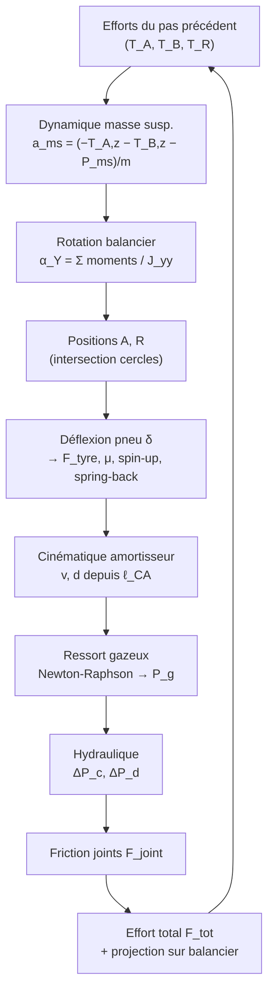

# Dossier de calcul complet — SimuLanding

*Document maître généré le 28 juin 2026. Il **rassemble en un seul endroit** toute la
documentation de calcul du simulateur de drop test : le PFD (dérivation des
efforts), le calcul des **amortisseurs hydrauliques**, des **frictions** et des
**ressorts gaz**, l'ensemble de la **méthodologie du modèle de calcul** et le
**bilan énergétique**.*

> Ce dossier est une **compilation fidèle** des documents de référence du dépôt
> (`docs/PFD_trains.md`, `docs/Modele_scientifique.md`,
> `docs/Bilan_energetique.md`, `docs/Ameliorations_du_modele.md`). Les fichiers
> sources restent la référence éditable ; ce document les réunit pour une lecture
> d'ensemble. Les titres internes ont été abaissés d'un niveau et chaque numéro de
> section (§) reste **local à sa partie**.

## Guide de lecture (selon la demande)

| Vous cherchez… | Allez en… |
|---|---|
| La dérivation rigoureuse des **efforts / torseurs** (PFD) de chaque train | **Partie A** |
| Le calcul de l'**amortisseur hydraulique** (metering, fuite, régimes) | **Partie B**, §7 |
| Le calcul du **ressort gaz** (double chambre, température, bulk/aération) | **Partie B**, §6 |
| Le calcul de la **friction** (joints) | **Partie B**, §8 |
| L'**effort total** d'amortisseur et sa **transmission** (torseur B/C) | **Partie B**, §9 |
| Le **pneu** (déflexion, spin-up, spring-back, adhérence) | **Partie B**, §10 |
| La **méthodologie de calcul** (cinématique, initialisation, intégration) | **Partie B**, §3-5, §11-12 |
| Le **mode avion complet** (2 DDL, couplage des trains) | **Partie B**, §15 et **Partie A**, §7 |
| Le **bilan énergétique** (méthode, conventions, vérification) | **Partie C** |

## Table des matières

- **Partie A — Principe Fondamental de la Dynamique (PFD) — dérivation des efforts**
  - 1. Conventions et notations
  - 2. Modélisation du StraitStrut
  - 3. Isolement du solide S₁ (tige + roue)
  - 4. Isolement du solide S₂ (corps fixe)
  - 5. Système complet et résolution
  - 5b. Variante d'ancrage — StraitStrut + drag brace
  - 6. TrailingArm (MLG)
  - 6b. Variante d'ancrage — TrailingArm sur jambe + bielle
  - 6c. Train à lame (leaf spring) — modèle indépendant
  - 7. Structure (fuselage) — PFD avion 2 DDL
  - 8. Hypothèses/simplifications à vérifier (synthèse pour la suite)
  - 9. Confrontation finale (à faire)
- **Partie B — Modèle scientifique — amortisseur, friction, ressort gaz & méthodologie de calcul**
  - 1. Objet et principe général
  - 2. Notations, abréviations et unités
  - 3. Dynamique de la masse suspendue
  - 4. Rotation du balancier
  - 5. Cinématique de l'amortisseur
  - 6. Ressort gazeux à double chambre
  - 7. Amortissement hydraulique
  - 8. Effort de friction des joints
  - 8b. Effort de friction des bagues de guidage (NLG — modèle DP4)
  - 9. Effort total de l'amortisseur
  - 10. Modèle de pneumatique
  - 11. Initialisation : stabilisation statique
  - 12. Schéma d'intégration temporelle
  - 13. Grandeurs de synthèse
  - 14. Hypothèses et limites du modèle
  - 15. Mode avion complet (2 DDL)
- **Partie C — Bilan énergétique — méthode et vérification**
  - 1. Principe : le théorème de l'énergie
  - 2. Inventaire des réservoirs et des flux
  - 3. Équation de bilan complète (référence)
  - 4. Confrontation au code
  - 5. Synthèse — pourquoi « à absorber » ≠ « absorbée »
  - 5 bis. Découverte : non‑conservation cinématique du NLG (jambe inclinée)
  - 6. Recommandation — ✅ IMPLÉMENTÉE
  - 7. Décisions actées
- **Partie D — Améliorations du modèle (annexe, historique & pistes)**
  - 1. État actuel observé
  - 2. Priorités recommandées
  - 3. Améliorations techniques du moteur
  - 4. Améliorations de qualité logicielle
  - 5. Ordre recommandé de traitement
  - 6. Recommandation principale


---

## Partie A — Principe Fondamental de la Dynamique (PFD) — dérivation des efforts

> *Source : `docs/PFD_trains.md`. Titre d'origine : « PFD des trains — dérivation rigoureuse (vérification des hypothèses) ».*

> **Objectif.** Reconstruire, à partir des **règles et conventions de la
> mécanique du solide** (et non de ce que fait le programme), le Principe
> Fondamental de la Dynamique pour chaque train. Méthode :
>
> 1. on **isole chaque solide** ;
> 2. on écrit le **torseur des actions mécaniques** en chaque point d'application ;
> 3. on écrit le **système d'équations** (théorèmes de la résultante et du moment
>    dynamiques) ;
> 4. on en déduit l'effort d'interface transmis à la cellule.
>
> Ce travail sert à **vérifier que les simplifications faites à l'origine**
> (issues du fichier Excel) sont justes. Ordre : **StraitStrut** (ce document),
> puis TrailingArm, puis la structure.
>
> ⚠️ *Ce document remplace une note antérieure qui concluait trop vite sur le
> signe de `Fx@B`. La conclusion de signe est ici **suspendue** : elle dépend de
> conventions (axe X, sens de Vx, sens du spin‑up) qui seront explicitées et
> confrontées au code dans un second temps.*

---

### 1. Conventions et notations

#### 1.1 Repères

- **Repère galiléen sol** R₀ = (O, X, Y, Z) : X longitudinal **dirigé vers
  l'arrière de l'avion** (l'avion avance donc vers −X), Z vertical vers le haut,
  Y = Z × X. Trièdre direct.
- **Repère jambe** R₁ = (x₁, y₁, z₁) lié à l'axe du fût : z₁ porté par l'**axe du
  fût**, orienté de la roue R vers l'attache B ; x₁ dans le plan longitudinal,
  y₁ = z₁ × x₁. La jambe est inclinée de l'angle β (chasse + assiette) ; on note
  P = R(0→1) la matrice de passage. Pour une jambe verticale, R₁ ≡ R₀.

#### 1.2 Torseur d'action mécanique

L'action d'un ensemble « a » sur un solide « b » est décrite par le **torseur**

$$
\{\mathcal{T}_{a\to b}\}_P=\begin{Bmatrix}\ \vec{R}_{a\to b}\ \\[2pt]\ \vec{M}_{P,a\to b}\ \end{Bmatrix},
\qquad
\vec{M}_{Q}=\vec{M}_{P}+\vec{QP}\times\vec{R}
$$

(R résultante, M_P moment au point P). **3ᵉ loi de Newton** :
{T(a→b)} = −{T(b→a)}.

#### 1.3 PFD (Newton–Euler)

Pour un solide S de masse m, centre d'inertie G, dans R₀ galiléen :

$$
\sum \vec{R}_{ext\to S}=m\,\vec{a}_{G}\qquad\text{(résultante dynamique)}
$$
$$
\sum \vec{M}_{G,ext\to S}=\vec{\delta}_{G}=\frac{\mathrm d\vec{\sigma}_G}{\mathrm dt}\qquad\text{(moment dynamique en }G)
$$

On travaille en **problème plan** (x₁, z₁) (plan longitudinal), moments portés
par y₁. Le plan latéral (y₁) est traité par symétrie et n'intervient pas dans
`Fx@B`.

---

### 2. Modélisation du StraitStrut

#### 2.1 Les solides isolés

| Solide | Description | Points remarquables | Masse |
|---|---|---|---|
| S₁ | **Tige** (coulisseau) + essieu + **roue** (masse non suspendue) | R, Gb, Gt | m₁ |
| S₂ | **Corps fixe** (fût), solidaire de la cellule | B, Gt, Gb, A | **négligée** (pas de G₂) |

La **roue** tourne librement autour de l'essieu (axe y₁) : son équation de
rotation (spin‑up) est **découplée** des équations de translation/attitude et
traitée à part (§5.4). S₁ regroupe tige + roue pour la résultante et le moment
de translation.

#### 2.2 Les liaisons

| Liaison | Nature | Transmet | Ne transmet pas |
|---|---|---|---|
| S₁/S₂ (guidage Gt, Gb) | **glissière** d'axe z₁ (modélisée par 2 appuis ponctuels transverses) | efforts ⊥ axe + moments | effort **axial** z₁ |
| Oléo‑pneu + hydraulique | **actionneur interne** S₂ ↔ S₁ | effort **axial** F_tot (constitutif) : en **A** sur le corps, en **Gt** sur la tige, selon l'axe de coulisse | — |
| S₂ / cellule en B | **encastrement** | effort **et** moment | — |
| roue/sol en S | **contact** | effort de contact (Fx, Fz) | moment → rotation roue |

> **Variante d'ancrage du corps.** Une seconde configuration remplace
> l'encastrement B par un montage isostatique **rotule B1 + linéaire annulaire B2 +
> drag brace (bielle C–D)** ; la tige S₁ et l'axe de coulisse (R, Gt, Gb) y sont
> identiques. Dérivation complète au **§5b**.

> L'effort axial de la glissière idéale est nul : c'est l'**oléo** qui fournit
> l'effort axial F_tot = Sc·Pc − Sd·Pd + Sbh·Pg + **F_fric(joint) +
> F_fric(bagues)** + F_butée. ⚠️ **Les frottements (joint et bagues) sont déjà
> inclus dans F_tot** : on ne les rajoute donc **pas** séparément dans les bilans
> (sinon double comptage).

#### 2.3 Conventions de signe explicites (à confronter plus tard)

- Avion en avance : il se déplace vers **−X** (X dirigé vers l'arrière), donc sa
  vitesse longitudinale **Vx < 0**.
- **Effort de contact** sur la roue, noté (Fx, Fz) : Fz = F_tyre ≥ 0 (vers le
  haut). Le signe de **Fx** dépend de la phase (spin‑up vs spring‑back) et
  **sera suivi symboliquement** — c'est lui qui fixe in fine le signe de `Fx@B`.
- Composantes en repère jambe : (fu, fw) = P·(Fx, Fz).

> ⚠️ **Décalage d'axe à instruire (confrontation).** Le programme saisit
> `vx = +36 m/s` (vitesse d'avance **positive**) : son axe longitudinal interne
> pointe donc **vers l'avant**, à l'**opposé** de X (arrière). Ce changement de
> sens entre la convention physique de ce document et celle du code est un
> **candidat direct** pour l'inversion de signe de `Fx@B` — à trancher au §5.4 et
> à l'étape de confrontation.

#### 2.4 Paramétrage géométrique

**L'axe de coulisse est défini uniquement par les deux bagues Gt et Gb.** Sa
direction unitaire est û = (Gt − Gb)/‖Gt − Gb‖ (de Gb vers Gt, « vers le haut » du
fût) ; on prend ẑ₁ = û et x̂₁ transverse dans le plan longitudinal. Pour un point
P, on note (ξP, ζP) ses coordonnées jambe : **ξ = décalage transverse à l'axe**,
**ζ = position axiale**.

- **Sur l'axe de coulisse** (ξ = 0) : Gt, Gb et le point A (ci‑dessous).
- **Pouvant être décalés de l'axe** (ξ ≠ 0) : l'attache **B** (sur le corps fixe)
  et le centre roue **R** (sur la tige). Correction au modèle « tout coaxial » :
  un essieu déporté (R) ou une ferrure d'attache déportée (B) sont pris en compte
  par leurs offsets ξR, ξB.

**Point d'application de l'effort d'amortisseur — point A.** L'effort axial de
l'oléo s'applique en un point A **calculé automatiquement** depuis Gt, Gb et la
course :

$$
A = G_t + \text{course}\cdot\frac{G_t - G_b}{\lVert G_t - G_b\rVert}
$$

A est donc sur la droite (Gt Gb), décalé de la **course** depuis Gt **du côté
opposé à Gb** : il reste **sur l'axe** (ξA = 0, ζA = ζt + course) et se déplace
avec l'enfoncement.

**Centre d'inertie de la tige.** G₁ est placé au **milieu de R et Gt** :
G₁ = (R + Gt)/2, soit ξ₁ = ξR/2 et ζ₁ = (ζR + ζt)/2.

**Appartenance des bagues (important pour la friction).** La bague haute **Gt est
portée par la tige** (elle **coulisse** : sa position avance avec la masse non
suspendue, comme R) ; la bague basse **Gb est portée par le corps fixe** (solidaire
de la cellule). L'**entraxe Gt–Gb varie donc avec la course**, ce qui modifie la
répartition des réactions de bague Xgt/Xgb (§2.2, règle du levier) et **donc
l'effort de frottement de bague** ``ffribag``. (Le modèle initial figeait Gt sur le
corps fixe — corrigé.)

Le point de contact S est sous R : vecteur RS = −R_eff·Z.

---

### 3. Isolement du solide S₁ (tige + roue)

#### 3.1 Inventaire des torseurs d'actions extérieures

| Action | Point | Résultante (rep. jambe) | Moment propre |
|---|---|---|---|
| Pesanteur | G₁ | P₁ (poids m₁g) | 0 |
| Contact sol → roue | R (offset ξR) | (fu, fw) | 0 (le moment de spin part en rotation roue) |
| Oléo S₂ → S₁ | Gt | (0, −F_tot) | 0 |
| Guide haut S₂ → S₁ | Gt | (Xt, 0) | 0 |
| Guide bas S₂ → S₁ | Gb | (Xb, 0) | 0 |

#### 3.2 Théorème de la résultante dynamique

Projection sur x₁ et z₁ (accélération a_G1 = (γ1u, γ1w)) :

$$
\boxed{\;f_u + X_t + X_b + P_{1u} = m_1\,\gamma_{1u}\;}\tag{1}
$$
$$
\boxed{\;f_w - F_{tot} + P_{1w} = m_1\,\gamma_{1w}\;}\tag{2}
$$

L'équation (2) est l'équation d'**enfoncement de la masse non suspendue** (DDL
axial d).

#### 3.3 Théorème du moment dynamique (en Gb, projeté sur y₁)

Moment d'une force (Fu, Fw) appliquée en (ξ, ζ), réduit en Gb (sur l'axe) :
M_y = (ζ − ζb)·Fu − ξ·Fw. L'oléo (en A) et les bagues étant **sur l'axe**, seul le
**décalage ξR de la roue** introduit un terme nouveau (le chargement vertical fw
charge alors les bagues) :

$$
\boxed{\;(\zeta_t-\zeta_b)\,X_t + (\zeta_R-\zeta_b)\,f_u - \xi_R\,f_w + (\zeta_1-\zeta_b)P_{1u} - \xi_1 P_{1w} = \delta_{1y}\;}\tag{3}
$$

(l'oléo en Gt, sur l'axe, a un moment nul en Gb ; Xb aussi). δ1y = moment
dynamique de S₁ en Gb (nul si attitude imposée et S₁ sans inertie de rotation
propre).

---

### 4. Isolement du solide S₂ (corps fixe)

#### 4.1 Inventaire des torseurs d'actions extérieures

**Masse du corps fixe négligée** → pas de poids ni d'inertie : S₂ est en
**équilibre** (membres de droite nuls).

| Action | Point | Résultante (rep. jambe) | Moment propre |
|---|---|---|---|
| Cellule → S₂ (encastrement) | B (offset ξB) | (Bu, Bw) | M_B |
| Oléo S₁ → S₂ (réaction) | A | (0, +F_tot) | 0 |
| Guide haut S₁ → S₂ (réaction) | Gt | (−Xt, 0) | 0 |
| Guide bas S₁ → S₂ (réaction) | Gb | (−Xb, 0) | 0 |

#### 4.2 Équilibre de la résultante (S₂ sans masse)

$$
\boxed{\;B_u - X_t - X_b = 0\;}\tag{4}
$$
$$
\boxed{\;B_w + F_{tot} = 0\;}\tag{5}
$$

#### 4.3 Équilibre des moments (en B, projeté sur y₁)

B pouvant être **décalé** de l'axe (ξB ≠ 0), l'effort d'amortisseur (en A, sur
l'axe) crée un moment à l'attache via cet offset (terme +ξB·F_tot) :

$$
\boxed{\;M_B + \xi_B\,F_{tot} - (\zeta_t-\zeta_B)X_t - (\zeta_b-\zeta_B)X_b = 0\;}\tag{6}
$$

---

### 5. Système complet et résolution

#### 5.1 Efforts de guidage (de (1) et (3))

De (1) : Xt + Xb = m1·γ1u − fu − P1u. De (3) on tire Xt, puis Xb. À masses
négligées :

$$
X_t = \frac{(\zeta_R-\zeta_b)\,f_u - \xi_R\,f_w}{\zeta_t-\zeta_b},\qquad X_b = -f_u - X_t
$$

> **Simplification programme** (à vérifier) : si la roue est **coaxiale** (ξR = 0),
> on retombe sur la pure **règle du levier** Xt = (ζR−ζb)/(ζt−ζb)·fu,
> Xb = −fu − Xt → **conforme** au code (`xgt+xgb=-xr`). **Nouveau terme si R
> déportée** (ξR ≠ 0) : le chargement **vertical** fw charge aussi les bagues
> (−ξR·fw) — absent du code, qui suppose la coaxialité.

#### 5.2 Effort d'interface en B

L'effort exercé **par la cellule sur le train** est (Bu, Bw, M_B) ; l'effort
exercé **par le train sur la cellule** (celui qui dimensionne l'attache et qui
entre dans le PFD avion) est son **opposé** : F_B(train→cellule) = −(Bu, Bw).

De (4) [S₂ sans masse] : B_u = X_t + X_b, et de (1) : X_t + X_b = m_1γ_{1u} − f_u
− P_{1u}. Donc :

$$
\boxed{\;F_{B,u}^{\,train\to cell} = -B_u = f_u + P_{1u} - m_1\gamma_{1u}\;}
$$

De (5) [S₂ sans masse] : B_w = −F_tot, soit un résultat **exact** :

$$
\boxed{\;F_{B,w}^{\,train\to cell} = -B_w = F_{tot}\;}
$$

#### 5.3 Lecture du résultat

- **Composante axiale/verticale** : S₂ sans masse → **F_B,w = F_tot (exact)**.
  C'est l'effort d'amortisseur (frottements joint + bagues **inclus dans F_tot**)
  transmis à la cellule. **Signe non litigieux.**
- **Composante transverse/horizontale** : à masses négligées,
  $$\boxed{\;F_{B,u}^{\,train\to cell}\approx f_u\;}$$
  c.‑à‑d. **égale à la composante transverse de l'effort de contact** (fu,
  projetée en repère jambe). **Tout le signe de `Fx@B` se réduit donc au signe de
  l'effort de contact horizontal fu** — d'où l'importance de fixer rigoureusement
  Fx (§5.4).
- **Effet des décalages B, R** : les offsets ξB, ξR **ne changent pas** F_B,u (la
  résultante transverse (1)+(4) en est indépendante) ; ils ne modifient que la
  **répartition des bagues** (Xt, Xb) et le **moment d'interface** M_B (terme
  ξB·F_tot). Le verdict de signe sur `Fx@B` reste donc **inchangé** par les
  décalages.

#### 5.4 Rotation de la roue et signe de l'effort de contact

Équation de rotation de la roue (essieu y₁, inertie J) :
$$
J\,\dot\Omega = R_{eff}\,F_{spin},\qquad F_{spin}=\mu\,F_{tyre}\,\mathrm{sgn}(g_{liss}),\quad g_{liss}=V_x-\Omega R_{eff}
$$

- **Phase spin‑up** : au toucher, la roue ne tourne pas ; le point de contact
  accompagne l'avion **vers l'avant (−X)** par rapport au sol. La friction
  sol→roue **s'oppose** à ce glissement → elle est dirigée **vers l'arrière
  (+X)**. Donc l'effort de contact longitudinal **Fx > 0** (selon +X) en phase
  spin‑up.
- L'effort réellement transmis au moyeu passe par la **raideur de pneu** (modèle
  spring‑back) : f_pneu = −kx·δx − cx·(dδx/dt), qui en quasi‑statique équilibre
  la friction.

> **Le point à trancher (étape suivante)** : selon que l'on transmette à la
> cellule **l'effort de contact** Fx ou **l'effort élastique au moyeu** f_pneu
> (de signes opposés en régime transitoire), `Fx@B` change de signe. Le présent
> bilan montre que c'est **la composante transverse de l'action réellement
> appliquée à S₁ en R** qui doit apparaître — il faudra donc identifier sans
> ambiguïté quelle force physique agit sur le moyeu, et la confronter à
> `fx_spring_wheel` (code) et à la convention Vx/X.

---

### 5b. Variante d'ancrage — StraitStrut + drag brace

> **Principe.** La **tige + roue (S₁)** et l'**axe de coulisse** (points R, Gt, Gb)
> sont **strictement identiques** au StraitStrut standard : tout le §3 (enfoncement,
> guidage Xt/Xb, friction, spin‑up) reste **inchangé**. Seul l'**ancrage du corps
> S₂ à la structure** change : l'**encastrement unique B** (qui transmettait effort
> **et** moment) est remplacé par un **montage isostatique à trois liaisons** :
>
> - **B1 — rotule** (sphérique) : transmet 3 efforts, **aucun moment** ;
> - **B2 — linéaire annulaire** d'axe (B1 B2) : transmet 2 efforts **⊥ à l'axe**,
>   **aucun moment**, **aucun effort axial** (glissement libre le long de B1 B2) ;
> - **drag brace** — **bielle à 2 rotules** entre **C** (lié au **corps**) et **D**
>   (lié à la **structure**) : c'est une **pièce à deux forces** → un **unique
>   effort selon l'axe (C D)**.
>
> B1 + B2 forment un **axe de trunnion** (B1 fixe un point ; B2 bloque les 2
> translations transverses) : il ne resterait qu'**un seul DDL**, la **rotation du
> corps autour de l'axe B1 B2**. La **drag brace** bloque ce dernier DDL. Le corps
> est donc **isostatiquement** maintenu.

#### 5b.1 Coordonnées par défaut (repère avion, mm, à pitch 0°)

| Point | X | Y | Z | Rôle |
|---|---|---|---|---|
| B1 | 1650 | 70 | 1078 | rotule corps ↔ structure |
| B2 | 1650 | −70 | 1078 | linéaire annulaire (axe B1 B2) |
| C | 1620 | 0 | 700 | rotule **corps** ↔ drag brace |
| D | 1950 | 0 | 1120 | rotule drag brace ↔ **structure** |

Vecteurs unitaires : axe trunnion **û_B = (B1 − B2)/‖B1 − B2‖ = (0, 1, 0)** (selon
**Y**, latéral) ; axe de bielle **û_CD = (D − C)/‖D − C‖ = (330, 0, 420)/534,1 ≈
(0,618 ; 0 ; 0,786)** (dans le plan X‑Z, vers l'**arrière** et le **haut**). La
drag brace est donc une **contre‑fiche de traînée** : elle reprend les charges
**fore/aft** autour de l'axe latéral.

#### 5b.2 Liaisons, inconnues et isostatisme

| Liaison | Nature | Inconnues d'effort |
|---|---|---|
| B1 (corps↔structure) | rotule | **R_B1 = (X₁, Y₁, Z₁)** → 3 |
| B2 (corps↔structure) | linéaire annulaire d'axe û_B | **R_B2 ⊥ û_B** (R_B2·û_B = 0) → 2 |
| drag brace (en C) | bielle à 2 rotules | **T** selon û_CD → 1 |

Total = **6 inconnues** = **6 équations** d'équilibre du corps (3 résultante + 3
moment, corps **sans masse** → membre de droite nul). Système **isostatique**.

#### 5b.3 Isolement de la drag brace (pièce à deux forces)

Bielle sans masse, chargée **uniquement** par deux rotules (C, D) → effort porté
par la droite (C D). Sur le **corps** en C : **+T·û_CD** ; sur la **structure** en
D : **−T·û_CD** (T > 0 = traction de la bielle). Aucun moment transmis.

#### 5b.4 Isolement du corps S₂ (masse négligée → équilibre)

L'action **interne** de la tige sur le corps (oléo **+F_tot·ẑ₁** en A ; réactions
de guidage **−Xt** en Gt, **−Xb** en Gb — identiques au §4.1, Xt/Xb issus du §3)
se réduit en un **torseur connu** (R_int, M_int) :

$$
\vec R_{int} = F_{tot}\,\hat z_1 - (X_t + X_b)\,\hat x_1,\qquad
\vec M_{int/B1} = \vec{B_1A}\times(F_{tot}\hat z_1) + \vec{B_1G_t}\times(-X_t\hat x_1) + \vec{B_1G_b}\times(-X_b\hat x_1)
$$

**Équilibre de la résultante (3 éq.) :**

$$
\boxed{\;\vec R_{int} + \vec R_{B1} + \vec R_{B2} + T\,\hat u_{CD} = \vec 0\;}\tag{4'}
$$

**Équilibre du moment en B1 (3 éq., R_B1 sans moment en B1) :**

$$
\boxed{\;\vec M_{int/B1} + \vec{B_1B_2}\times \vec R_{B2} + \vec{B_1C}\times (T\,\hat u_{CD}) = \vec 0\;}\tag{6'}
$$

#### 5b.5 Résolution (structure du calcul)

La résolution se découple proprement grâce à la géométrie du trunnion :

1. **Drag brace T — projection du moment (6′) sur l'axe trunnion û_B.** Comme
   B₁B₂ ∥ û_B, le terme B₁B₂ × R_B2 est **⊥ û_B** (projection nulle), et R_B1 ne
   donne aucun moment en B1 :

   $$
   \boxed{\;T = -\,\frac{\vec M_{int/B1}\cdot \hat u_B}{\big(\vec{B_1C}\times \hat u_{CD}\big)\cdot \hat u_B}\;}
   $$

   → **la drag brace reprend exactement la composante du moment interne autour de
   l'axe trunnion** (moment de traînée/charge axiale). C'est sa fonction.

2. **Linéaire annulaire R_B2 — 2 composantes restantes de (6′)** (⊥ û_B), une fois
   T connu.
3. **Rotule R_B1 — résultante (4′)**, une fois R_B2 et T connus.

#### 5b.6 Efforts transmis à la structure et cohérence

Les efforts **du train sur la structure** (entrant dans le PFD avion §7) sont les
**réactions** aux trois points :

- en **B1** : −R_B1 ; en **B2** : −R_B2 ; en **D** (drag brace) : −T·û_CD.

Leur **somme** vaut, par (4′), **−R_int = −F_tot·ẑ₁ + (Xt+Xb)·x̂₁**. La **résultante
globale transmise est donc identique** à celle du modèle encastré (§5.2 :
F_B,w = F_tot vertical, F_B,u = fu transverse) — **seule la répartition** sur trois
points (B1, B2, D) **et la suppression du moment d'encastrement** changent : le
moment M_B du §4.3 est désormais **repris par le couple {B1, B2, drag brace}**.

> **Conséquences pour l'implémentation (étape suivante).** (i) Le cœur S₁
> (enfoncement, Xt/Xb, friction, spin‑up, énergie) est **réutilisé tel quel** ;
> (ii) on ajoute la résolution **3D** du corps (4′)(6′) pour produire les efforts
> en B1, B2, D ; (iii) ces trois efforts remplacent l'unique torseur d'interface B
> dans le PFD avion. La cinématique d'enfoncement (axe de coulisse R/Gt/Gb) est
> **inchangée**.

#### 5b.7 Hypothèses propres à la variante

- **H‑db1** : corps fixe **sans masse** (déjà au §4) → équilibre statique du corps.
- **H‑db2** : liaisons **parfaites** (rotule B1, linéaire annulaire B2, rotules de
  la bielle) → **sans frottement**, aucun moment parasite.
- **H‑db3** : **drag brace sans masse** ni flambage → pièce à deux forces exacte.
- **H‑db4** : montage **isostatique** (6 inconnues / 6 équations) → efforts
  déterminés sans hypothèse de raideur.

---

### 6. TrailingArm (MLG)

Même méthode, en **repère sol** (X arrière, Z haut). ⚠️ **Le torseur d'interface
se calcule en 3D** (efforts **et** moments) : la rotation du balancier reste plane
(autour de Y), mais les **décalages en Y** — roue déportée (R_y ≠ B_y),
amortisseur oblique (A‑C en Y) — produisent des composantes **Fy** et surtout des
**moments Mx, Mz** au pivot, qu'un calcul purement plan raterait.

#### 6.1 Les solides isolés

| Solide | Description | Points | Masse |
|---|---|---|---|
| S′₁ | **Balancier** (bras) + essieu + **roue** | R, A, B | m′ (roue = masse non susp.) |
| S′₂ | **Amortisseur** (bielle oléo‑pneu/hydraulique) | A, C | **négligée** (bielle à 2 forces) |

#### 6.2 Les liaisons

| Liaison | Nature | Transmet | Ne transmet pas |
|---|---|---|---|
| Balancier / cellule en B | **pivot** d'axe Y | effort (X,Z) + moments X,Z | **moment autour de Y** |
| Amortisseur / cellule en C | **rotule** | effort seul | tout moment |
| Amortisseur / balancier en A | **rotule** | effort seul | tout moment |
| roue / sol en R | **contact** | (Fx, Fz) | moment → rotation roue |

> **Variante d'ancrage.** Une seconde configuration interpose une **jambe** entre
> le train et la structure : le balancier (B) et l'amortisseur (C) se fixent sur la
> jambe, montée isostatiquement par **rotule F1 + linéaire annulaire F2 + bielle
> D–E**. La dynamique (§6) est identique. Dérivation complète au **§6b**.

> L'amortisseur est **rotulé aux deux bouts** (A et C) et de masse négligée → c'est
> une **bielle à deux forces** : son effort est **porté par l'axe A‑C**, de norme
> F_tot (même modèle interne oléo/hydraulique qu'au §2, mais ici **sans bagues ni
> efforts transverses** puisque pivoté aux deux extrémités). On garde la même
> convention de contact (Fx, Fz) qu'au StraitStrut (§2.3).

#### 6.3 Isolement de l'amortisseur (bielle à 2 forces)

Effort axial F_tot le long de A‑C (F_tot > 0 en compression : l'amortisseur
repousse ses extrémités) :

$$
\boxed{\;\vec T_A = F_{tot}\,\frac{A-C}{\lVert A-C\rVert}\;}\ (\text{sur le balancier en }A),
\qquad
\boxed{\;\vec F_C = -\vec T_A = F_{tot}\,\frac{C-A}{\lVert A-C\rVert}\;}\ (\text{sur la cellule en }C)
$$

> **Code** (`engine.py` l.329, 334) : `ta_x = -ftot*(C_x-A_x)/entraxe`
> (= F_tot·(A−C)_x/‖A−C‖) et `fc_x = -ta_x`. **Conforme.**

#### 6.4 Isolement du balancier (R, A, B)

| Action | Point | Résultante (rep. sol) | Moment propre |
|---|---|---|---|
| Pesanteur | G′ | poids m′g = (0, 0, −m′g) | 0 |
| Contact sol → roue | R | T_R = (Fx, Fy, Fz) **(3D)** | 0 (le moment de spin part en rotation roue) |
| Amortisseur → balancier | A | T_A = F_tot·(A−C)/‖A−C‖ **(3D)** | 0 |
| Pivot cellule → balancier | B | T_B **(3D)** | **moments Mx, Mz** (pas de My) |

**Théorème de la résultante dynamique** :

$$
\boxed{\;\vec T_R + \vec T_A + \vec T_B + \vec P' = m'\,\vec a_{G'}\;}\tag{7}
$$

**Théorème du moment dynamique en B** (projeté sur Y ; le pivot ne reprend aucun
moment Y) :

$$
\boxed{\;(\vec{BR}\times \vec T_R)_Y + (\vec{BA}\times \vec T_A)_Y + (\vec{BG'}\times \vec P')_Y = J_B\,\ddot\theta\;}\tag{8}
$$

(8) est l'équation de **rotation du balancier** (DDL d'angle θ, accélération θ̈).

#### 6.5 Efforts d'interface (pivot B et rotule C)

De (7) : T_B = m′·a_G′ − T_R − T_A − P′. L'effort transmis **à la cellule** au
pivot est son opposé (3ᵉ loi). **On conserve la masse du balancier+roue** (m′) :

$$
\boxed{\;\vec F_B = -\vec T_B = \vec T_R + \vec T_A + \vec P' - m'\,\vec a_{G'}\;},\qquad \boxed{\;\vec F_C = -\vec T_A\;}
$$

(F_C, issue de la bielle à 2 forces, est inchangée par la masse du balancier.)

> **Divergence avec le code** : `engine.py` pose `tb = -ta - tr` (l.330),
> `fb = -tb = ta + tr` (l.335), c.‑à‑d. **balancier sans masse** (P′ et m′·a_G′
> négligés). En tenant compte de la masse, il faut **ajouter P′ − m′·a_G′** (poids
> + inertie de translation du balancier+roue) à F_B. La rotation θ est, elle, déjà
> gardée via (8) ; `fc = -ta` (l.334) reste conforme.

**Moment transmis au pivot B (Mx, Mz) — calcul 3D.** Le pivot d'axe Y reprend
l'effort 3D **et** les moments autour de X et Z (pas autour de Y, axe libre). Le
moment des efforts du balancier réduit en B (d'Alembert : l'inertie −m′·a_G′ agit
en G′) est :

$$
\boxed{\;\vec M_B = \vec{BA}\times\vec T_A + \vec{BR}\times\vec T_R + \vec{BG'}\times(\vec P' - m'\,\vec a_{G'})\;}
$$

La composante **My n'est pas transmise** (elle équilibre la rotation, eq (8) :
J_yy·θ̈) ; le pivot ne réagit que **Mx et Mz**. En notant BA = A−B, BR = R−B :

$$
M_{B,x} = (BA_y\,T_{A,z} - BA_z\,T_{A,y}) + (BR_y\,T_{R,z} - BR_z\,T_{R,y}) + (\text{terme masse})_x
$$
$$
M_{B,z} = (BA_x\,T_{A,y} - BA_y\,T_{A,x}) + (BR_x\,T_{R,y} - BR_y\,T_{R,x}) + (\text{terme masse})_z
$$

> **Code** (`engine.py` l.342‑343) : `mb_x`, `mb_z` = (BA×T_A + BR×T_R)\_{x,z}
> (sans terme de masse). **Conforme** pour m′ = 0. C'est le **décalage R_y ≠ B_y**
> (roue déportée) qui rend Mx, Mz non nuls — d'où la **nécessité du calcul 3D**.

#### 6.6 Lecture du résultat

- **Résultante transmise à la cellule** : F_B + F_C = (T_R + T_A + P′ − m′·a_G′)
  + (−T_A) = **T_R + P′ − m′·a_G′** : la réaction de contact **corrigée du poids et
  de l'inertie** du balancier+roue. (À masse négligée on retrouve exactement T_R —
  contrôle de cohérence du modèle simplifié, cf. modèle scientifique §9.2.)
- **Composante horizontale au pivot** : le poids étant vertical (P′_x = 0),
  F_B,x = **Fx + T_A,x − m′·a_G′,x** : contact horizontal **+** projection
  horizontale de l'amortisseur **−** inertie horizontale du balancier+roue.
- **Comparaison StraitStrut ↔ TrailingArm** : la **résultante horizontale** vaut,
  à la correction d'inertie près, **Fx** dans les deux cas (StraitStrut :
  fu − m₁·γ1u ; TrailingArm : Fx − m′·a_G′,x). Les deux trains transmettent donc
  **la même réaction de contact horizontale** ; seule la **répartition** diffère
  (StraitStrut : tout en B ; TrailingArm : réparti pivot B / rotule C, le terme
  d'amortisseur T_A,x au pivot étant compensé par F_C,x = −T_A,x à la rotule).
- **Moments 3D au pivot** : Mx, Mz sont non nuls dès qu'il existe un **décalage en
  Y** (roue déportée, amortisseur oblique). Sur le cas par défaut, R_y − B_y ≈
  −0,16 m donne **Mx ≈ −7000 N·m** et Mz ≈ −950 N·m : un calcul purement plan les
  **annulerait à tort**. → l'assemblage TrailingArm **doit** être 3D.
- **Signe** : comme au §5.4, tout repose sur le **signe de l'effort de contact
  Fx** (convention commune Vx/X). La cohérence NLG↔MLG se joue sur cette
  **définition unique de Fx**, pas sur la mécanique de transmission (identique en
  résultante). Or `tr_x = kx·δx + cx·(dδx/dt)` (code, l.229) est **de signe
  opposé à `fx_spring_wheel`** du StraitStrut (§1.3) → décalage à instruire.

#### 6.7 Balancier corps rigide — masse active (modèle PFD complet)

> ⚠️ **Modèle nouveau.** Le modèle historique est **incohérent** : balancier sans
> masse en translation (fb = ta + tr) **mais** doté d'une inertie de rotation
> jyy ≠ 0. Le modèle ci‑dessous traite le balancier comme un **vrai corps
> rigide** (masse m′, centre d'inertie G′, inertie propre I_{G′}). Il **change la
> trajectoire** (la masse agit dans la dynamique).
>
> **Référence de validation.** En **réutilisant jyy comme inertie au pivot**
> (I_B = jyy fixe) et G′ = milieu(B, R), la limite **m′ → 0 redonne exactement
> l'historique** — y compris la rotation : avec m′ = 0, (6a) donne
> T_B = −(T_A+T_R) et (6b) se réduit à jyy·θ̈ = [(A−B)×T_A + (R−B)×T_R]_Y, soit
> l'équation de rotation du code (l.197‑202). On valide donc m′ = 0 contre
> l'historique, et m′ > 0 par **bilan d'énergie**.

**Paramétrage retenu** (un seul nouveau paramètre d'entrée) :
- **m′** : masse balancier + roue (nouveau, = `m_arm`) ;
- **G′ = milieu(B, R)** par défaut (pas de nouvel input) ;
- **I_B = jyy** (réutilisé), d'où I_{G′} = jyy − m′·‖BG′‖² (rester I_{G′} ≥ 0 ⇒
  m′ ≤ jyy/‖BG′‖²).

**Cinématique** (plan X–Z ; pivot B en translation verticale avec la cellule,
bras en rotation θ autour de B) :

$$
\vec a_{G'} = \vec a_B + \ddot\theta\,(\hat y \times \vec r_{BG'}) - \dot\theta^{2}\,\vec r_{BG'},
\qquad \vec r_{BG'} = G' - B
$$

**PFD du balancier (corps rigide).** Inconnues : réaction pivot $\vec T_B$ (2
comp.) et $\ddot\theta$ (1).

$$
\boxed{\;m'\,\vec a_{G'} = \vec T_A + \vec T_R + \vec T_B + \vec P'\;}\tag{6a}
$$
$$
\boxed{\;I_{G'}\,\ddot\theta = \big[(A-G')\times\vec T_A + (R-G')\times\vec T_R + (B-G')\times\vec T_B\big]_Y\;}\tag{6b}
$$

(6a)+(6b) = 3 équations scalaires → $\vec T_B$ et $\ddot\theta$. Effort transmis à
la cellule : $\vec F_B = -\vec T_B$ (pivot), $\vec F_C = -\vec T_A$ (rotule).

**Couplage structure.** $\vec F_B + \vec F_C$ pilotent la masse suspendue (train
isolé) ou le fuselage (avion, §7) ; $\ddot\theta$ remplace l'équation de rotation
historique (jyy). La **boucle d'intégration** avance θ, θ̇ **et** la cellule de
façon couplée.

**Différences clés avec §6.5** (modèle interface) : ici la rotation est pilotée
par I_{G′} (et non jyy), le poids m′g crée un moment, et l'inertie m′·a_{G′}
entre **dans la trajectoire** (pas seulement dans l'effort reporté).

---

### 6b. Variante d'ancrage — TrailingArm sur jambe + bielle

> **Principe** (analogue au §5b). Le **balancier**, l'**amortisseur** et la roue
> (toute la dynamique du §6) sont **inchangés** : les efforts d'interface du train
> restent **F_B** (pivot, avec ses moments Mx, Mz) et **F_C** (rotule), donnés par
> le §6.5. Ce qui change : ces efforts ne vont plus **directement** à la structure
> mais à une pièce intermédiaire, **la jambe**, elle-même montée **isostatiquement**
> sur la structure :
>
> - le **balancier** est fixé à la jambe par son **pivot B**, l'**amortisseur** par
>   sa **rotule C** (mêmes points qu'au §6) ;
> - la jambe est liée à la structure par **F1 — rotule** (3 efforts) et **F2 —
>   linéaire annulaire** d'axe (F1 F2) (2 efforts ⊥ à l'axe) ;
> - plus une **bielle D–E** à **2 rotules** (D lié à la **jambe**, E à la
>   **structure**) → un **unique effort selon (D E)**.
>
> F1 + F2 = axe de trunnion (la jambe ne pourrait que pivoter autour de F1 F2) ; la
> bielle bloque ce dernier DDL → la jambe est **isostatiquement** maintenue
> (3 + 2 + 1 = 6 inconnues = 6 équations d'équilibre).

#### 6b.1 Coordonnées par défaut (repère avion, mm, à pitch 0°)

| Point | X | Y | Z | Rôle |
|---|---|---|---|---|
| B | (cf. §6) | | | pivot balancier ↔ **jambe** |
| C | (cf. §6) | | | rotule amortisseur ↔ **jambe** |
| F1 | 5350 | −1200 | 1000 | rotule jambe ↔ structure |
| F2 | 5750 | −1100 | 1030 | linéaire annulaire (axe F1 F2) |
| D | 5650 | −1050 | 600 | rotule **jambe** ↔ bielle |
| E | 5550 | −600 | 1050 | rotule bielle ↔ **structure** |

Vecteurs : axe trunnion **û_F = (F2 − F1)/‖·‖ ≈ (0,968 ; 0,242 ; 0,073)** ; axe de
bielle **û_DE = (E − D)/‖·‖ ≈ (−0,155 ; 0,698 ; 0,698)**.

#### 6b.2 Liaisons, inconnues et isostatisme

| Liaison | Nature | Inconnues d'effort |
|---|---|---|
| F1 (jambe↔structure) | rotule | **R_F1 = (X₁, Y₁, Z₁)** → 3 |
| F2 (jambe↔structure) | linéaire annulaire d'axe û_F | **R_F2 ⊥ û_F** → 2 |
| bielle (en D) | bielle à 2 rotules | **T** selon û_DE → 1 |

Total = **6 inconnues** = **6 équations** d'équilibre de la jambe (corps **sans
masse** → membre de droite nul). Système **isostatique**.

#### 6b.3 Isolement de la bielle D–E (pièce à deux forces)

Bielle sans masse, deux rotules → effort selon (D E). Sur la **jambe** en D :
**+T·û_DE** ; sur la **structure** en E : **−T·û_DE**. Aucun moment.

#### 6b.4 Isolement de la jambe (masse négligée → équilibre)

La jambe reçoit du train (3ᵉ loi, efforts **du balancier/amortisseur sur la jambe**
= ceux transmis « à la cellule » du §6.5) : **F_B** et le moment de pivot
**M_B = (M_{B,x}, 0, M_{B,z})** en **B**, et **F_C** en **C**. Torseur interne
réduit en F1 :

$$
\vec R_{int} = \vec F_B + \vec F_C,\qquad
\vec M_{int/F_1} = \vec M_B + \vec{F_1B}\times\vec F_B + \vec{F_1C}\times\vec F_C
$$

**Équilibre de la résultante (3 éq.) :**

$$
\boxed{\;\vec R_{int} + \vec R_{F1} + \vec R_{F2} + T\,\hat u_{DE} = \vec 0\;}\tag{4''}
$$

**Équilibre du moment en F1 (3 éq., R_F1 sans moment en F1) :**

$$
\boxed{\;\vec M_{int/F_1} + \vec{F_1F_2}\times \vec R_{F2} + \vec{F_1D}\times (T\,\hat u_{DE}) = \vec 0\;}\tag{6''}
$$

#### 6b.5 Résolution (structure du calcul)

Découplage identique au §5b.5 grâce au trunnion :

1. **Bielle T — projection de (6'') sur û_F** : F1F2 ∥ û_F annule le terme F2, R_F1
   ne donne aucun moment en F1 →
   $$
   \boxed{\;T = -\,\frac{\vec M_{int/F_1}\cdot \hat u_F}{\big(\vec{F_1D}\times \hat u_{DE}\big)\cdot \hat u_F}\;}
   $$
   → la bielle reprend la composante du moment interne autour de l'axe trunnion.
2. **R_F2** (2 composantes ⊥ û_F de (6'')), puis **R_F1** (résultante 4'').

#### 6b.6 Efforts transmis à la structure et cohérence

Efforts **de la jambe sur la structure** (entrant dans le PFD avion §7) : −R_F1 en
**F1**, −R_F2 en **F2**, −T·û_DE en **E**. Leur **somme** vaut −R_int =
−(F_B + F_C) ; le **torseur global transmis est identique** à celui du TrailingArm
standard (§6.5, F_B en B + F_C en C) — **seule la répartition** sur trois points
(F1, F2, E) **change**. La dynamique avion (§7) est donc **inchangée** ; on obtient
en plus les efforts de dimensionnement de la jambe et de la bielle.

> **Implémentation (étape suivante).** (i) Cœur TrailingArm (§6) réutilisé tel
> quel → F_B, M_B, F_C ; (ii) résolution 3D de la jambe (4'')(6'') → R_F1, R_F2, T ;
> (iii) ces efforts remplacent, pour le report, l'interface B/C dans le PFD avion.

#### 6b.7 Hypothèses propres à la variante

- **H‑ja1** : **jambe sans masse** → équilibre statique.
- **H‑ja2** : liaisons **parfaites** (rotules F1, D, E ; linéaire annulaire F2)
  → sans frottement, aucun moment parasite.
- **H‑ja3** : **bielle sans masse** ni flambage → pièce à deux forces exacte.
- **H‑ja4** : montage **isostatique** (6 / 6) → efforts déterminés sans raideur.

---

### 6c. Train à lame (leaf spring) — modèle indépendant

> **Principe.** Modèle de train **le plus simple** : une **lame** flexible se
> comporte comme un **ressort vertical** monté entre l'attache structure **B**
> (encastrement) et le **centre roue R** (extrémité libre de la lame). Sous
> charge, R **descend/remonte verticalement** ; la lame se déforme et développe
> un effort **élastique + visqueux** qui s'oppose au mouvement vertical. Cet
> effort est appliqué à l'**extrémité de la lame confondue avec R**, puis
> **réduit en B** par le PFD de la lame → torseur d'encastrement transmis à la
> structure.
>
> **Différences avec le StraitStrut (§2).** Il n'y a **plus d'amortisseur
> hydraulique (oléo) ni de ressort gaz** : la raideur et la dissipation sont
> portées par la **lame seule** (ressort linéaire k + amortisseur visqueux c).
> En revanche **toute la roue et le pneu sont identiques** au StraitStrut :
> raideur de pneu, **spring‑back** et **spin‑up** (§5.4) sont **réutilisés tels
> quels**, ainsi que la **position par défaut de R**.

#### 6c.1 Coordonnées et paramètres par défaut (repère avion, mm, à pitch 0°)

| Point | X | Y | Z | Rôle |
|---|---|---|---|---|
| B | 3500 | 0 | 1000 | **encastrement** lame ↔ structure |
| R | 2710 | 0 | 381 | centre roue (extrémité de lame) — **comme StraitStrut** |

Vecteur de lame **BR = R − B = (−790, 0, −619) mm** (R est plus **avant** et plus
**bas** que B ; longueur ‖BR‖ ≈ 1004 mm, dans le plan X‑Z).

| Paramètre | Symbole | Défaut | Origine |
|---|---|---|---|
| Raideur de lame | k | **2000 N/mm** (= 2,0·10⁶ N/m) | **nouveau** (ressort de lame) |
| Amortissement de lame | c | **1000 N/(m/s)** (= 1000 N·s/m) | **nouveau** (amortisseur visqueux) |
| Masse non suspendue | m₁ | **10 kg** | **nouveau** (essieu + roue) |
| Roue + pneu (rayon, raideur pneu, spring‑back, spin‑up, μ…) | — | **StraitStrut** | réutilisés tels quels |

> ⚠️ k, c et m₁ sont les **seuls** paramètres mécaniques propres à ce modèle ;
> tous les autres (roue/pneu) sont hérités du StraitStrut. Pas de section oléo,
> pas de gaz, pas de bagues de guidage.

#### 6c.2 Solides et liaisons

| Solide | Description | Points | Masse |
|---|---|---|---|
| S₁ | **Lame** + essieu + **roue** (masse non suspendue) | B, R | m₁ = 10 kg |

La **lame** est l'élément **élastique/dissipatif** (elle remplace l'oléo+gaz). La
**roue** tourne librement autour de l'essieu (axe Y) : son équation de rotation
(**spin‑up**) est **découplée** et traitée comme au **§5.4**.

| Liaison | Nature | Transmet | Ne transmet pas |
|---|---|---|---|
| S₁ / cellule en B | **encastrement** | effort **et** moment | — |
| lame (interne) | **ressort + amortisseur** vertical entre B et R | effort vertical F_lame | — |
| roue/sol en S | **contact** | effort de contact (Fx, Fz) | moment → rotation roue |

#### 6c.3 Cinématique et loi de la lame

Seul DDL d'enfoncement : la **déflexion verticale δ** de la lame, définie comme le
**rapprochement vertical** de B et R par rapport à la configuration libre :

$$
\delta = \big(z_B - z_R\big)_{\text{libre}} - \big(z_B - z_R\big),
\qquad \dot\delta = -\frac{\mathrm d (z_B - z_R)}{\mathrm dt}
$$

(δ > 0 = lame comprimée, roue rapprochée du corps). La lame développe, **à son
extrémité R**, un effort **vertical** ressort + amortisseur :

$$
\boxed{\;F_{lame} = k\,\delta + c\,\dot\delta\;}\qquad (\ge 0\ \text{en compression})
$$

dirigé pour **s'opposer au mouvement** (pousse le corps vers le haut, la roue vers
le bas). Il n'y a **pas** de composante axiale d'oléo ni de pression gaz.

#### 6c.4 Roue, pneu et contact (réutilisés du StraitStrut)

Strictement comme au **§5.4** : déflexion de pneu δ_pneu, effort vertical de pneu
F_pneu(δ_pneu) (**spring‑back**), équation de rotation de la roue (**spin‑up**)

$$
J\,\dot\Omega = R_{eff}\,F_{spin},\qquad F_{spin} = \mu\,F_{pneu}\,\mathrm{sgn}(V_x-\Omega R_{eff})
$$

et effort de contact horizontal Fx (friction de spin‑up), de **même convention de
signe** qu'au §5.4. En limite de **roue sans inertie de translation**, l'effort
vertical au moyeu équilibre la lame : **F_pneu = F_lame** ; sinon

$$
m_1\,\ddot z_R = F_{pneu} - F_{lame} - m_1 g
$$

#### 6c.5 PFD de la lame → torseur d'encastrement en B

La lame est traitée comme **sans masse propre** (toute la masse non suspendue est
au moyeu R ; l'inertie de flexion de la lame est négligée). Soit **F_R** l'effort
**appliqué à la lame en R** par l'ensemble roue/sol :

$$
\vec F_R = (f_x,\ 0,\ f_z),\qquad f_z = F_{lame}\ (\text{vertical, vers le haut}),\quad f_x = \text{effort de contact (§5.4)}
$$

**Équilibre de la lame sans masse** (résultante + moment en B) :

$$
\vec R_B + \vec F_R = \vec 0,\qquad \vec M_B + \vec{BR}\times\vec F_R = \vec 0
$$

d'où le **torseur transmis par le train à la structure** en B (réaction, = −torseur
sur la lame) :

$$
\boxed{\;\vec R_{B}^{\,train\to cell} = \vec F_R,\qquad
\vec M_{B}^{\,train\to cell} = \vec{BR}\times\vec F_R\;}
$$

soit en plan X‑Z, le **moment de tangage** (autour de Y) en B :

$$
\boxed{\;M_{B,y} = (z_R - z_B)\,f_x - (x_R - x_B)\,f_z\;}
$$

C'est un **encastrement** : il transmet **effort + moment**, comme le StraitStrut
(§5.2). La composante verticale transmise vaut **F_lame** (cf. §5.3 : F_B,w = F_tot,
ici F_tot ≡ F_lame) ; la composante horizontale vaut l'**effort de contact**
(§5.3). Le moment provient du **bras de levier BR** entre l'attache et la roue.

#### 6c.6 Report avion et énergie

- **Report avion (§7).** Le train à lame entre dans le PFD avion **exactement
  comme un NLG StraitStrut** : un **encastrement en B** apportant (Fx, Fz) **et**
  un moment de tangage M_B,y (terme −M_B dans l'équation de tangage (10)).
- **Bilan énergétique.** Mêmes postes que les autres trains pour le **pneu**
  (déformation, spin‑up, glissement) ; côté jambe, l'oléo/gaz est remplacé par
  l'**énergie élastique de lame** E_lame = ½ k δ² (**stockée**, restituée) et la
  **dissipation visqueuse** P_amort = c δ̇² (**absorbée**). Convention « travail »
  identique au reste du document.

#### 6c.7 Hypothèses propres au modèle

- **H‑la1** : lame = **ressort linéaire k + amortisseur visqueux c** en parallèle,
  agissant **verticalement** à l'extrémité R. Comportement linéaire (pas de
  butée, pas de raidissement géométrique).
- **H‑la2** : **lame sans masse propre** (inertie de flexion négligée) → réduction
  statique de l'effort de R en torseur d'encastrement B.
- **H‑la3** : **roue/pneu identiques au StraitStrut** (spring‑back, spin‑up, μ) ;
  position R par défaut identique au StraitStrut.
- **H‑la4** : liaison B = **encastrement parfait** (transmet effort **et** moment),
  comme le NLG StraitStrut au §7.

---

### 7. Structure (fuselage) — PFD avion 2 DDL

Un seul solide : le **fuselage** (masse m, inertie de tangage J_yy, CG en G).
Repère sol, plan X‑Z. **2 degrés de liberté** : translation verticale z_cg et
**tangage θ** (rotation autour de Y en G). La translation longitudinale X est
**imposée** (Vx constante) → pas de DDL associé (les efforts X sont repris par la
contrainte de roulage, mais **contribuent au tangage**).

#### 7.1 Les points d'interface (efforts issus des §4 et §6)

| Train | Liaison(s) | Point(s) | Effort transmis à la cellule |
|---|---|---|---|
| NLG (StraitStrut) | encastrement | B_N | F_B^N = (FxN, FzN) **+ moment M_B^N** |
| MLG gauche (TrailingArm) | pivot + rotule | B_L, C_L | F_B^L (pivot) + F_C^L (rotule), **pas de moment** |
| MLG droite (TrailingArm) | pivot + rotule | B_R, C_R | F_B^R (pivot) + F_C^R (rotule), **pas de moment** |

Le pivot ne transmet pas de moment de tangage (My) ; la rotule aucun moment ;
seul l'**encastrement NLG** transmet M_B^N.

#### 7.2 Inventaire des torseurs sur le fuselage

| Action | Point | Résultante (rep. sol) | Moment propre |
|---|---|---|---|
| Poids allégé de la portance | G | (0, −m·g·(1−L)) | 0 |
| NLG → fuselage | B_N | (FxN, FzN) | M_B^N |
| MLG g. pivot → fuselage | B_L | (FxBL, FzBL) | 0 |
| MLG g. rotule → fuselage | C_L | (FxCL, FzCL) | 0 |
| MLG d. pivot → fuselage | B_R | (FxBR, FzBR) | 0 |
| MLG d. rotule → fuselage | C_R | (FxCR, FzCR) | 0 |

(L = coefficient de portance ∈ [0,1], supposée **constante** pendant la chute.)

#### 7.3 Théorème de la résultante (vertical Z → z̈_cg)

$$
\boxed{\;m\,\ddot z_{cg} = \sum_i F_{z,i} - m\,g\,(1-L)\;}\tag{9}
$$

avec Σ_i F_z,i = FzN + FzBL + FzCL + FzBR + FzCR (= « Aircraft.Fz total »). La
résultante **horizontale (X) n'est pas un DDL** (Vx imposée).

#### 7.4 Théorème du moment dynamique en G (tangage → θ̈)

Moment autour de Y en G. Pour chaque interface P_i = (x_i, z_i), effort
(Fx,i, Fz,i) et moment propre M_yi :

$$
\boxed{\;J_{yy}\,\ddot\theta = \sum_i\Big[(x_i-x_G)\,F_{z,i} - (z_i-z_G)\,F_{x,i}\Big] - M_B^{N}\;}\tag{10}
$$

(convention m_pitch = −M_y ; seul l'encastrement NLG apporte le moment propre
M_B^N ; pivots et rotules n'en apportent pas.)

> **Code** (`engine_aircraft.py` l.886‑892) : `mpitch += (px-cgx)*fz -
> (pz-cgz)*fx - my` puis `theta_ddot = mpitch / jyy`. **Conforme** : la somme
> porte sur **tous** les points d'interface (B du NLG ; B **et** C de chaque MLG),
> `my` n'étant non nul que pour l'encastrement NLG.

#### 7.5 Lecture et intégration

- Les efforts horizontaux Fx,i **n'agissent que par le tangage** (terme
  −(z_i−z_G)·Fx,i) : c'est **le seul canal** par lequel le signe de `Fx@B`
  influence la dynamique avion (pas de DDL longitudinal).
- **Couplage** : (9) et (10) sont intégrées en parallèle (z_cg, θ) ; à chaque pas
  les positions et efforts des trois trains sont recalculés (cinématique rigide
  des stations + noyaux locaux NLG/MLG). Cf. modèle scientifique §15.
- **Cohérence des signes — point central** : pour que le tangage soit correct,
  **les trois trains doivent injecter Fx,i dans la même convention**. Or le NLG
  (`fx_spring_wheel`) et les MLG (`tr_x`) sont de **signes opposés** (§1.3, §6.6).
  C'est **ici** que l'incohérence se matérialise dans la dynamique avion → verdict
  à rendre en confrontation.

---

### 8. Hypothèses/simplifications à vérifier (synthèse pour la suite)

| # | Hypothèse du programme | Statut |
|---|---|---|
| H1 | Masse du corps fixe S₂ négligée (pas de G₂) ; inertie transverse de S₁ (m₁γ₁u) | S₂ : posé ; S₁ transverse à quantifier |
| H2 | Répartition des bagues par règle du levier (Xb, Xt) | ✅ retrouvée (§5.1) |
| H3 | F_B,w ≈ F_tot (vertical = effort amortisseur) | ✅ cohérent (§5.3) |
| H4 | F_B,u ≈ effort de contact horizontal | ✅ structure du bilan ; **signe à fixer** |
| H5 | DDL horizontal de la roue découplé (spring‑back) | à examiner (§5.4) |
| H6 | Liaison B = encastrement (transmet un moment M_B) | posé ; cohérent avec le modèle NLG |
| H7 | Roue/attache **coaxiales** (ξR = ξB = 0) pour les bagues et M_B | à vérifier — le modèle géométrique réel autorise des décalages (§2.4) |
| H8 | Amortisseur = **bielle à 2 forces** (F_tot porté par A‑C) | ✅ (rotulé aux deux bouts) |
| H9 | Portance **constante** (coefficient L) ; pas de DDL longitudinal (Vx imposée) | posé ; cohérent avec le modèle avion (§7) |

---

### 9. Confrontation finale (à faire)

Toutes les pièces sont maintenant posées (StraitStrut §2‑5, TrailingArm §6,
structure §7). Reste :

- **Verdict de signe sur `Fx@B`** : reprise des H1–H9 et de la convention Vx/X,
  pour trancher le décalage **`tr_x` (MLG) ↔ `fx_spring_wheel` (NLG)** de **signes
  opposés** (§1.3, §6.6) — qui se matérialise dans le **tangage avion** (§7.5).
- **Quantification des termes négligés/ajoutés** : masse du balancier (§6.5,
  désormais conservée vs code), inertie transverse de S₁, décalages ξR/ξB.

---

## Partie B — Modèle scientifique — amortisseur, friction, ressort gaz & méthodologie de calcul

> *Source : `docs/Modele_scientifique.md`. Titre d'origine : « Modèle scientifique de la simulation de drop test — train à balancier (TrailingArm) ».*

> Document de référence décrivant la physique et les équations implémentées dans
> le moteur de calcul `dropsim`. Il reproduit fidèlement la macro VBA d'origine
> (`DropCalcul`, classe `ClMLG`) du classeur Excel
> *DROSIM_SA61 — Simulation drop test avion complet*.

> Mise à jour 2026-06-21 : pour le modèle StraitStrut (NLG), le profil par
> défaut est aligné sur la référence projet **Strait Strut Reference** et la
> non-régression associée repose sur le golden projet.
>
> Les courbes Excel historiques (`Results_NLG.csv`) restent utilisées comme
> support d'analyse scientifique, mais ne constituent plus la baseline de test
> par défaut pour StraitStrut.

---

### 1. Objet et principe général

Le simulateur reproduit un **essai de chute** (drop test) d'un atterrisseur
de type **à balancier** (*levered / trailing-arm*). Une masse représentant la
part d'avion supportée par la jambe
tombe d'une hauteur donnée (vitesse verticale d'impact $V_z$) avec une vitesse
horizontale $V_x$ représentant la vitesse avion au toucher des roues. On calcule
l'évolution temporelle des efforts, courses, pressions et accélérations jusqu'à
l'enfoncement maximal et le rebond.

Le modèle couple **quatre sous-systèmes** physiques, intégrés pas à pas avec un
schéma explicite de pas de temps $\Delta t$.
L'interface utilisateur est **RK4-only** ; le moteur conserve un mode interne
explicite pour le profil `auto_fast`.

| Sous-système | Loi physique dominante | Module |
|---|---|---|
| Dynamique masse suspendue + balancier | 2ᵉ loi de Newton, moment cinétique | `engine.py` |
| Ressort gazeux double chambre | Loi polytropique $PV^\gamma=\text{cte}$ | `gas.py` |
| Amortissement hydraulique | Bernoulli / perte de charge, compressibilité | `hydraulic.py`, `metering.py` |
| Pneumatique | Loi d'écrasement, adhérence de Coulomb, spin-up | `tyre.py` |
| Cinématique du mécanisme | Intersection de cercles/sphères (Newton-Raphson) | `geometry.py` |

---

### 2. Notations, abréviations et unités

#### 2.1 Convention de repère

Repère train orthonormé $(X, Y, Z)$ :
- $X$ : axe longitudinal avion (sens de roulage) ;
- $Y$ : axe transversal (envergure) ;
- $Z$ : axe vertical (positif vers le haut).

Le moteur travaille **intégralement en unités SI** ; les saisies utilisateur
sont en unités d'affichage (mm, bar, cc, cSt, MPa, °, °C) et converties par
`TrailingArmInputs.to_si()`.

#### 2.2 Points géométriques du mécanisme

| Symbole | Description |
|---|---|
| $B$ | Articulation principale du balancier sur la masse suspendue (pivot) |
| $A$ | Point d'attache bas de l'amortisseur (sur le balancier) |
| $C$ | Point d'attache haut de l'amortisseur (sur la masse suspendue) |
| $R$ | Centre de la roue (extrémité du balancier) |
| $S$ | Point de contact pneu / sol |

#### 2.3 Grandeurs principales

| Symbole | Grandeur | Unité SI | Unité d'affichage |
|---|---|---|---|
| $m$ | Masse suspendue supportée | kg | kg |
| $M_{ns}$ | Masse non suspendue (roue) | kg | kg |
| $V_z$ | Vitesse verticale d'impact | m·s⁻¹ | m·s⁻¹ |
| $V_x$ | Vitesse horizontale avion | m·s⁻¹ | m·s⁻¹ |
| $L$ | Coefficient de portance (*lift*), $0 \le L \le 1$ | – | – |
| $\Delta t$ | Pas de temps d'intégration | s | s |
| $g$ | Accélération de la pesanteur ($= 9{,}81$) | m·s⁻² | m·s⁻² |
| $d$ | Course de l'amortisseur (enfoncement) | m | mm |
| $v$ | Vitesse de la tige d'amortisseur | m·s⁻¹ | m·s⁻¹ |
| $J_{yy}$ | Inertie du balancier autour de $Y$ | kg·m² | kg·m² |
| $\theta_{aY}$ | Angle du bras $B\!-\!A$ autour de $Y$ | rad | rad |
| $\theta_{rY}$ | Angle du bras $B\!-\!R$ autour de $Y$ | rad | rad |
| $\delta$ | Déflexion (écrasement) du pneu | m | mm |
| $\gamma$ | Exposant polytropique du gaz | – | – |
| $\vec{T}_A,\ \vec{T}_B,\ \vec{T}_R$ | Efforts de liaison en $A$, $B$, $R$ (sur le balancier) | N | N |
| $\vec{F}_B,\ \vec{F}_C$ | Efforts transmis à la masse suspendue en $B$ (pivot), $C$ (rotule) | N | N |
| $\vec{\mathcal{R}}$ | Résultante du torseur d'effort transmis à la cellule | N | N |
| $\mathcal{M}_{B,X},\ \mathcal{M}_{B,Z}$ | Moments de liaison repris par le pivot $B$ (axes $X$ et $Z$) | N·m | N·m |

#### 2.4 Géométrie de l'amortisseur

| Symbole | Description | Unité |
|---|---|---|
| $D_{pis}$ | Diamètre du piston | m (mm) |
| $D_{bh}$ | Diamètre extérieur de la bague hydraulique (BH) | m (mm) |
| $D_{ins,BH}$ | Diamètre intérieur de la butée hydraulique BH | m (mm) |
| $D_{pal}$ | Diamètre intérieur du palier BH (limite de la fuite annulaire) | m (mm) |
| $L_{bh}$ | Longueur du trou de la butée hydraulique | m (mm) |
| $L_{pal}$ | Longueur du palier BH (longueur de fuite annulaire) | m (mm) |
| $e_{exc}$ | Désaxage de la butée dans le palier BH (excentricité) | m (mm) |
| $D_t$ | Diamètre de tige | m (mm) |
| $\text{course}$ | Course totale (SAT, *Stroke At Tail*) | m (mm) |

Sections déduites (propriétés de `TrailingArmParamsSI`) :

$$
S_c = \frac{\pi}{4}\left(D_{pis}^2 - D_{bh}^2\right), \qquad
S_d = \frac{\pi}{4}\left(D_{pis}^2 - D_t^2\right),
$$
$$
S_{bh} = \frac{\pi}{4}\,D_{bh}^2, \qquad
S_t = \frac{\pi}{4}\,D_t^2 .
$$

- $S_c$ : section de **compression** (m²) ;
- $S_d$ : section de **détente** (m²) ;
- $S_{bh}$ : section de la bague hydraulique (m²) ;
- $S_t$ : section de tige (m²).

---

### 3. Dynamique de la masse suspendue

La masse suspendue est soumise à la réaction de l'amortisseur (transmise par les
points $A$ et $B$) et à son poids apparent. La **2ᵉ loi de Newton** projetée sur
$Z$ donne l'accélération $a_{ms}$ (m·s⁻²) :

$$
a_{ms} = \frac{1}{m}\left(-T_{A,z} - T_{B,z} - P_{ms}\right)
$$

où :
- $T_{A,z}, T_{B,z}$ : composantes verticales des efforts aux liaisons $A$ et $B$ (N) ;
- $P_{ms}$ : poids apparent de la masse suspendue, déjà allégé de la portance :

$$
P_{ms} = m\, g \,(1 - L) \quad\text{[N]}
$$

Intégration explicite (vitesse $v_{ms}$ en m·s⁻¹, déplacement $z_{ms}$ en m) :

$$
v_{ms}^{\,k+1} = v_{ms}^{\,k} + a_{ms}\,\Delta t, \qquad
z_{ms}^{\,k+1} = z_{ms}^{\,k} + v_{ms}^{\,k+1}\,\Delta t
$$

La condition initiale impose $v_{ms}^{\,0} = -V_z$ (chute) et $z_{ms}^{\,0}=0$.

---

### 4. Rotation du balancier

Le balancier tourne autour de l'axe $Y$ passant par le pivot $B$. Le **théorème
du moment cinétique** projeté sur $Y$ fournit l'accélération angulaire
$\alpha_Y$ (rad·s⁻²) :

$$
\alpha_Y = \frac{1}{J_{yy}}\Big[
(A_z - B_z)\,T_{A,x} - (A_x - B_x)\,T_{A,z}
+ (R_z - B_z)\,T_{R,x} - (R_x - B_x)\,T_{R,z}
\Big]
$$

où $T_{A,x}, T_{A,z}$ sont les composantes de l'effort d'amortisseur en $A$, et
$T_{R,x}, T_{R,z}$ les composantes de l'effort pneu transmis au centre roue $R$.
Les bras de levier sont les écarts de coordonnées $(A-B)$ et $(R-B)$ (m).

Intégration de la cinématique angulaire (rad·s⁻¹, rad) :

$$
\omega_Y^{\,k+1} = \omega_Y^{\,k} + \alpha_Y\,\Delta t, \qquad
\theta_{aY}^{\,k+1} = \theta_{aY}^{\,k} + \omega_Y^{\,k+1}\,\Delta t
$$

et de même pour $\theta_{rY}$ (les deux bras tournent solidairement autour de $B$).

Positions des points $A$ et $R$ (bras rigides de longueurs planaires $\ell_{AB}$
et $\ell_{RB}$, mesurées dans le plan $X\!-\!Z$) :

$$
R_x = B_x - \ell_{RB}\sin\theta_{rY}, \qquad R_z = B_z - \ell_{RB}\cos\theta_{rY},
$$
$$
A_x = B_x - \ell_{AB}\sin\theta_{aY}, \qquad A_z = B_z - \ell_{AB}\cos\theta_{aY}.
$$

---

### 5. Cinématique de l'amortisseur

La course de l'amortisseur dérive de la distance 3D entre les points $C$ (fixe
sur la masse suspendue) et $A$ (mobile sur le balancier) :

$$
\ell_{CA} = \sqrt{(C_x - A_x)^2 + (C_y - A_y)^2 + (C_z - A_z)^2}\quad\text{[m]}
$$

La **vitesse de tige** $v$ (m·s⁻¹) et la **course** $d$ (m) sont obtenues par
différence finie sur l'entraxe :

$$
v = -\frac{\ell_{CA}^{\,k} - \ell_{CA}^{\,k-1}}{\Delta t}, \qquad
d = \ell_{CA}^{\,0} - \ell_{CA}^{\,k}
$$

avec $\ell_{CA}^{\,0}$ l'entraxe initial. L'écart $C_y - A_y$ (constant) rend
l'amortisseur **oblique** : la projection 3D réduit naturellement la part de
l'effort qui entraîne le balancier.

#### 5.1 Localisation des points par intersection de cercles

À chaque pas, $A$ et $R$ sont relocalisés par **intersection de deux contraintes
de distance**, résolue par **Newton-Raphson** (module `geometry.py`). Pour $A$,
intersection de la sphère $(C, \ell_{CA})$ et du cercle $(B, \ell_{AB})$ dans le
plan $X\!-\!Z$ ($A_y$ constant) :

$$
\begin{cases}
\ell_{CA}^2 - (C_x - A_x)^2 - (C_y - A_y)^2 - (C_z - A_z)^2 = 0 \\
\ell_{AB}^2 - (B_x - A_x)^2 - (B_z - A_z)^2 = 0
\end{cases}
$$

La mise à jour de Newton s'écrit $\mathbf{x} \leftarrow \mathbf{x} - \mathbf{J}^{-1}\mathbf{f}$,
où $\mathbf{J}$ est la jacobienne $2\times2$ des résidus.

#### 5.2 Attitude (pitch / roll)

L'assiette ($\theta_{pitch}$) et la gîte ($\theta_{roll}$) sont appliquées comme
une **rotation rigide** de tout le train autour du point de contact sol $S$, via
la formule de rotation de **Rodrigues** (matrice $R(\mathbf{u}, c, s)$, avec
$c=\cos$, $s=\sin$). Pour $\theta_{pitch}=\theta_{roll}=0$, la transformation est
l'identité.

---

### 6. Ressort gazeux à double chambre

L'amortisseur oléopneumatique comporte deux chambres de gaz : **basse pression**
(BP) et **haute pression** (HP). Chaque chambre suit une **loi polytropique** :

$$
P\,V^{\gamma} = \text{cte}
$$

avec $\gamma$ l'exposant polytropique (1,4 pour une compression adiabatique de
diatomique). La pression de gaz $P_g$ (Pa) et les variations de volume des deux
chambres ($\Delta V_{bp}, \Delta V_{hp}$) sont les trois inconnues d'un système
non linéaire résolu par **Newton-Raphson** (module `gas.py`).

#### 6.1 Système d'équations

Inconnues : $x_0 = \Delta V_{bp}$, $x_1 = \Delta V_{hp}$, $x_2 = P_g$.

**Conservation de volume** (couplée à la compressibilité de l'huile) :

$$
f_0 = d\,S_t - \frac{V_h\,P_{gtamp}}{B} - x_0 - x_1\, \sigma(x_2) = 0
$$

**Lois polytropiques** des deux chambres :

$$
f_1 = x_2\,(V_{g,bp}^{0} - x_0)^{\gamma} - P_{bp}^{0}\,(V_{g,bp}^{0})^{\gamma} = 0
$$
$$
f_2 = x_2\,(V_{g,hp}^{0} - x_1)^{\gamma} - P_{hp}^{0}\,(V_{g,hp}^{0})^{\gamma} = 0
$$

où :
- $V_h$ : volume d'huile (m³) ;
- $B$ : module de compressibilité de l'huile (*bulk modulus*, Pa) ;
- $P_{gtamp}$ : pression tampon (Pa), pression du pas précédent ;
- $V_{g,bp}^{0}, V_{g,hp}^{0}$ : volumes de gaz initiaux BP / HP (m³) ;
- $P_{bp}^{0}, P_{hp}^{0}$ : pressions initiales BP / HP (Pa).

#### 6.2 Activation lissée de la chambre HP

La chambre HP ne s'active qu'au-dessus de sa pression de tarage $P_{hp}^{0}$. Le
basculement est lissé par une fonction **arctangente** (interrupteur très raide)
de coefficient $k = 0{,}02$ :

$$
\sigma(P_g) = \frac{1}{\pi}\left[\arctan\!\big(k\,(P_g - P_{hp}^{0})\big) + \frac{\pi}{2}\right] \in [0, 1]
$$

Sa dérivée (utilisée dans la jacobienne) :

$$
\sigma'(P_g) = \frac{k}{1 + \big(k\,(P_g - P_{hp}^{0})\big)^2}
$$

L'**effort de gaz** sur la tige vaut alors :

$$
F_{gas} = S_t\,P_g \quad\text{[N]}
$$

#### 6.3 Effet de la température

Avant la simulation, les paramètres de gaz et d'huile saisis à la température de
référence $T_{ref} = 25\,°\text{C}$ sont **recalculés à la température de chute**
$T$ (module `inputs.py`, reproduisant les cellules G41–G45 et O35 du classeur) :

- **loi de Gay-Lussac** (pression à volume quasi constant) :
  $\displaystyle r = \frac{T + 273{,}15}{T_{ref} + 273{,}15}$ ;
- **dilatation thermique de l'huile** : $V_h(T) = V_h\,(1 + 7\times10^{-4}\,(T - T_{ref}))$ ;
- **compensation du volume de gaz BP** : $V_{g,bp}(T) = V_{g,bp} + (V_h - V_h(T))$ ;
- **pression BP** (Gay-Lussac × correction de Boyle) :
  $\displaystyle P_{bp}(T) = P_{bp}\, r \, \frac{V_{g,bp}}{V_{g,bp}(T)}$ ;
- **pression HP** : $P_{hp}(T) = P_{hp}\, r$ ;
- **viscosité** : loi exponentielle $\nu(T) = 20\,e^{-0{,}023\,T}$ (cSt) pour $T>0$.

#### 6.4 Module de compressibilité effectif avec aération

Le module de compressibilité utilisé par le moteur est calculé en deux étapes :

1. définition des paramètres de référence à $T_{ref}=25\,^{\circ}\mathrm{C}$
   (valeurs de saisie) ;
2. correction en température à $T$, puis calcul du module équivalent du mélange
   huile + gaz.

##### 6.4.1 Valeurs de référence à 25 °C

La loi de mélange (moyenne harmonique des modules) est :

$$
B_{eff} = \left(\frac{\alpha}{K_{air}} + \frac{1-\alpha}{K_{huile}}\right)^{-1}
$$

avec :
- $\alpha$ : fraction volumique de gaz (aération), en pratique saisie en % puis
  convertie en fraction ;
- $K_{air}$ : module de compressibilité équivalent de la phase gazeuse (MPa) ;
- $K_{huile}$ : module de compressibilité de l'huile non aérée (MPa).

Dans la version actuelle, les valeurs par défaut sont basées sur des données
MIL-PRF-87257 disponibles publiquement :
$\alpha = 0{,}0005$ (0,05 %), $K_{air,ref}=0{,}1$ MPa,
$K_{huile,ref}=1\,500$ MPa à 25 °C,
ce qui donne $B_{eff}(25\,^{\circ}\mathrm{C}) \approx 176{,}53$ MPa.

##### 6.4.2 Correction en température

Pour le calcul au point de fonctionnement (température de chute $T$),
`dropsim` applique les corrections suivantes :

$$
K_{air}(T) = K_{air,ref}\,\frac{T+273{,}15}{T_{ref}+273{,}15}
$$

Cette relation provient du comportement d'un gaz parfait piégé dans des
micro-volumes (bulles/aération) :

$$
B_g = -V\,\frac{dP}{dV} = n\,P_{abs}
$$

où $B_g$ est le module volumique du gaz et $n$ l'exposant polytropique
($n=1$ en isotherme, $n=\gamma$ en adiabatique). Dans ce cadre :

- à volume de gaz donné, $P_{abs}\propto T_K$ (loi des gaz parfaits,
  température absolue $T_K=T+273{,}15$) ;
- donc $B_g\propto P_{abs}\propto T_K$ ;
- en regroupant les constantes (dont $n$) dans la valeur de référence
  $K_{air,ref}$, on obtient la loi de mise à l'échelle utilisée dans le code.

Autrement dit, le modèle suppose que la **raideur volumique apparente** de la
phase gazeuse varie linéairement avec la température absolue.

Ordre de grandeur (par rapport à 25 °C) :

- à 0 °C : $K_{air}(0)/K_{air}(25) = 273{,}15/298{,}15 \approx 0{,}916$ ;
- à 40 °C : $K_{air}(40)/K_{air}(25) = 313{,}15/298{,}15 \approx 1{,}050$.

Cette dépendance est cohérente pour un modèle système 0D/1D. Elle ne représente
pas explicitement les phénomènes fins de transfert thermique local, dissolution
du gaz, ni la variation transitoire de l'exposant polytropique.

$$
K_{huile}(T) = K_{huile,ref}\,\big(1 + c_T\,(T-T_{ref})\big)
$$

où $c_T$ est la sensibilité thermique relative de $K_{huile}$ (1/°C),
paramétrable dans la saisie. Le module équivalent utilisé par la simulation est
alors :

$$
B_{eff}(T)=\left(\frac{\alpha}{K_{air}(T)}+\frac{1-\alpha}{K_{huile}(T)}\right)^{-1}
$$

Par défaut, $c_T=-0{,}00364\,\mathrm{\,^{\circ}C^{-1}}$, ce qui donne
$K_{huile}(40\,^{\circ}\mathrm{C})\approx 1\,418$ MPa, cohérent avec la valeur
typique publiée pour une huile MIL-PRF-87257 testée à 40 °C et 27,6 MPa
(4000 psig).

Le terme $\alpha$ est conservé constant avec la température dans cette version
(hypothèse de modèle système). La dynamique fine des bulles (dissolution,
cavitation transitoire, coalescence) n'est pas résolue explicitement.

##### 6.4.3 Sources

- **Source Excel de référence (implémentation historique)** :
  `DROSIM_SA61-_#Simulation drop test avion complet.xlsm`, onglets **MLG** et
  **NLG**, cellule **O36** :
  $B_{eff} = 1/(R34/R35 + (1-R34)/R36)$ ; avec **R34** (aération),
  **R35** ($K_{air}$), **R36** ($K_{huile}$).
- **Source MIL-PRF-87257 (spécification)** :
  `MIL-PRF-87257C` (public domain via Everyspec) : exigence
  $B_{iso,sec}(40\,^{\circ}\mathrm{C},27{,}6\,\mathrm{MPa})\ge 1379$ MPa.
- **Source produit qualifié MIL-PRF-87257 (valeur typique)** :
  fiche technique `RADCOLUBE FR257` (MIL-PRF-87257F), valeur typique
  $B_{iso,sec}(40\,^{\circ}\mathrm{C},27{,}6\,\mathrm{MPa})\approx 1418$ MPa.
- **Source implémentation SimuLanding** :
  `dropsim/inputs.py`, fonctions
  `compute_bulk_modulus_from_aeration` et
  `compute_bulk_modulus_at_temperature`.
- **Base physique utilisée** :
  loi des gaz parfaits (forme absolue en Kelvin) pour l'évolution de la phase
  gazeuse et loi de mélange en compressibilités de type **Wood** pour le module
  effectif d'un mélange homogène gaz-liquide (niveau 0D/1D). La dépendance en
  température de la famille MIL-PRF-87257 est documentée de manière qualitative
  dans `SAE AIR1362D` (courbes de module secant/tangent pour MIL-PRF-87257).

---

### 7. Amortissement hydraulique

L'amortissement provient de la **perte de charge** de l'huile forcée à travers
des orifices, modélisée par la relation de **Bernoulli** (orifice en paroi
mince) :

$$
\Delta P = \tfrac{1}{2}\,\rho\left(\frac{Q}{S\,C_d}\right)^2 \mathrm{sign}(Q)
$$

où :
- $\rho$ : masse volumique de l'huile (kg·m⁻³) ;
- $Q$ : débit volumique (m³·s⁻¹) ;
- $S$ : section de passage (m²) ;
- $C_d$ : coefficient de décharge (–).

#### 7.1 Coefficient de décharge à deux régimes

$C_d$ dépend du nombre de **Reynolds** d'orifice et bascule entre régime
laminaire et turbulent (corrélations du classeur, module `hydraulic.py`) :

$$
C_d =
\begin{cases}
\big(2{,}28 + 64\,s/Re\big)^{-1/2} & \text{si } Re/s < 50 \quad\text{(laminaire)}\\[4pt]
\big(1{,}5 + 13{,}74\,\sqrt{s/Re}\big)^{-1/2} & \text{sinon} \quad\text{(turbulent)}
\end{cases}
$$

avec $Re$ le Reynolds de l'orifice (basé sur le diamètre équivalent) et $s$ un
paramètre d'élancement de l'orifice.

#### 7.2 Compression : couplage à la compressibilité de l'huile

En **compression** ($Q_c = S_c\,v > 0$), la perte de charge $\Delta P_c$ à
travers la bague hydraulique est couplée à la compressibilité de l'huile. Le
système 2×2 sur $(P_c, Q_c)$ est résolu par Newton-Raphson (4 itérations fixes,
auto-référencé comme dans le VBA) :

$$
\begin{cases}
f_0 = Q_c - S_c\,v + \kappa\,(P_c - P_c^{ref}) = 0 \\[4pt]
f_1 = (P_c - P_g) - \tfrac{1}{2}\,\rho\,Q_c^{2}\left(\dfrac{1}{S_{bh}\,C_d}\right)^2 \mathrm{sign}(Q_c) = 0
\end{cases}
$$

avec le terme de compressibilité :

$$
\kappa = \frac{S_c\,(\text{course} - d)}{B\,\Delta t}
$$

La pression de compression vaut $P_c = P_g + \Delta P_c$ (Pa).

#### 7.3 Détente : trous piston + clapet

En **détente** ($Q_d = S_d\,v < 0$), l'huile traverse à la fois les trous du
piston de détente et le clapet (diaphragme). Les pertes s'additionnent :

$$
\Delta P_d = \tfrac{1}{2}\rho\left(\frac{Q_d}{S_{diap}\,C_{d,diap}}\right)^2\!\mathrm{sign}(Q_d)
+ \tfrac{1}{2}\rho\left(\frac{Q_d}{S_{pis}\,C_{d,pis}}\right)^2\!\mathrm{sign}(Q_d)
$$

En compression du côté détente ($Q_d \ge 0$), seul le terme « piston » subsiste.
La pression de détente vaut $P_d = P_c - \Delta P_d$ (Pa). Les sections d'orifice
sont $S_{pis} = N_{pis}\,\frac{\pi}{4}D_{pis,trou}^2$ et
$S_{diap} = N_{diap}\,\frac{\pi}{4}D_{diap,trou}^2$.

#### 7.4 Section variable de la bague hydraulique (metering)

> *Cette section correspond au débit principal à travers les rainures de la bague hydraulique (branche 1 du réseau parallèle décrit en §7.5).*

La section de passage $S_{bh}(d)$ varie le long de la course grâce à des
**rainures** usinées dans la bague (module `metering.py`). Pour chaque rainure,
l'aire ouverte est l'**aire d'intersection de deux disques** (« lentille ») de
rayons $r_1$ (bague) et $r_2$ (rainure) distants de $e$ :

$$
A_{lens} = r_1^2 \arccos\!\frac{e^2 + r_1^2 - r_2^2}{2\,e\,r_1}
+ r_2^2 \arccos\!\frac{e^2 + r_2^2 - r_1^2}{2\,e\,r_2}
- \tfrac{1}{2}\sqrt{\Lambda}
$$

avec
$\Lambda = (-e + r_1 + r_2)(e + r_1 - r_2)(e - r_1 + r_2)(e + r_1 + r_2)$.

Une progressivité **linéaire** est appliquée en entrée et en sortie de chaque
rainure (sur une longueur entière $L_{prog}$), et les contributions de toutes les
rainures sont sommées millimètre par millimètre puis interpolées.

#### 7.5 Fuite annulaire entre le palier BH et la butée hydraulique

Une **fuite parasitaire** existe entre la surface extérieure de la butée hydraulique (diamètre $D_{bh}$) et l'alésage intérieur du palier BH (diamètre $D_{pal}$). Cette fuite forme un chemin **en parallèle** de la branche principale (rainures de la butée), sur une longueur $L_{pal}$.

##### 7.5.1 Géométrie de la section annulaire

$$
r_1 = \frac{D_{bh}}{2}, \qquad r_2 = \frac{D_{pal}}{2}, \qquad e = r_2 - r_1 \quad\text{(jeu radial)}
$$
$$
A_{ann} = \frac{\pi}{4}\left(D_{pal}^2 - D_{bh}^2\right), \qquad D_h = D_{pal} - D_{bh}
$$

La fuite n'existe que si $D_{pal} > D_{bh}$ (jeu positif).

##### 7.5.2 Loi laminaire de Hagen-Poiseuille annulaire avec correction de désaxage

Pour un écoulement laminaire dans un anneau concentrique (solution exacte de Stokes) :

$$
Q_{conc} = \frac{\pi\,\Delta P}{8\,\mu\,L_{pal}}
\left[
r_2^4 - r_1^4 - \frac{(r_2^2 - r_1^2)^2}{\ln(r_2/r_1)}
\right]
$$

où $\mu = \rho\,\nu$ est la viscosité dynamique de l'huile (Pa·s). Cette loi donne $Q_{conc}$ **linéaire en $\Delta P$**.

Approximation au jeu fin ($e \ll r_1$) :
$$
Q_{conc} \approx \frac{\pi\,D_m\,c^3}{12\,\mu\,L_{pal}}\,\Delta P, \qquad D_m = \frac{D_{pal}+D_{bh}}{2}, \quad c = r_2 - r_1
$$

**Correction de désaxage (Someya)** : si la butée est décentrée dans le palier d'une excentricité $e_{exc}$ (distance entre les axes), le débit réel est amplifié par un facteur analytique exact (solution de Stokes en anneau excentrique) :

$$
\varepsilon^* = \frac{e_{exc}}{c} \in [0, 1], \qquad f_{exc} = 1 + \frac{3}{2}\,\varepsilon^{*2}
$$

$$
Q_{fuite,lam} = Q_{conc} \times f_{exc}
$$

Cas limites :
- $\varepsilon^* = 0$ (concentrique) : $f_{exc} = 1$ (aucune correction, modèle actuel par défaut) ;
- $\varepsilon^* = 1$ (contact d'un côté) : $f_{exc} = 2{,}5$ (débit maximal $\times\,2{,}5$).

Le paramètre $e_{exc}$ se saisit en mm dans la page **Saisie** (valeur par défaut : 0, soit concentrique).

##### 7.5.3 Extension turbulente (Darcy-Weisbach)

Lorsque le nombre de Reynolds de la fuite dépasse le seuil laminaire, la loi de Hagen-Poiseuille surestime fortement le débit. On calcule d'abord le Reynolds laminaire :

$$
Re_{lam} = \frac{\rho\, V_{lam}\, D_h}{\mu}, \qquad V_{lam} = \frac{|Q_{fuite,lam}|}{A_{ann}}
$$

- Si $Re_{lam} \le 2\,000$ : régime **laminaire**, $Q_{fuite} = Q_{fuite,lam}$.
- Si $Re_{lam} \ge 4\,000$ : régime **turbulent** — le débit est calculé par inversion de Darcy-Weisbach avec le même facteur d'excentricité $f_{exc}$ :

$$
\Delta P = f\,\frac{L_{pal}}{D_h}\,\frac{\rho\,V^2}{2}
\implies
Q_{turb} = A_{ann}\sqrt{\frac{2\,\Delta P\,D_h}{\rho\,f\,L_{pal}}} \times f_{exc}
$$

Facteur de frottement de Blasius (conduite hydrauliquement lisse) :
$$
f = 0{,}3164\,Re^{-0{,}25}
$$

- Si $2\,000 < Re_{lam} < 4\,000$ : **zone transitoire**, interpolation continue :
$$
Q_{fuite} = (1-w)\,Q_{lam} + w\,Q_{turb}, \qquad w = \frac{Re_{lam} - 2\,000}{2\,000}
$$

##### 7.5.4 Réseau hydraulique parallèle en compression

Les deux branches sont soumises à la **même perte de charge** $\Delta P_c = P_c - P_g$ ; leurs débits s'additionnent :

$$
Q_c = Q_{rainures}(\Delta P_c) + Q_{fuite}(\Delta P_c)
$$

Le débit total $Q_c = S_c\,v$ est imposé par la cinématique de la tige. La fuite est donc traitée comme une branche **en parallèle** qui prélève du débit aux rainures : le débit réellement vu par les rainures BH vaut

$$
Q_{rainures}^{\text{eff}} = Q_c - Q_{fuite}(\Delta P_c)
$$

**Formulation du solveur (continuité garantie).** Plutôt que de réécrire le système avec une dérivée numérique du réseau, on **conserve strictement** la structure du Newton-Raphson 2×2 de la compression sans fuite (§7.2). Seule la relation orifice $f_1$ est modifiée en remplaçant $Q_c$ par $Q_{rainures}^{\text{eff}} = Q_c - Q_{fuite}$ :

$$
f_1 = (P_c - P_g) - \tfrac{1}{2}\,\rho \left(\frac{Q_c - Q_{fuite}(\Delta P_c)}{S_{bh}\,C_d}\right)^{2}\operatorname{sign}\!\left(Q_c - Q_{fuite}\right) = 0
$$

La jacobienne reste **analytique** et identique à celle du modèle historique (à la substitution $Q_c \to Q_c - Q_{fuite}$ près) :

$$
J_{11} = \frac{\partial f_1}{\partial Q_c} = -\,(Q_c - Q_{fuite})\,\rho\,(S_{bh}C_d)^{-2}\,\operatorname{sign}\!\left(Q_c - Q_{fuite}\right)
$$

Le débit de fuite $Q_{fuite}(\Delta P_c)$ (§7.5.2–7.5.3, laminaire/transition/turbulent) est évalué à la perte de charge courante de l'itération. Comparée à la branche sans fuite, **seule la substitution $Q_c \to Q_c - Q_{fuite}$ dans $f_1$ et $J_{11}$ diffère** ; tout le reste du schéma auto-référent (4 itérations fixes, mise à jour de $\Delta P_c$) est inchangé.

> **Pourquoi cette formulation et pas $f_1 = Q_c - Q_{reseau}$ ?** La version précédente posait $f_1 = Q_c - Q_{reseau}(\Delta P_c)$ avec une jacobienne **numérique** (différences finies). Cette formulation transposée ne se réduisait **pas** au modèle historique lorsque $Q_{fuite}\to 0$ et n'était pas convergée en 4 itérations : pour une fuite quasi nulle, $\Delta P_c$ sautait de ~25 % (3,20 → 2,40 bar) par simple changement de branche de code. La formulation actuelle élimine ce défaut.

**Jacobienne complète (sensibilité de la fuite à la pression).** Le résidu $f_1$ dépend de l'inconnue $P_c$ (donc de $\Delta P_c = P_c - P_g$) **par deux voies** : directement par le terme $(P_c - P_g)$, et indirectement parce que la fuite $Q_{fuite}(\Delta P_c)$ retranche du débit rainures. La dérivée correcte est donc

$$
J_{10} = \frac{\partial f_1}{\partial P_c}
= 1 + \rho\,(S_{bh}C_d)^{-2}\,\lvert Q_c - Q_{fuite}\rvert\,\frac{\partial Q_{fuite}}{\partial \Delta P_c}
$$

où $\partial Q_{fuite}/\partial \Delta P_c$ est estimée par différence finie centrée. **Sans ce terme** (jacobienne supposant la fuite constante pendant le pas, $J_{10}=1$), le Newton-Raphson **diverge** dès que la fuite devient dominante ($Q_{rainures}^{\text{eff}}\to 0$ en fin de course à haute pression) : il prédit un débit de fuite supérieur au débit fourni par la tige, $Q_{rainures}^{\text{eff}}$ devient fortement négatif et $\Delta P_c$ explose (plusieurs milliers de bar — effort hydraulique parasite de plusieurs centaines de kN). En incluant $\partial Q_{fuite}/\partial \Delta P_c$ dans $J_{10}$, le solveur reste **stable et physique** sur toute la course. Lorsque $Q_{fuite}\to 0$, ce terme s'annule ($J_{10}\to 1$) et l'on retombe **exactement** sur le schéma historique (continuité préservée, tests de non-régression sans fuite inchangés).

Le partage des débits, le rapport $Q_{fuite}/Q_c$ et le Reynolds de fuite sont enregistrés par le moteur (colonnes `Hydrau.Qc rainures BH`, `Hydrau.Qc fuite annulaire`, `Hydrau.Part fuite`, `Hydrau.Re fuite annulaire`).

> **Non-régression** : si $D_{pal} \le D_{bh}$ (jeu nul ou négatif), la branche fuite est supprimée et le calcul revient exactement au modèle historique (§7.2 sans modification). Grâce à la formulation par substitution, la **continuité est aussi assurée à jeu non nul** : lorsque $Q_{fuite}\to 0$ (jeu très fin ou palier très long), $\Delta P_c$ tend continûment vers la valeur du modèle historique.


#### 7.6 Étude de tolérances mini/maxi de la loi hydraulique

La page **Loi hydraulique** calcule la carte $F_{tot}(d,v)$ pour trois cas :

1. **Nominal** : dimensions issues de la saisie ;
2. **Tolérance mini** : cas défavorable avec fuite accrue et rainures réduites ;
3. **Tolérance maxi** : cas opposé avec fuite réduite et rainures accrues.

On note les dimensions nominales :

- $D_{pal,0}$ : diamètre intérieur palier BH ;
- $D_{bh,0}$ : diamètre extérieur butée hydraulique (BH) ;
- $p_{i,0}$ : profondeur de la rainure $i$.

et les tolérances saisies (en valeur absolue, positives) :

- $\Delta D_{pal}$ ;
- $\Delta D_{bh}$ ;
- $\Delta p$.

Les cas sont construits par :

$$
\text{Nominal}:
\begin{cases}
D_{pal}=D_{pal,0}\\
D_{bh}=D_{bh,0}\\
p_i=p_{i,0}
\end{cases}
$$

$$
\text{Tolérance mini}:
\begin{cases}
D_{pal}=D_{pal,0}+\Delta D_{pal}\\
D_{bh}=D_{bh,0}-\Delta D_{bh}\\
p_i=\max(0,\,p_{i,0}-\Delta p)
\end{cases}
$$

$$
\text{Tolérance maxi}:
\begin{cases}
D_{pal}=D_{pal,0}-\Delta D_{pal}\\
D_{bh}=D_{bh,0}+\Delta D_{bh}\\
p_i=p_{i,0}+\Delta p
\end{cases}
$$

Interprétation physique :

- **Tolérance mini** augmente le jeu annulaire $D_{pal}-D_{bh}$ et diminue les
  profondeurs de rainures : c'est en général un cas de plus forte sensibilité à
  la fuite ;
- **Tolérance maxi** réduit le jeu annulaire et augmente les profondeurs de
  rainures : cas opposé.

Pour chaque cas, le moteur de la page recalcule intégralement :

- la table de section des rainures $S_{bh}(d)$ ;
- les pertes hydrauliques (compression/détente, branche rainures + fuite
  annulaire) ;
- l'effort total $F_{tot}(d,v)$ sur la grille de vitesses (−1 à +3 m/s) et de
  course (pas 1 mm).

Remarque importante : dans cette version, les profondeurs de rainures utilisées
au calcul sont saturées au rayon de bague ($p_i \le D_{bh}/2$).

---

### 8. Effort de friction des joints

La friction des joints d'étanchéité s'oppose au mouvement de la tige. Elle
combine un terme de **friction sèche** (Coulomb, proportionnel au périmètre de
tige) et un terme **proportionnel à la pression** (la pression plaque la lèvre du
joint contre la tige) :

$$
F_{joint} = \mathrm{sign}(v)\;c_{atte}(v)\left[
f_c\,D_t\,\pi \;+\; f_h\,P_d\,\frac{\pi}{4}\big(A_{seal}^2 - D_t^2\big)
\right]
$$

où :
- $f_c$ : coefficient de friction sèche (N·m⁻¹, saisi en N·mm⁻¹) ;
- $f_h$ : coefficient de friction lié à la pression (–) ;
- $P_d$ : pression de détente vue par le joint (Pa) ;
- $D_t$ : diamètre de tige (m) ;
- $A_{seal}$ : diamètre effectif du joint (m), déduit de la section du tore :
  $A_{seal} = D_t + 2\,\text{tore}$ ;
- $c_{atte}(v)$ : **coefficient d'atténuation** dépendant de la vitesse (effet de
  Stribeck) :

$$
c_{atte}(v) = \frac{1}{\sqrt{0{,}95 + 0{,}28\sqrt{\dfrac{1}{90\,|v|}}}}
$$

Le terme annulaire $\frac{\pi}{4}(A_{seal}^2 - D_t^2)$ représente l'aire de
contact effective du joint sur laquelle agit la pression.

---

### 8b. Effort de friction des bagues de guidage (NLG — modèle DP4)

Spécifique au train **StraitStrut** (NLG). La jambe coulisse dans deux bagues de
guidage — **haute $G_t$** (portée sur la tige) et **basse $G_b$** (portée sur le
fût/piston). Le décalage du centre roue $R$ par rapport à l'axe de coulisse
$G_t\!-\!G_b$ crée un moment de flexion, repris par des **réactions transverses**
$X_{Gt}$ et $X_{Gb}$ (perpendiculaires à l'axe), obtenues par l'équilibre 2D de la
tige (cf. Partie A, *Appartenance des bagues*). Ces efforts normaux engendrent une
friction de glissement.

**Pressions de contact.** On rapporte chaque effort transverse à l'aire projetée de
sa bague (diamètre de portée × longueur) :

$$
p_{guide} = \frac{|X_{Gt}|}{D_t\,L_{guide}}, \qquad
p_{piston} = \frac{|X_{Gb}|}{D_{pis}\,L_{piston}}
$$

où $D_t$ est le diamètre de **tige** (portée de la bague haute), $D_{pis}$ le
diamètre de **piston** (portée de la bague basse), et $L_{guide}$, $L_{piston}$ les
longueurs de bague. Les pressions sont exprimées en **MPa** pour la loi de friction.

**Coefficient de friction $\mu(p,v)$ — modèle DP4.** Les bagues sont des coussinets
métal-polymère auto-lubrifiants type **GGB DP4**, en fonctionnement lubrifié. Le
coefficient de friction est modélisé comme la **moyenne de deux lois** :

$$
\mu(p,v) = \tfrac{1}{2}\Big[\underbrace{\mu_{p\infty} + (\mu_{p0}-\mu_{p\infty})\,e^{-p/p_{ref}}}_{\mu_p(p)\ :\ \text{décroissance exponentielle en pression}}
\;+\;
\underbrace{\mu_{v,\min} + (\mu_{v,\max}-\mu_{v,\min})\big(1-e^{-\alpha|v|}\big)}_{\mu_v(v)\ :\ \text{montée asymptotique en vitesse}}\Big]
$$

- **Terme de pression** $\mu_p(p)$ : $\mu$ **décroît** quand la pression de contact
  augmente — comportement bien établi des composites PTFE/métal-polymère (croissance
  sous-linéaire de l'aire réelle de contact, extrusion d'un film de transfert à bas
  cisaillement). La forme **exponentielle** reste valable au-delà de $\sim$21 MPa, là
  où une droite $\mu = a - b\,p$ deviendrait non physique (μ négatif).
- **Terme de vitesse** $\mu_v(v)$ : $\mu$ **croît** avec la vitesse de glissement puis
  **sature** (branche montante type Stribeck, forme asymptotique de
  Constantinou–Mokha pour les contacts polymère/acier lubrifiés).

**Assemblage de l'effort.** Avec $\mu_{guide}=\mu(p_{guide},v)$ et
$\mu_{piston}=\mu(p_{piston},v)$ :

$$
F_{bague} = \mathrm{sign}(v)\;c_{atte}(v)\,\big(\mu_{guide}\,|X_{Gb}| + \mu_{piston}\,|X_{Gt}|\big)
$$

où $c_{atte}(v)$ est le **même** facteur d'atténuation statique→dynamique que pour le
joint (§8), qui régularise le passage par $v=0$ (point de rebroussement).

**Calibration (GGB DP4 lubrifié).** Les six coefficients sont des **paramètres de
configuration** saisis dans la page **Avion complet → configuration StraitStrut**
(section *Friction de bague (DP4)*) ; ils voyagent avec le train via
`StraitStrutGeomSI.bag_friction`. Valeurs **par défaut**, dans la plage publiée par
GGB pour le DP4 lubrifié ($\mu \approx 0{,}04$–$0{,}12$) :

| Paramètre | Symbole | Champ | Défaut | Rôle |
|---|---|---|---|---|
| μ à pression nulle | $\mu_{p0}$ | `bag_mu_p0` | 0,12 | μ_p quand $p\to 0$ |
| μ à haute pression | $\mu_{p\infty}$ | `bag_mu_pinf` | 0,04 | asymptote de $\mu_p$ |
| pression caractéristique | $p_{ref}$ | `bag_p_ref` | 20 MPa | échelle de décroissance |
| μ à vitesse nulle | $\mu_{v,\min}$ | `bag_mu_vmin` | 0,05 | μ_v quand $v\to 0$ |
| μ à haute vitesse | $\mu_{v,\max}$ | `bag_mu_vmax` | 0,12 | asymptote de $\mu_v$ |
| raideur en vitesse | $\alpha$ | `bag_alpha` | 16 s·m⁻¹ | montée de $\mu_v$ |

Le coefficient $\mu$ effectivement appliqué est restitué dans les résultats du train
isolé (colonnes `StraitStrut.MuGt`, `StraitStrut.MuGb`).

> **Historique.** Ce modèle **remplace** la formule linéaire d'origine du classeur
> Excel (`ClNLG.FFriBag`, $\mu = \tfrac12(-0{,}0007\,p + 0{,}1248 + 0{,}0825|v| + 0{,}0898)$).
> Cette dernière comportait deux incohérences (pression de contact piston calculée sur
> $|X_{Gt}|$ au lieu de $|X_{Gb}|$ ; appariement μ/effort inversé), d'abord corrigées,
> puis sa **dépendance linéaire en pression** s'est avérée hors domaine validé : les
> pressions de contact simulées atteignent **30–42 MPa**, bien au-delà des $\sim$21 MPa
> où la linéarité tient. Le modèle DP4 exponentiel/asymptotique, calé sur les données
> constructeur et la littérature tribologique (PTFE/métal-polymère, modèle
> Constantinou–Mokha), est physiquement plus défendable sur toute la plage.

---

### 9. Effort total de l'amortisseur

L'effort axial total transmis par l'amortisseur résulte de la somme des
contributions de pression (compression, détente, gaz) et de friction, avec une
**butée de fin de course lissée** (active hors de l'intervalle
$[0, \text{course}]$) :

$$
F_{tot} = S_c\,P_c - S_d\,P_d + S_{bh}\,P_g + F_{joint} + F_{bague} + F_{butée}(d)
$$

(le terme $F_{bague}$ — friction des bagues de guidage, §8b — n'est présent que pour
le NLG StraitStrut ; il est nul pour le TrailingArm.)

avec

$$
F_{butée}(d) =
\begin{cases}
0 & \text{si } 0 \le d \le \text{course} \\
\phantom{-}K\,x\left(1-e^{-x/s}\right) & \text{si } d > \text{course},\ x=d-\text{course} \\
-K\,x\left(1-e^{-x/s}\right) & \text{si } d < 0,\ x=-d
\end{cases}
$$

où :

- $K = 10^{8}\ \text{N·m}^{-1}$ est la raideur asymptotique ;
- $s$ est une longueur de lissage (paramètre utilisateur,
  `endstop_smooth_mm`, 2 mm par défaut).

Cette loi conserve la même asymptote qu'une butée linéaire en grande
pénétration, tout en imposant une pente nulle à l'entrée en contact pour réduire
les chocs numériques. Le mode historique « butée linéaire pure » n'est plus
utilisé.

L'**effort hydraulique** isolé (sans gaz ni friction) vaut :

$$
F_{hyd} = S_c\,(P_c - P_g) - S_d\,(P_d - P_g) \quad\text{[N]}
$$

#### 9.1 Projection sur le balancier

L'effort $F_{tot}$ est projeté sur les trois axes via les cosinus directeurs de
l'amortisseur $C\!-\!A$ (division par l'entraxe réel, d'où la réduction
automatique en configuration oblique) :

$$
T_{A,z} = -F_{tot}\,\frac{C_z - A_z}{\ell_{CA}},\quad
T_{A,y} = -F_{tot}\,\frac{C_y - A_y}{\ell_{CA}},\quad
T_{A,x} = -F_{tot}\,\frac{C_x - A_x}{\ell_{CA}}
$$

Les efforts au pivot $B$ se déduisent de l'équilibre :
$T_{B,x} = -T_{A,x} - T_{R,x}$, etc.

#### 9.2 Torseur d'effort transmis à la masse suspendue (points $B$ et $C$)

Le balancier et l'amortisseur (sous-système supposé de masse négligeable devant
la masse suspendue) relient le sol à la **masse suspendue** par **deux liaisons**
de natures différentes :

- en $C$ : la **tête d'amortisseur** est une **rotule** (liaison sphérique).
  Une rotule ne transmet **qu'un effort**, sans aucun moment ;
- en $B$ : le **pivot du balancier** est une **liaison pivot** d'axe $Y$. Le
  pivot reprend l'**effort de liaison** et les **moments autour de $X$ et de
  $Z$**. En revanche, l'axe $Y$ étant l'axe de rotation libre de la liaison, le
  pivot **ne transmet aucun moment autour de $Y$**.

Par le principe d'action–réaction (3ᵉ loi de Newton), les efforts appliqués
**par le train sur la masse suspendue** sont les opposés des efforts de liaison
calculés sur le balancier :

$$
\vec{F}_C = -\,\vec{T}_A \quad\text{(rotule en } C\text{)}, \qquad
\vec{F}_B = -\,\vec{T}_B \quad\text{(pivot en } B\text{)}.
$$

##### Résultante

La résultante du torseur est la somme des deux efforts de liaison :

$$
\vec{\mathcal{R}} = \vec{F}_B + \vec{F}_C
= -(\vec{T}_B + \vec{T}_A) = \vec{T}_R,
$$

car $\vec{T}_B = -\vec{T}_A - \vec{T}_R$. Autrement dit, **la résultante
transmise à la cellule est exactement la réaction sol** $\vec{T}_R$ (force au
centre roue $R$ ramenée à la structure) — propriété utilisée comme contrôle de
cohérence du modèle.

##### Moment de liaison au pivot $B$

Le moment repris par le pivot se calcule par **équilibre du balancier**, à partir
des efforts qui agissent **réellement sur ce corps** : l'effort d'amortisseur
$\vec{T}_A$ appliqué en $A$ et la réaction sol $\vec{T}_R$ appliquée en $R$,
réduits au point $B$ (bras $\vec{BA}$ et $\vec{BR}$). On **n'utilise pas**
l'effort $\vec{F}_C$ en $C$, qui s'applique sur la cellule et non sur le
balancier. Le moment des efforts du balancier réduit en $B$ vaut :

$$
\vec{\mathcal{M}}_B = \vec{BA}\times\vec{T}_A + \vec{BR}\times\vec{T}_R
= (A - B)\times\vec{T}_A + (R - B)\times\vec{T}_R .
$$

Une **liaison pivot d'axe $Y$ ne peut transmettre aucun moment autour de $Y$** :
cet axe est la direction de rotation libre du balancier. La composante selon $Y$
de $\vec{\mathcal{M}}_B$ n'est donc **pas** reprise par la liaison ; elle est
équilibrée par la **dynamique de rotation du balancier** (accélération angulaire
$\alpha_Y$ et inertie $J_{YY}$, cf. §8). Le pivot ne réagit que les **moments
autour de $X$ et de $Z$**. En notant $\vec{BA} = (a_x, a_y, a_z)$ et
$\vec{BR} = (r_x, r_y, r_z)$ :

$$
\mathcal{M}_{B,X} = (a_y\,T_{A,z} - a_z\,T_{A,y}) + (r_y\,T_{R,z} - r_z\,T_{R,y}),
$$

$$
\mathcal{M}_{B,Z} = (a_x\,T_{A,y} - a_y\,T_{A,x}) + (r_x\,T_{R,y} - r_y\,T_{R,x}).
$$

Ces grandeurs — résultante $\vec{\mathcal{R}}$, effort de rotule $\vec{F}_C$,
effort de pivot $\vec{F}_B$ et moments de pivot $\mathcal{M}_{B,X}$ et
$\mathcal{M}_{B,Z}$ — sont
exportées par le moteur (préfixe `Torseur…`) et tracées dans l'onglet
**Torseur B & C** de la page Résultats. Elles fournissent les **charges
d'interface** servant au dimensionnement des attaches de l'atterrisseur sur la
cellule.

---

### 10. Modèle de pneumatique

#### 10.1 Déflexion et effort vertical

La **déflexion** (écrasement) du pneu est l'enfoncement du centre roue $R$ sous
le niveau correspondant au rayon libre :

$$
\delta = R_{0} - (R_z - S_z) \quad\text{[m]}
$$

où $R_0$ est le rayon libre du pneu. L'**effort vertical** $F_{tyre}$ (N) est
interpolé linéairement sur la table expérimentale déflexion → charge :

$$
F_{tyre}(\delta) = L_i + (\delta - \delta_i)\,\frac{L_{i+1} - L_i}{\delta_{i+1} - \delta_i},
\quad \delta_i \le \delta < \delta_{i+1}
$$

Le **rayon effectif** sous charge vaut :

$$
R_{eff} = R_0 - \frac{\delta}{3} \quad\text{[m]}
$$

#### 10.2 Adhérence, spin-up et spring-back

Au toucher des roues, la roue immobile est mise en rotation par friction avec le
sol (**spin-up**). Le **taux de glissement** (*slip ratio*) est :

$$
s = \frac{V_x - \Omega\,R_{eff}}{|V_x|}
$$

où $\Omega$ est la vitesse de rotation de la roue (rad·s⁻¹). Le **coefficient
d'adhérence** $\mu$ est interpolé sur la table $\mu(s)$, avec un facteur de
réduction dynamique $0{,}55$ :

$$
\mu(s) = 0{,}55\left[\mu_i + (|s| - s_i)\,\frac{\mu_{i+1} - \mu_i}{s_{i+1} - s_i}\right]
$$

L'**effort de spin-up** (friction longitudinale) vaut :

$$
F_{spin} = \mu(s)\,F_{tyre}\,\mathrm{sign}(s) \quad\text{[N]}
$$

et accélère la roue en rotation (théorème du moment cinétique, inertie polaire
$J$ kg·m²) :

$$
\dot\Omega = \frac{F_{spin}\,(R_0 - \delta)}{J}, \qquad
\Omega^{k+1} = \Omega^{k} + \dot\Omega\,\Delta t
$$

Le **spring-back** (rappel élastique horizontal du pneu après le spin-up) est
modélisé par un système masse–ressort–amortisseur de raideur $k_x$ (N·m⁻¹) et
d'amortissement $c_x$ (N·s·m⁻¹) :

$$
F_x = k_x\,\delta_x + c_x\,\dot\delta_x \quad\text{[N]}
$$

avec la dynamique de la masse roue $M_{roue}$ :

$$
\ddot\delta_x = \frac{-F_x + F_{spin}}{M_{roue}},\qquad
\dot\delta_x^{k+1} = \dot\delta_x^{k} + \ddot\delta_x\,\Delta t,\qquad
\delta_x^{k+1} = \delta_x^{k} + \dot\delta_x^{k+1}\,\Delta t
$$

L'effort horizontal transmis au centre roue est $T_{R,x} = k_x\,\delta_x + c_x\,\dot\delta_x$.

> **Bilan énergétique du spin-up (diagnostic).** L'énergie puisée dans
> l'avancement par la friction de contact, $\sum F_{spin}\,V_x\,\Delta t$, se
> répartit en quatre parts comptabilisées par le bilan énergétique
> (cf. *Améliorations §5.2*) :
> $$
> \underbrace{F_{spin}\,V_x\,\Delta t}_{\text{apport avancement}}
> = \underbrace{\tfrac{1}{2} J(\Omega^2 - \Omega_0^2)}_{\text{rotation roue}}
> + \underbrace{F_{spin}\,\dot\delta_x\,\Delta t}_{\text{translation roue}}
> + \underbrace{T_{R,x}\,\dot x_R\,\Delta t}_{\text{couplage balancier}}
> + \underbrace{E_{glis}}_{\text{chaleur de glissement}}
> $$
> Le terme de **couplage balancier** $T_{R,x}\,\dot x_R$ traduit le travail de
> l'effort longitudinal sur le moyeu $R$ lorsque le balancier pivote
> ($\dot x_R = \mathrm{d}x_R/\mathrm{d}t$) : l'effort de contact pousse le moyeu
> horizontalement et injecte de l'énergie dans le mécanisme. Le gain de rotation
> est évalué par sa **variation exacte** $\tfrac{1}{2} J(\Omega^2 - \Omega_0^2)$
> (et non $F_{spin}(R_0-\delta)\,\Omega\,\Delta t$) car le couple de spin-up est
> quasi-impulsionnel. Avec cette comptabilité complète, le résidu de bilan se
> réduit à l'erreur d'intégration d'Euler ($\sim 0{,}3\,\%$ de l'énergie
> d'impact, décroissant avec $\Delta t$).

---

### 11. Initialisation : stabilisation statique

Avant la phase dynamique, l'amortisseur est amené à son **équilibre statique**
sous le seul effort de gaz (perte de charge nulle car $v = 0$, donc $F_{joint}=0$).
On recherche la course $d$ telle que :

$$
F_{tot}(d) = S_t\,P_g(d) + F_{butée}(d) \approx 0
$$

par décréments successifs de $d$ ($\Delta d = -10^{-8}$ m), jusqu'à
$|F_{tot}| < 1\ \text{N}$.

---

### 12. Schéma d'intégration temporelle

L'ensemble est intégré par schéma explicite de la séquence suivante, répétée sur
$N = \lfloor T_{simu} / \Delta t \rfloor$ pas :



Le pas de temps typique est $\Delta t = 10^{-4}\ \text{s}$ ; la stabilité du
schéma explicite impose un pas suffisamment petit devant les constantes de temps
hydrauliques et de butée.

**Portée actuelle du sélecteur d'intégrateur** :
- `euler` : comportement historique (Euler explicite d'ordre 1) ;
- `rk4` : intégration d'ordre supérieur activée sur les sous-équations
  cinématiques où l'accélération est tenue constante pendant le pas
  (translation masse suspendue, rotation balancier, spring-back), avec
  évaluation couplée gaz/hydraulique sur 4 stages RK4 le long de la trajectoire
  locale du pas.

**Solveur noyau gaz/hydraulique (optionnel)** :
- `legacy` : chemin historique explicite ;
- `implicit_adaptive` : tentative de résolution implicite locale en fin de
  sous-pas avec raffinement adaptatif (estimateur 1 sous-pas vs 2 demi-sous-pas)
  sur le noyau gaz/hydraulique.
- `auto` : sélection hybride locale, qui bascule vers `implicit_adaptive` dans
  les zones raides détectées et conserve `legacy` ailleurs.
- `auto_fast` : variante plus conservatrice, destinée à réduire le temps de
  calcul au maximum. Hors implicite, il emprunte le chemin hydraulique le plus
  léger avec un pas de calcul un peu plus large pour limiter le coût sur les
  longs transitoires.
- `auto_precise` : variante plus prudente, qui privilégie la fidélité numérique
  au prix d'une activation implicite plus fréquente.

La mémoire interne hydraulique/gaz est toutefois réinjectée au niveau du pas
global (mise à jour en fin de pas), ce qui reste un compromis pragmatique :
amélioration de la cohérence intra-pas sans basculer vers un solveur implicite
ou adaptatif fully-coupled sur toutes les variables internes.

---

### 13. Grandeurs de synthèse

À l'issue du calcul, les indicateurs caractéristiques (historiquement alignés
sur l'onglet *Summary MLG*, plage B46:C61) sont extraits :

| Grandeur | Définition | Unité |
|---|---|---|
| Fx / Fz Spin up | Efforts à l'instant $\arg\max F_x$ | N |
| Fx / Fz Spring back | Efforts à l'instant $\arg\min F_x$ | N |
| Fz Max | Effort vertical pneu maximal | N |
| Stroke … | Course $d$ aux instants ci-dessus | mm |
| Max damper velocity | $\max v$ | m·s⁻¹ |
| Max gas / comp / rebound pressure | $\max P_g$, $\max P_c$, $\max P_d$ | bar |
| Max vertical acc | $\max\lvert a_{ms}\rvert / g$ | g |
| Ground load factor | $\displaystyle \frac{F_{z,max}}{g\,m}$ | – |
| Load factor | $\text{Ground load factor} + L$ | – |

Le **facteur de charge sol** (*ground load factor*) rapporte l'effort vertical
maximal au poids statique ; le **facteur de charge** y ajoute la portance.

---

### 14. Hypothèses et limites du modèle

- **Intégration explicite** : pas de temps borné par la stabilité ; pas
  d'adaptation automatique. Le mode `rk4` améliore le couplage intra-pas, mais
  ne remplace pas encore un schéma fully-coupled implicite/adaptatif sur toutes
  les variables internes (gaz/hydraulique).
- **Mode implicite/adaptatif noyau** : activé automatiquement selon la
  stratégie hybride (`auto_fast` / `auto_precise`) dans les zones raides ;
  l'usage dépend du cas et du profil choisi.
- **Mode hybride automatique** : compromis pragmatique entre coût et robustesse;
  il n'est qu'une heuristique locale, pas une garantie de coût minimal global,
  mais son réglage actuel ramène le coût quasiment au niveau du chemin
  historique tout en réservant l'implicite aux zones les plus raides.
- **Profils rapide / précis** : ils matérialisent deux réglages du même principe
  hybride afin de pouvoir choisir explicitement entre vitesse de calcul et marge
  de sécurité numérique.
- **Benchmark 10 s** : sur deux cas représentatifs, `auto_fast` est à nouveau
  le profil rapide, plus rapide que `euler` et nettement plus rapide que
  `legacy`, tout en conservant un écart de Fz plus élevé que `auto_precise`.
- **Comparatif vitesse / précision (référence = `auto_precise`)** :
  cas `nominal_0p5s` (`dt = 1e-4`, `m = 1250 kg`, `vz = 3.05 m/s`)

  | Mode | Temps CPU (s) | % implicite | ΔFz (N) | ΔCourse (mm) | ΔAcc (g) |
  |---|---:|---:|---:|---:|---:|
  | `euler` | 0,427 | 0,000 % | 15,1 | 0,053 | 0,001 |
  | `legacy` | 1,015 | 0,000 % | 30,4 | 0,016 | 0,002 |
  | `auto_fast` | 0,379 | 1,656 % | 621,0 | 0,556 | 0,051 |
  | `auto_precise` | 1,644 | 34,366 % | 0,0 | 0,000 | 0,000 |

  cas `long_10s` (`dt = 1e-4`, `m = 1250 kg`, `vz = 3.05 m/s`)

  | Mode | Temps CPU (s) | % implicite | ΔFz (N) | ΔCourse (mm) | ΔAcc (g) |
  |---|---:|---:|---:|---:|---:|
  | `euler` | 3,138 | 0,000 % | 15,1 | 0,053 | 0,001 |
  | `legacy` | 10,932 | 0,000 % | 30,4 | 0,016 | 0,002 |
  | `auto_fast` | 2,095 | 5,638 % | 621,0 | 0,556 | 0,051 |
  | `auto_precise` | 12,540 | 7,692 % | 0,0 | 0,000 | 0,000 |
- **Mécanisme plan** : la rotation du balancier est traitée dans le plan
  $X\!-\!Z$ ; l'obliquité en $Y$ est prise en compte uniquement par projection de
  l'effort d'amortisseur.
- **Tables expérimentales** : le pneu (déflexion/charge, $\mu$/glissement) et la
  loi de metering reposent sur des données tabulées interpolées linéairement.
- **Friction des joints** : modèle semi-empirique (Coulomb + pression) calé sur
  le classeur d'origine ; le terme de pression n'est actif que si
  $A_{seal} > D_t$.
- **Compressibilité** : le module effectif $B_{eff}$ tient compte de l'aération
  via une loi de mélange (huile + gaz) ; c'est une formulation standard des
  modèles systèmes. En revanche, la dynamique fine des bulles (coalescence,
  dissolution, cavitation transitoire) n'est pas résolue explicitement.
- **Fuite annulaire** : l'écoulement annulaire est supposé **axisymétrique, établi et unidirectionnel** (pas d'effet d'entrée). En régime turbulent, la corrélation de Blasius est valable pour $Re < 10^5$ environ (conduite lisse) ; pour une rugosité significative du palier, la loi de Colebrook-White serait plus précise. La transition laminaire-turbulent est lissée mais reste une approximation.

---

### 15. Mode avion complet (2 DDL)

Le mode avion complet implémenté dans `dropsim/engine_aircraft.py` couple un
fuselage rigide à trois trains :

- 1 train avant NLG de type StraitStrut ;
- 2 trains principaux MLG de type TrailingArm, paramétrés identiques et
  symétrisés en $Y$.

La dynamique globale comporte 2 degrés de liberté :

- translation verticale du centre de gravité ;
- rotation en tangage autour de l'axe $Y$ au centre de gravité.

#### 15.1 Hypothèses de modélisation

- Le sol global est plan, horizontal et fixé à $z=0$.
- La portance est constante pendant la simulation via un coefficient $L$.
- Le couplage se fait au même pas de temps global $\Delta t$ pour avion + NLG +
  MLG gauche + MLG droite.
- Les noyaux locaux StraitStrut et TrailingArm sont réutilisés sans
  simplification de leurs lois internes (gaz, hydraulique, pneu, friction,
  butées).

#### 15.2 Variables d'état globales et paramètres

- $z_{cg}$, $\dot z_{cg}$, $\ddot z_{cg}$ : déplacement, vitesse, accélération
  verticale du centre de gravité.
- $\theta$, $\dot\theta$, $\ddot\theta$ : tangage, vitesse angulaire,
  accélération angulaire.
- $m$ : masse avion.
- $J_{yy}$ : inertie en tangage du fuselage.
- $L$ : coefficient de portance constant.
- $(x_{cg}, z_{cg,0})$ : position nominale du centre de gravité dans le repère
  avion.

#### 15.3 Cinématique rigide des stations de train

Pour une station train de coordonnées avion nominales $(x_s, z_s)$, la position
sol instantanée utilisée par le moteur est :

$$
x_s^{sol}=x_{cg}+ (x_s-x_{cg})\cos\theta - (z_s-z_{cg,0})\sin\theta
$$

$$
z_s^{sol}=z_{cg,0}+z_{cg} + (x_s-x_{cg})\sin\theta + (z_s-z_{cg,0})\cos\theta
$$

Les vitesses/accélérations verticales de support imposées aux noyaux locaux sont
(linéarisation identique à l'implémentation) :

$$
v_{sup,i}=\dot z_{cg}-x_i\,\dot\theta
$$

$$
a_{sup,i}=\ddot z_{cg}-x_i\,\ddot\theta
$$

où $x_i = x_{station,i}-x_{cg}$ (NLG, MLG gauche, MLG droite).

#### 15.4 Initialisation globale et condition de contact initial

L'initialisation impose une condition géométrique simple : la roue la plus basse
est tangente au sol au temps initial.

Pour chaque train, on calcule la cote verticale roue-sol de référence, puis :

$$
z_{bottom}=\min\left(z_{R,NLG}-R_{0,NLG},\ z_{R,MLG,g}-R_{0,MLG},\ z_{R,MLG,d}-R_{0,MLG}\right)
$$

$$
z_{cg}(t=0) = -z_{bottom}
$$

Les offsets rigides des points d'attache (B, C, Gt, Gb selon le train) sont
mesurés au repos, convertis en repère corps, puis reconvertis à chaque pas pour
garantir la cohérence géométrique dans l'export animation.

#### 15.5 Équations globales du fuselage (PFD 2 DDL)

Les efforts injectés dans le PFD avion sont les efforts transmis par les
liaisons de train :

- NLG : effort en B ;
- MLG gauche : efforts en B et C ;
- MLG droite : efforts en B et C.

Somme verticale :

$$
F_{z,total}=F_{z,NLG}+F_{z,MLG,g}+F_{z,MLG,d}
$$

Équation de translation verticale :

$$
m\,\ddot z_{cg}=F_{z,total}-m\,g\,(1-L)
$$

Moment de tangage total autour du centre de gravité, avec pour chaque point de
liaison $P_i=(x_i,z_i)$ et effort $\vec F_i=(F_{x,i},F_{z,i})$ :

$$
M_{pitch}=\sum_i\left((x_i-x_{cg})F_{z,i}-(z_i-z_{cg})F_{x,i}\right)
$$

Équation de rotation :

$$
J_{yy}\,\ddot\theta=M_{pitch}
$$

Intégration temporelle (fonction commune `_integrate_const_acc`) :

$$
\dot z_{cg}^{k+1}, z_{cg}^{k+1} = \mathcal{I}(\dot z_{cg}^{k}, z_{cg}^{k}, \ddot z_{cg}^{k}, \Delta t)
$$

$$
\dot\theta^{k+1}, \theta^{k+1} = \mathcal{I}(\dot\theta^{k}, \theta^{k}, \ddot\theta^{k}, \Delta t)
$$

où $\mathcal{I}$ est Euler ou RK4 selon le paramètre `integrator`.

#### 15.6 Couplage local NLG (StraitStrut)

La jambe NLG est résolue dans son repère local avec rotation sol-jambe :

$$
R_{sol\to lg}=R_{sol\to lg}(\alpha_p,\alpha_r), \qquad
\alpha_p = \alpha_{strut,pitch} - \theta
$$

La déflexion pneu NLG est calculée en repère monde uniquement :

$$
z_{R,NLG}^{world}=z_{B,NLG}^{world} + (\overrightarrow{BR}_{sol})_z
$$

$$
\delta_{NLG}=R_{0,NLG}-(z_{R,NLG}^{world}-z_{sol}), \qquad
\delta_{NLG}=\max(0,\delta_{NLG})
$$

L'effort total jambe NLG suit la même forme que le modèle NLG isolé :

$$
F_{tot,NLG}=S_c\,P_c-S_d\,P_d+S_{bh}\,P_g+F_{fric,joint}+F_{fric,bagues}+F_{butée}
$$

Forçage de contact vers le PFD avion :

- si $F_{tyre,NLG}>0$, l'effort transmis en B est injecté ;
- sinon, l'effort injecté est nul pour éviter d'exciter l'avion avec une
  précharge interne hors contact sol.

#### 15.7 Couplage local MLG gauche et droite (TrailingArm)

Chaque MLG est résolu via `_trailing_arm_local_step` avec cinématique support
imposée :

$$
\Delta z_{sup} = z_{sup}^{k} - z_{sup,local}^{k}
$$

et forçages $v_{sup}$, $a_{sup}$ issus de la cinématique fuselage.

Le modèle MLG droit est obtenu par symétrie géométrique en $Y$ des paramètres
du MLG gauche.

Les efforts transmis au fuselage sont les efforts de liaison en B et C renvoyés
par le noyau local :

$$
\vec F_{MLG} = \vec F_B + \vec F_C
$$

avec export complet des composantes et moments de torseur.

#### 15.8 Schéma algorithmique d'un pas avion complet

1. Calcul des stations de train depuis $(z_{cg},\theta)$.
2. Calcul des cinématiques support $(z_{sup},v_{sup},a_{sup})$ pour NLG et MLG.
3. Résolution locale NLG (gaz/hydraulique/pneu/frictions).
4. Résolution locale MLG gauche puis MLG droite.
5. Assemblage des efforts et moments globaux.
6. Calcul de $(\ddot z_{cg},\ddot\theta)$ puis intégration en temps.
7. Enregistrement des sorties physiques et géométriques.

#### 15.9 Sorties scientifiques du mode avion complet

Le moteur exporte :

- états globaux avion ($z_{cg}$, $\dot z_{cg}$, $\ddot z_{cg}$,
  $\theta$, $\dot\theta$, $\ddot\theta$) ;
- contributions d'efforts verticaux par train et moment de tangage total ;
- pour NLG et chaque MLG : course, vitesse, efforts, pressions,
  déflexion pneu, glissement, torseurs, diagnostics hydrauliques ;
- géométrie des points caractéristiques pour animation et vérifications
  cinématiques.

#### 15.10 Gouvernance de référence (golden)

Deux artefacts avion coexistent et doivent rester séparés :

- `tests/reference/golden_aircraft_summary.json` : baseline de non-régression
  utilisée par `tests/test_aircraft_regression.py`.
- `tests/reference/golden_summary_aircraft.json` : artefact de référence projet
  orienté résumé, non consommé par le test de régression avion.

Régénération officielle du golden de test avion :

```
/Users/neoyan/SimuLanding/.venv/bin/python scripts/regen_golden_aircraft_test.py
```

Cette séparation évite les faux échecs de non-régression causés par
l'écrasement d'un format par l'autre.

---

*Document généré pour le projet SimuLanding — modèle `dropsim`. Les équations
ci-dessus correspondent une à une aux implémentations des modules `engine.py`,
`gas.py`, `hydraulic.py`, `metering.py`, `tyre.py`, `geometry.py` et
`inputs.py`.*

---

## Partie C — Bilan énergétique — méthode et vérification

> *Source : `docs/Bilan_energetique.md`. Titre d'origine : « Audit du bilan énergétique — repartir de zéro ».*

> **Objet.** Reconstruire, à partir du **théorème de l'énergie**, le bilan
> énergétique complet d'un drop test, et **identifier pourquoi « l'énergie à
> absorber » ≠ « l'énergie absorbée »** dans le bilan affiché (résidu / écart).
> Même démarche que le PFD : on pose tout à plat, on écrit les formules, **puis on
> confronte au code** (`engine.py`, `engine_aircraft.py`, page Résultats avion).
>
> Document destiné à être **commenté** avant toute correction.

---

### 1. Principe : le théorème de l'énergie

Pour le système complet (cellule + trains + roues), sans apport extérieur autre
que la pesanteur et l'avancement, l'énergie se conserve :

$$
\underbrace{E_{\text{apport}}(t)}_{\text{à absorber}}
= \underbrace{E_{\text{cin}}(t)}_{\text{réservoirs cinétiques}}
+ \underbrace{E_{\text{stock}}(t)}_{\text{stockée (réversible)}}
+ \underbrace{E_{\text{diss}}(t)}_{\text{dissipée (absorbée)}}
+ \ \varepsilon(t)
$$

- **Énergie à absorber** E_apport : énergie cinétique initiale d'impact + travail
  de la pesanteur pendant la course + énergie puisée dans l'avancement (spin‑up).
  C'est ce que le train **doit** encaisser.
- **Énergie absorbée** = part **dissipée** E_diss (irréversible : hydraulique,
  frottements, glissement pneu) **+** part **stockée** E_stock (réversible : gaz,
  élasticité pneu, butée).
- **Résidu** ε(t) : doit tendre vers 0 (erreur d'intégration seule).
  Tout résidu structurel = **terme manquant** dans le bilan.

> Le « bon » bilan se ferme : ε ne doit être que l'erreur du schéma
> (Euler/RK4), décroissante avec Δt. Un écart **constant ou croissant** trahit un
> réservoir ou un flux **oublié**.

**Bilan instantané — pas besoin d'attendre l'arrêt.** L'égalité ci‑dessus est une
**identité à chaque instant** : l'énergie injectée se répartit *en permanence*
entre cinétique (pièces en mouvement), stockée (ressorts) et dissipée. Pour un
résidu nul **en continu**, il faut donc compter **tous** les réservoirs — ressorts
**et** pièces en mouvement. (Sinon « à absorber » vs « dissipée » ne coïncideraient
qu'à l'**arrêt total** ET **détente complète** des ressorts — ce qui n'arrive
jamais, le gaz restant comprimé.) → confirme qu'il **faut** calculer l'énergie
stockée.

---

### 2. Inventaire des réservoirs et des flux

#### 2.1 Réservoirs cinétiques (instantanés)

| Réservoir | Expression | Présent page 6 ? |
|---|---|---|
| Translation cellule/CG | ½·m·ż² | ✅ |
| Tangage cellule | ½·Jyy·θ̇² | ✅ |
| **Masse non suspendue** (tige+roue) | ½·Mns·v² | ❌ **omis** |
| **Rotation roue** (spin‑up) | ½·J·ω² | ❌ **omis** |
| **Spring‑back pneu** (translation moyeu) | ½·mw·vx² | ❌ **omis** |
| **Rotation balancier** (MLG) | ½·Jbal·ω_bal² | ❌ **omis** |

#### 2.2 Énergie stockée (réversible, restituable)

| Réservoir | Expression | Présent page 6 ? |
|---|---|---|
| Ressort gazeux | ∫ Fgas·dd | ✅ (signé) |
| Élasticité pneu (vertical) | ∫ Ftyre·d(defl) | ✅ (signé) |
| Élasticité spring‑back (horizontal) | ½·kx·δx² | ❌ **omis** |
| Butée de fin de course | ∫ Fbutée·dd | ❌ **omis** |

#### 2.3 Énergie dissipée (irréversible = absorbée)

| Dissipation | Expression rigoureuse | Page 6 (recalcul UI) |
|---|---|---|
| Hydraulique | ∫ Fhyd·dd (travail signé) | ∫ max(0, −Fhyd·v)·dt (puissance) |
| Frottement joint | ∫ Ffrijoi·dd | inclus dans p_fric |
| Frottement bagues | ∫ Ffribag·dd | inclus dans p_fric |
| Glissement pneu/sol | ∫ μ·Fz·\|Vglis\|·dt | ✅ |
| Amortisseur spring‑back | ∫ cx·vx²·dt | ❌ **omis** |

#### 2.4 Flux d'entrée (« à absorber »)

| Flux | Expression | Page 6 ? |
|---|---|---|
| Cinétique initiale | ΣE_cin(t=0) | partielle (cellule seule) |
| Travail pesanteur | m·g·(1−L)·(z₀−z) | ✅ |
| **Apport d'avancement** (spin‑up puise à Vx) | ∫ Fspin·Vx·dt | ❌ **omis** |

---

### 3. Équation de bilan complète (référence)

$$
E_{\text{apport}} = \underbrace{\sum E_{\text{cin}} + \sum E_{\text{stock}}}_{\text{récupérable}} + \underbrace{\sum E_{\text{diss}}}_{\text{absorbée définitivement}} + \varepsilon
$$

avec, en détail :

$$
E_{\text{apport}} = E_{\text{cin}}(0) + \int (\text{poids})\cdot \dot z\,\mathrm dt + \int F_{spin}\,V_x\,\mathrm dt
$$

$$
\sum E_{\text{cin}} = \tfrac12 m\dot z^2 + \tfrac12 J_{yy}\dot\theta^2 + \sum_{\text{trains}}\Big(\tfrac12 M_{ns} v^2 + \tfrac12 J\,\omega^2 + \tfrac12 m_w v_x^2 + \tfrac12 J_{bal}\,\omega_{bal}^2\Big)
$$

---

### 4. Confrontation au code

#### 4.1 Moteur TrailingArm isolé (`engine.py`) — bilan **rigoureux** (référence)

Le moteur **suit tous** les réservoirs et flux ci‑dessus (l.1024‑1264) :

- dissipations en **travail signé F·dd** (l.1187‑1201), qui **se télescope
  exactement** avec le travail de la réaction d'amortisseur → le résidu n'est que
  l'erreur d'Euler (commentaire l.1190‑1195) ;
- spin‑up : apport `e_fwd = ∫Fspin·Vx·dt` et glissement
  `e_slip = ∫Fspin·(Vx−vx)·dt − ΔEc_rot − tr_x·vR_x·dt`, avec **ΔEc_rot exact**
  = ½J(ω²−ω₀²) (l.1218‑1234) — sinon résidu O(Δt²) constant ;
- gravité `e_grav` (l.1236), réservoirs cinétiques (l.1252‑1257).

$$
\varepsilon = E_{\text{cin}}(0) + e_{grav} + e_{fwd} - \big(\textstyle\sum E_{cin} + \sum E_{stock} + \sum E_{diss}\big)
$$

→ **résidu ≈ erreur d'intégration** (~0,3 % de l'apport, décroît avec Δt). **C'est
le modèle à suivre.**

#### 4.2 Bilan **avion** (page `6_Resultats_avion_complet.py`) — sources des écarts

⚠️ Le bilan avion **n'utilise pas** les énergies suivies par le moteur : il est
**recalculé dans l'UI** à partir des colonnes de sortie (l.758‑890). D'où les
écarts :

1. **Apport incomplet** : `e_input = ½m·ż² + ½Jyy·θ̇²` (cellule) `+ gravité`
   seulement. **Manque** : la cinétique initiale des trains (Mns, roue, spring‑back,
   balancier) **et** l'apport d'avancement `∫Fspin·Vx·dt`.
2. **Réservoirs cinétiques omis** : masse non suspendue, rotation roue,
   spring‑back, **rotation balancier** (cf. §2.1). Leur énergie « disparaît » du
   bilan → écart.
3. **Stockage incomplet** : spring‑back élastique (½kx·δx²) et butée omis (§2.2).
4. **Dissipation en puissance, pas en travail** : `p_hyd = max(0, −Fhyd·v)` puis
   `cumtrapz` (l.789, 826). La version travail `∫Fhyd·dd` se télescope exactement ;
   la version puissance souffre du **lag de ΔP** et de l'erreur d'intégration
   (cf. commentaire l.1195 du moteur). De plus le `max(0, …)` **ignore les phases
   de restitution** (détente) → biais.
5. **Amortisseur spring‑back** `∫cx·vx²·dt` omis (§2.3).

Le code page 6 le reconnaît : « l'écart restant correspond aux termes internes
encore non modélisés » (caption l.850‑854).

---

### 5. Synthèse — pourquoi « à absorber » ≠ « absorbée »

| # | Cause de l'écart | Niveau | Effet |
|---|---|---|---|
| G1 | Cinétique des trains (Mns, roue, spring‑back, balancier) absente de l'apport ET des réservoirs | Apport + réservoirs | écart structurel |
| G2 | Apport d'avancement ∫Fspin·Vx·dt omis | Apport | sous‑estime l'apport |
| G3 | Stockage spring‑back (½kx·δx²) + butée omis | Stock | écart en fin de course |
| G4 | Dissipation hydraulique en **puissance** (+ max(0,·) + lag ΔP) au lieu de **travail F·dd** | Dissipation | biais + bruit |
| G5 | Amortisseur spring‑back cx·vx² omis | Dissipation | petit écart |
| G6 | Recalcul UI au lieu de réutiliser le bilan moteur (déjà fermé) | Architecture | duplication + dérive |

---

### 5 bis. Découverte : non‑conservation cinématique du NLG (jambe inclinée)

> L'audit énergétique a révélé un **vrai défaut de modélisation** dans le NLG
> (`engine_strait_strut.py`), pas un simple oubli de bilan : pour β ≠ 0 le résidu
> ne tombait pas à l'erreur d'intégration (1,5–2,6 %, **constant en Δt**).

**Cause.** Le suivi de position ne prenait que la projection **axiale** du mouvement
vertical de la masse suspendue Ms (`vz_ms·cosβ` le long de l'axe), pas le
déplacement vertical **complet**. Le cylindre étant rigidement lié à Ms, R (et tout
le train) doit suivre Ms verticalement **en entier** ; la composante
perpendiculaire (`vz_ms·sinβ`) était perdue. Conséquences en cascade :

| Terme | Erreur | Ordre |
|---|---|---|
| Position verticale de R (→ écrasement pneu) | recevait `vz_ms·cos²β` au lieu de `vz_ms` | sin²β |
| Énergie cinétique du rod | `½m·vz_mns_lg²` (axial) au lieu de `½m·\|v_abs\|²` | sin²β |
| Travail de pesanteur du rod | `mns·g·(dépl. axial)` au lieu de `mns·g·(dépl. vertical)` | sin²β |
| Couplage moyeu | R se déplace horizontalement (`v_damper·sinβ`) → la réaction tr_x y travaille ; terme **omis** (comme `engine.py` MLG l'inclut) | sinβ·charge |

**Correction (validée).** (1) tous les points (B, Gb, R, Gt) reçoivent le
déplacement vertical complet de Ms ; (2) E_cin rod = vitesse absolue
`½m(vz_ms² + v_damper² + 2·vz_ms·v_damper·cosβ)` ; (3) gravité rod sur le
déplacement vertical `Δz_ms + Δd·cosβ` ; (4) terme de couplage moyeu
`tr_x·v_damper·û_x` (cf. MLG). **Résidu : 1,5–2,6 % → 0,03–0,13 %** et **décroît
avec Δt** (erreur d'intégration pure) pour β jusqu'à 20° de tangage.

**Impact physique.** L'ancien modèle **sous‑estimait les charges NLG d'environ 5 %**
à 10° (la vitesse de fermeture sous‑comptée de ~3 % s'amplifie en v² dans
l'amortisseur : pression compression +17 %, Fz max +5 %, facteur de charge +4,5 %).
Golden NLG + avion régénérés.

> ⚠️ **Limitation résiduelle (roulis).** Le modèle de guidage est plan (x‑z jambe) :
> la composante latérale leg‑y de l'effort pneu est ignorée (`tb_lg = [tr_lg[0], 0,
> ftot]`). En **roulis pur** le résidu remonte (~1,5 % à 10°). Sans impact pratique :
> l'avion couplé est 2‑DDL (z + tangage, **pas de roulis**) et `strut_roll` vaut 0
> par défaut. Correction = guidage 3D (hors périmètre actuel).

---

### 6. Recommandation — ✅ IMPLÉMENTÉE

**Propager le bilan rigoureux du moteur jusqu'à l'avion**, au lieu de le recalculer
dans l'UI :

1. ✅ L'énergie est **trackée par `engine_aircraft`** : chaque slot de train
   accumule son bilan en **travail** (mêmes formules que `engine.py`/
   `engine_strait_strut.py` : F·dd, ΔEc_rot exact, apport d'avancement, couplage
   moyeu, trapézoïdal en RK4), **masse suspendue exclue** (portée par le fuselage).
2. ✅ `run_aircraft` somme les bilans par train + **cinétique fuselage**
   (½M·ż² + ½Jyy·θ̇²) + **gravité fuselage** (poids effectif (1−lift)). Tous les
   réservoirs (§2.1‑2.2) et l'apport d'avancement (§2.4) sont inclus.
3. ✅ Colonnes moteur exposées (`Énergie.Apport total`, `Cinétique fuselage`,
   `Cinétique trains`, `Stockée totale`, `Dissipée totale`, `Résidu de bilan`) ;
   la page Résultats avion (onglet **Avion complet**) ne fait plus que **tracer**
   (plus de recalcul UI approximatif).

**Résultat validé** : résidu **≈ erreur d'intégration**, **décroissant avec Δt** :
RK4 (`auto_precise`) 0,21 % → 0,15 % (Δt 1e‑4 → 5e‑5) ; `auto_fast` (Euler) 0,43 %
→ 0,28 %. La dynamique est inchangée (golden avion + PFD intacts : l'énergie est
purement additive). Les couplages inter‑corps (efforts d'interface train↔fuselage)
se télescopent par construction (3ᵉ loi de Newton, cinématique d'attache cohérente).

---

### 7. Décisions actées

- **Réservoirs** = **tous les ressorts** (gaz, pneu vertical, spring‑back
  horizontal, butée) **+ toutes les pièces encore en mouvement** (masse suspendue,
  masse non suspendue, rotation roue, spring‑back, rotation balancier).
- **Convention** : **travail** (∫F·dd), qui se ferme par télescopage.
- **Trois calculs, une seule démarche** : le **MLG** (`engine.py`) est la
  référence ; le **NLG seul** et l'**avion complet** doivent suivre **exactement**
  la même méthode :
  - NLG : réécrire le bilan en **travail** (comme `engine.py`), avec apport
    d'avancement et ΔEc_rot exact ;
  - avion : bilan = **somme des bilans par train** (NLG + MLG g + MLG d) **+
    cinétique du fuselage** (translation + tangage) + gravité fuselage, tracké par
    le moteur (plus de recalcul UI).
- **Cible** : résidu = erreur d'intégration (→ 0 avec Δt), **à chaque instant**.

---

## Partie D — Améliorations du modèle (annexe, historique & pistes)

> *Source : `docs/Ameliorations_du_modele.md`. Titre d'origine : « Pistes d'amélioration du modèle `dropsim` ».*

> Audit du programme actuel, établi à partir du code, de l'interface, du
> stockage et des tests automatisés. Ce document ne reprend pas le contenu de
> `Idees.md` ; il se base uniquement sur l'état réel du dépôt.

---

### 1. État actuel observé

#### 1.0 Addendum (2026-06-21)

Depuis la dernière mise à jour, les points suivants sont actés dans le dépôt :

- le modèle StraitStrut peut basculer en implicite/adaptatif quand nécessaire
  (stratégie `auto_fast` / `auto_precise`) ;
- le profil par défaut StraitStrut est aligné sur la référence projet
  **Strait Strut Reference** ;
- le golden StraitStrut est désormais calé sur cette référence projet ;
- la suite complète est verte (`62 passed`).

#### 1.1 Mise à jour récente StraitStrut (NLG)

Depuis la dernière itération, la non-régression dédiée StraitStrut est alignée
sur la référence projet **Strait Strut Reference** via le golden
`tests/reference/golden_strait_strut_summary.json`.

Les comparaisons directes au CSV Excel `Results_NLG.csv` restent possibles pour
l'analyse historique ponctuelle, mais ne sont plus la baseline active du profil
par défaut StraitStrut.

Le projet dispose déjà de points solides :

- moteur physique structuré par sous-domaines (`gas.py`, `hydraulic.py`,
  `metering.py`, `tyre.py`, `geometry.py`, `engine.py`) ;
- interface Streamlit déjà riche (saisie, résultats, comparaison, loi
  hydraulique) ;
- validation de base en place (`tests/test_validation.py`,
  `tests/test_storage.py`) ;
- diagnostics utiles déjà présents : bilan énergétique, convergence
  hydraulique, torseur, animation, ratio cinématique.

En revanche, l'audit met aussi en évidence plusieurs zones à renforcer :

- la stratégie de référence doit rester explicitée (référence projet vs
  références historiques Excel) pour éviter des ambiguïtés de maintenance ;
- le schéma de stockage JSON est resté à `simuland/1` alors que la sémantique
  de plusieurs noms de colonnes a changé ;
- les libellés d'affichage, les clés internes, les références Excel et la
  documentation ont divergé à plusieurs endroits ;
- la page de saisie concentre encore beaucoup de paramètres physiques,
  numériques et de configuration, ce qui rend l'évolution plus fragile.

---

### 2. Priorités recommandées

#### 2.1 Maintenir la non-régression complète — priorité critique

**Constat.** La suite complète est verte, mais il faut verrouiller ce statut
dans la durée.

- les golden files doivent rester régénérés de façon contrôlée ;
- les changements de libellés d'affichage doivent rester découplés des clés
  de test ;
- la politique de référence (profil projet) doit rester documentée.

**Amélioration proposée.**

- contrôler toute régénération de golden en revue ;
- conserver des tests focalisés sur des clés stables ;
- ajouter une cible simple de validation complète du dépôt avant chaque push.

**Impact.** Très fort. Sans cela, les futures évolutions resteront difficiles à
sécuriser.

---

#### 2.2 Introduire un vrai versionnage de schéma pour les résultats et sauvegardes — priorité critique

**Constat.** Le fichier de sauvegarde reste en `simuland/1`, alors que des
changements incompatibles ont déjà eu lieu : renommage du modèle, suppression de
compatibilités historiques, renommage des clés internes et des libellés.

**Amélioration proposée.**

- passer à un schéma explicite `simuland/2` ;
- distinguer clairement :
  - les **clés machine stables** ;
  - les **libellés UI modifiables** ;
  - les **exports orientés utilisateur** ;
- prévoir une migration de lecture si l'on souhaite encore rouvrir d'anciens
  fichiers.

**Impact.** Très fort. C'est le point qui protège le projet contre les futures
ruptures silencieuses.

---

#### 2.3 Découpler les identifiants internes des libellés affichés — priorité forte

**Constat.** Les colonnes résultats servent à la fois :

- d'identifiant logique (`OUTPUT_COLUMNS`) ;
- de libellé visible dans l'UI ;
- de nom exporté dans les CSV ;
- de référence dans les tests.

Le renommage de `MLG.*` vers `TrailingArm.*` a montré que ce couplage fragilise
à la fois les tests, les golden files et les exports.

**Amélioration proposée.**

- garder une clé interne purement stable, par exemple `trailing_arm_d` ;
- générer les libellés utilisateur dans une couche dédiée ;
- faire dépendre les tests des clés stables plutôt que des libellés visibles.

**Impact.** Fort. Réduit fortement le coût des renommages et de la maintenance.

---

#### 2.4 Réorganiser la page de saisie — priorité forte

**Constat.** `app/pages/1_Saisie.py` concentre aujourd'hui :

- les entrées physiques ;
- les paramètres numériques ;
- les conversions ;
- des aides visuelles ;
- des migrations de session ;
- le déclenchement de calcul.

Le fichier est devenu dense et mélange logique métier et UI.

**Amélioration proposée.**

- séparer les réglages en sections ou pages :
  - paramètres physiques du train ;
  - paramètres gaz/huile ;
  - paramètres numériques/solveur ;
  - diagnostics avancés ;
- extraire les composants de formulaire réutilisables ;
- réduire la logique de migration dans la page elle-même.

**Impact.** Fort côté maintenabilité et robustesse UI.

---

#### 2.5 Mettre en place une validation continue simple — priorité forte

**Constat.** Le dépôt possède des tests utiles, mais l'état réel montre qu'une
partie des régressions a pu passer jusqu'à casser la suite complète.

**Amélioration proposée.**

- ajouter un workflow CI minimal (`pytest`) ;
- distinguer un jeu de tests rapide et un jeu complet ;
- échouer explicitement si les fichiers de référence ne correspondent plus au
  format attendu.

**Impact.** Fort. Sécurise les itérations futures.

---

### 3. Améliorations techniques du moteur

#### 3.1 Clarifier le contrat du solveur `auto_fast` / `auto_precise`

**Constat.** Le moteur mélange aujourd'hui plusieurs notions : intégrateur RK4,
chemin explicite historique, heuristique de sélection implicite/adaptative et
profil rapide/précis.

**Amélioration proposée.**

- documenter formellement la signification de chaque mode ;
- isoler la stratégie de sélection dans une couche testable indépendamment ;
- tracer les statistiques de bascule implicite dans les résultats de synthèse.

**Impact.** Moyen à fort. Rend le comportement du solveur plus explicable.

---

#### 3.2 Structurer les sorties de diagnostic

**Constat.** Le moteur produit déjà beaucoup d'informations utiles
(convergence, énergie, torseur, fuite, géométrie), mais elles restent dispersées
dans de longues tables de colonnes.

**Amélioration proposée.**

- regrouper les diagnostics par familles ;
- distinguer dans le résultat final :
  - grandeurs physiques principales ;
  - diagnostics numériques ;
  - données d'animation ;
  - données de debug.

**Impact.** Moyen. Facilite l'exploitation du moteur et des exports.

---

#### 3.3 Introduire une API de post-traitement dédiée

**Constat.** Une partie des métriques de synthèse et du formatage se trouve dans
`simulation.py`, ce qui mélange calcul, structuration et reporting.

**Amélioration proposée.**

- créer une couche de post-traitement dédiée ;
- centraliser les métriques, unités, labels et exports ;
- éviter que les tests dépendent directement du tableau brut quand ils veulent
  seulement vérifier une grandeur dérivée.

**Impact.** Moyen. Simplifie la maintenance de la page Résultats et des tests.

---

### 4. Améliorations de qualité logicielle

#### 4.1 Mettre à jour la documentation de premier niveau

**Constat.** Le `README.md` décrit encore en partie l'ancien état du projet :

- vocabulaire MLG ;
- mention d'un moteur Euler explicite fidèle ;
- architecture partiellement datée.

**Amélioration proposée.**

- réaligner le README sur le modèle TrailingArm actuel ;
- documenter les pages existantes, les commandes utiles et la stratégie de
  validation ;
- préciser l'état du stockage et des fichiers de référence.

**Impact.** Moyen. Important pour l'onboarding et les reprises futures.

---

#### 4.2 Réduire la dette des scripts `_extract`

**Constat.** Les scripts utilitaires historiques restent utiles, mais plusieurs
portent encore fortement la terminologie MLG/Excel et servent de facto de
boîte à outils non homogène.

**Amélioration proposée.**

- distinguer clairement les scripts encore maintenus ;
- renommer/normaliser ceux qui font partie du flux de validation ;
- documenter lesquels sont de simple exploration ponctuelle.

**Impact.** Moyen. Réduit la confusion autour du périmètre réellement supporté.

---

#### 4.3 Ajouter des tests de cohérence UI / données exportées

**Constat.** Plusieurs régressions récentes touchent l'interface et les noms de
colonnes visibles, alors que les tests couvrent surtout le cœur physique.

**Amélioration proposée.**

- tester que les colonnes exportées attendues existent ;
- tester que les onglets sensibles (graphe personnalisé, ratio cinématique,
  convergence) restent compatibles avec les résultats générés ;
- verrouiller le nom du fichier exporté si souhaité.

**Impact.** Moyen. Très utile après les récents renommages.

---

### 5. Ordre recommandé de traitement

#### Immédiat

1. Réparer `tests/test_regression.py` et le golden file.
2. Introduire un vrai schéma `simuland/2` pour les sauvegardes/résultats.
3. Découpler clés internes et libellés affichés.

#### Court terme

1. Réorganiser la page Saisie.
2. Mettre en place une CI simple.
3. Mettre à jour le `README.md`.

#### Moyen terme

1. Structurer l'API de post-traitement.
2. Reclasser les diagnostics et les exports.
3. Nettoyer/documenter les scripts `_extract`.

---

### 6. Recommandation principale

L'amélioration la plus importante à court terme n'est pas une nouvelle
fonction physique : c'est la **stabilisation du contrat logiciel** du moteur
et de ses résultats.

En pratique, la priorité numéro 1 est :

**remettre la suite complète de non-régression au vert et figer un schéma de
sortie/versionnement robuste.**

Sans cela, chaque évolution future du modèle continuera à coûter plus cher en
maintenance, en diagnostics et en risque de divergence entre code, tests,
exports et documentation.
