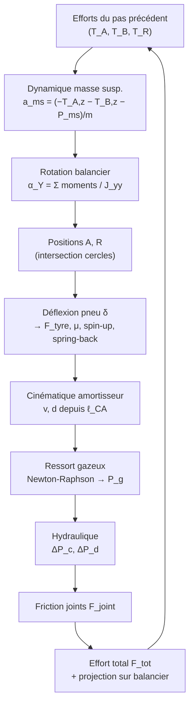

# Modèle scientifique de la simulation de drop test — train à balancier (MLG)

> Document de référence décrivant la physique et les équations implémentées dans
> le moteur de calcul `dropsim`. Il reproduit fidèlement la macro VBA d'origine
> (`DropCalcul`, classe `ClMLG`) du classeur Excel
> *DROSIM_SA61 — Simulation drop test avion complet*.

---

## 1. Objet et principe général

Le simulateur reproduit un **essai de chute** (drop test) d'un atterrisseur
principal (MLG, *Main Landing Gear*) de type **à balancier** (*levered /
trailing-arm*). Une masse représentant la part d'avion supportée par la jambe
tombe d'une hauteur donnée (vitesse verticale d'impact $V_z$) avec une vitesse
horizontale $V_x$ représentant la vitesse avion au toucher des roues. On calcule
l'évolution temporelle des efforts, courses, pressions et accélérations jusqu'à
l'enfoncement maximal et le rebond.

Le modèle couple **quatre sous-systèmes** physiques, intégrés pas à pas avec un
schéma explicite de pas de temps $\Delta t$ (sélecteur `integrator = euler|rk4`) :

| Sous-système | Loi physique dominante | Module |
|---|---|---|
| Dynamique masse suspendue + balancier | 2ᵉ loi de Newton, moment cinétique | `engine.py` |
| Ressort gazeux double chambre | Loi polytropique $PV^\gamma=\text{cte}$ | `gas.py` |
| Amortissement hydraulique | Bernoulli / perte de charge, compressibilité | `hydraulic.py`, `metering.py` |
| Pneumatique | Loi d'écrasement, adhérence de Coulomb, spin-up | `tyre.py` |
| Cinématique du mécanisme | Intersection de cercles/sphères (Newton-Raphson) | `geometry.py` |

---

## 2. Notations, abréviations et unités

### 2.1 Convention de repère

Repère train orthonormé $(X, Y, Z)$ :
- $X$ : axe longitudinal avion (sens de roulage) ;
- $Y$ : axe transversal (envergure) ;
- $Z$ : axe vertical (positif vers le haut).

Le moteur travaille **intégralement en unités SI** ; les saisies utilisateur
sont en unités d'affichage (mm, bar, cc, cSt, MPa, °, °C) et converties par
`MLGInputs.to_si()`.

### 2.2 Points géométriques du mécanisme

| Symbole | Description |
|---|---|
| $B$ | Articulation principale du balancier sur la masse suspendue (pivot) |
| $A$ | Point d'attache bas de l'amortisseur (sur le balancier) |
| $C$ | Point d'attache haut de l'amortisseur (sur la masse suspendue) |
| $R$ | Centre de la roue (extrémité du balancier) |
| $S$ | Point de contact pneu / sol |

### 2.3 Grandeurs principales

| Symbole | Grandeur | Unité SI | Unité d'affichage |
|---|---|---|---|
| $m$ | Masse suspendue supportée | kg | kg |
| $M_{ns}$ | Masse non suspendue (roue) | kg | kg |
| $V_z$ | Vitesse verticale d'impact | m·s⁻¹ | m·s⁻¹ |
| $V_x$ | Vitesse horizontale avion | m·s⁻¹ | m·s⁻¹ |
| $L$ | Coefficient de portance (*lift*), $0 \le L \le 1$ | – | – |
| $\Delta t$ | Pas de temps d'intégration | s | s |
| $g$ | Accélération de la pesanteur ($= 9{,}81$) | m·s⁻² | m·s⁻² |
| $d$ | Course de l'amortisseur (enfoncement) | m | mm |
| $v$ | Vitesse de la tige d'amortisseur | m·s⁻¹ | m·s⁻¹ |
| $J_{yy}$ | Inertie du balancier autour de $Y$ | kg·m² | kg·m² |
| $\theta_{aY}$ | Angle du bras $B\!-\!A$ autour de $Y$ | rad | rad |
| $\theta_{rY}$ | Angle du bras $B\!-\!R$ autour de $Y$ | rad | rad |
| $\delta$ | Déflexion (écrasement) du pneu | m | mm |
| $\gamma$ | Exposant polytropique du gaz | – | – |
| $\vec{T}_A,\ \vec{T}_B,\ \vec{T}_R$ | Efforts de liaison en $A$, $B$, $R$ (sur le balancier) | N | N |
| $\vec{F}_B,\ \vec{F}_C$ | Efforts transmis à la masse suspendue en $B$ (pivot), $C$ (rotule) | N | N |
| $\vec{\mathcal{R}}$ | Résultante du torseur d'effort transmis à la cellule | N | N |
| $\mathcal{M}_{B,X},\ \mathcal{M}_{B,Z}$ | Moments de liaison repris par le pivot $B$ (axes $X$ et $Z$) | N·m | N·m |

### 2.4 Géométrie de l'amortisseur

| Symbole | Description | Unité |
|---|---|---|
| $D_{pis}$ | Diamètre du piston | m (mm) |
| $D_{bh}$ | Diamètre extérieur de la bague hydraulique (BH) | m (mm) |
| $D_{ins,BH}$ | Diamètre intérieur de la butée hydraulique BH | m (mm) |
| $D_{pal}$ | Diamètre intérieur du palier BH (limite de la fuite annulaire) | m (mm) |
| $L_{bh}$ | Longueur du trou de la butée hydraulique | m (mm) |
| $L_{pal}$ | Longueur du palier BH (longueur de fuite annulaire) | m (mm) |
| $e_{exc}$ | Désaxage de la butée dans le palier BH (excentricité) | m (mm) |
| $D_t$ | Diamètre de tige | m (mm) |
| $\text{course}$ | Course totale (SAT, *Stroke At Tail*) | m (mm) |

Sections déduites (propriétés de `MLGParamsSI`) :

$$
S_c = \frac{\pi}{4}\left(D_{pis}^2 - D_{bh}^2\right), \qquad
S_d = \frac{\pi}{4}\left(D_{pis}^2 - D_t^2\right),
$$
$$
S_{bh} = \frac{\pi}{4}\,D_{bh}^2, \qquad
S_t = \frac{\pi}{4}\,D_t^2 .
$$

- $S_c$ : section de **compression** (m²) ;
- $S_d$ : section de **détente** (m²) ;
- $S_{bh}$ : section de la bague hydraulique (m²) ;
- $S_t$ : section de tige (m²).

---

## 3. Dynamique de la masse suspendue

La masse suspendue est soumise à la réaction de l'amortisseur (transmise par les
points $A$ et $B$) et à son poids apparent. La **2ᵉ loi de Newton** projetée sur
$Z$ donne l'accélération $a_{ms}$ (m·s⁻²) :

$$
a_{ms} = \frac{1}{m}\left(-T_{A,z} - T_{B,z} - P_{ms}\right)
$$

où :
- $T_{A,z}, T_{B,z}$ : composantes verticales des efforts aux liaisons $A$ et $B$ (N) ;
- $P_{ms}$ : poids apparent de la masse suspendue, déjà allégé de la portance :

$$
P_{ms} = m\, g \,(1 - L) \quad\text{[N]}
$$

Intégration explicite (vitesse $v_{ms}$ en m·s⁻¹, déplacement $z_{ms}$ en m) :

$$
v_{ms}^{\,k+1} = v_{ms}^{\,k} + a_{ms}\,\Delta t, \qquad
z_{ms}^{\,k+1} = z_{ms}^{\,k} + v_{ms}^{\,k+1}\,\Delta t
$$

La condition initiale impose $v_{ms}^{\,0} = -V_z$ (chute) et $z_{ms}^{\,0}=0$.

---

## 4. Rotation du balancier

Le balancier tourne autour de l'axe $Y$ passant par le pivot $B$. Le **théorème
du moment cinétique** projeté sur $Y$ fournit l'accélération angulaire
$\alpha_Y$ (rad·s⁻²) :

$$
\alpha_Y = \frac{1}{J_{yy}}\Big[
(A_z - B_z)\,T_{A,x} - (A_x - B_x)\,T_{A,z}
+ (R_z - B_z)\,T_{R,x} - (R_x - B_x)\,T_{R,z}
\Big]
$$

où $T_{A,x}, T_{A,z}$ sont les composantes de l'effort d'amortisseur en $A$, et
$T_{R,x}, T_{R,z}$ les composantes de l'effort pneu transmis au centre roue $R$.
Les bras de levier sont les écarts de coordonnées $(A-B)$ et $(R-B)$ (m).

Intégration de la cinématique angulaire (rad·s⁻¹, rad) :

$$
\omega_Y^{\,k+1} = \omega_Y^{\,k} + \alpha_Y\,\Delta t, \qquad
\theta_{aY}^{\,k+1} = \theta_{aY}^{\,k} + \omega_Y^{\,k+1}\,\Delta t
$$

et de même pour $\theta_{rY}$ (les deux bras tournent solidairement autour de $B$).

Positions des points $A$ et $R$ (bras rigides de longueurs planaires $\ell_{AB}$
et $\ell_{RB}$, mesurées dans le plan $X\!-\!Z$) :

$$
R_x = B_x - \ell_{RB}\sin\theta_{rY}, \qquad R_z = B_z - \ell_{RB}\cos\theta_{rY},
$$
$$
A_x = B_x - \ell_{AB}\sin\theta_{aY}, \qquad A_z = B_z - \ell_{AB}\cos\theta_{aY}.
$$

---

## 5. Cinématique de l'amortisseur

La course de l'amortisseur dérive de la distance 3D entre les points $C$ (fixe
sur la masse suspendue) et $A$ (mobile sur le balancier) :

$$
\ell_{CA} = \sqrt{(C_x - A_x)^2 + (C_y - A_y)^2 + (C_z - A_z)^2}\quad\text{[m]}
$$

La **vitesse de tige** $v$ (m·s⁻¹) et la **course** $d$ (m) sont obtenues par
différence finie sur l'entraxe :

$$
v = -\frac{\ell_{CA}^{\,k} - \ell_{CA}^{\,k-1}}{\Delta t}, \qquad
d = \ell_{CA}^{\,0} - \ell_{CA}^{\,k}
$$

avec $\ell_{CA}^{\,0}$ l'entraxe initial. L'écart $C_y - A_y$ (constant) rend
l'amortisseur **oblique** : la projection 3D réduit naturellement la part de
l'effort qui entraîne le balancier.

### 5.1 Localisation des points par intersection de cercles

À chaque pas, $A$ et $R$ sont relocalisés par **intersection de deux contraintes
de distance**, résolue par **Newton-Raphson** (module `geometry.py`). Pour $A$,
intersection de la sphère $(C, \ell_{CA})$ et du cercle $(B, \ell_{AB})$ dans le
plan $X\!-\!Z$ ($A_y$ constant) :

$$
\begin{cases}
\ell_{CA}^2 - (C_x - A_x)^2 - (C_y - A_y)^2 - (C_z - A_z)^2 = 0 \\
\ell_{AB}^2 - (B_x - A_x)^2 - (B_z - A_z)^2 = 0
\end{cases}
$$

La mise à jour de Newton s'écrit $\mathbf{x} \leftarrow \mathbf{x} - \mathbf{J}^{-1}\mathbf{f}$,
où $\mathbf{J}$ est la jacobienne $2\times2$ des résidus.

### 5.2 Attitude (pitch / roll)

L'assiette ($\theta_{pitch}$) et la gîte ($\theta_{roll}$) sont appliquées comme
une **rotation rigide** de tout le train autour du point de contact sol $S$, via
la formule de rotation de **Rodrigues** (matrice $R(\mathbf{u}, c, s)$, avec
$c=\cos$, $s=\sin$). Pour $\theta_{pitch}=\theta_{roll}=0$, la transformation est
l'identité.

---

## 6. Ressort gazeux à double chambre

L'amortisseur oléopneumatique comporte deux chambres de gaz : **basse pression**
(BP) et **haute pression** (HP). Chaque chambre suit une **loi polytropique** :

$$
P\,V^{\gamma} = \text{cte}
$$

avec $\gamma$ l'exposant polytropique (1,4 pour une compression adiabatique de
diatomique). La pression de gaz $P_g$ (Pa) et les variations de volume des deux
chambres ($\Delta V_{bp}, \Delta V_{hp}$) sont les trois inconnues d'un système
non linéaire résolu par **Newton-Raphson** (module `gas.py`).

### 6.1 Système d'équations

Inconnues : $x_0 = \Delta V_{bp}$, $x_1 = \Delta V_{hp}$, $x_2 = P_g$.

**Conservation de volume** (couplée à la compressibilité de l'huile) :

$$
f_0 = d\,S_t - \frac{V_h\,P_{gtamp}}{B} - x_0 - x_1\, \sigma(x_2) = 0
$$

**Lois polytropiques** des deux chambres :

$$
f_1 = x_2\,(V_{g,bp}^{0} - x_0)^{\gamma} - P_{bp}^{0}\,(V_{g,bp}^{0})^{\gamma} = 0
$$
$$
f_2 = x_2\,(V_{g,hp}^{0} - x_1)^{\gamma} - P_{hp}^{0}\,(V_{g,hp}^{0})^{\gamma} = 0
$$

où :
- $V_h$ : volume d'huile (m³) ;
- $B$ : module de compressibilité de l'huile (*bulk modulus*, Pa) ;
- $P_{gtamp}$ : pression tampon (Pa), pression du pas précédent ;
- $V_{g,bp}^{0}, V_{g,hp}^{0}$ : volumes de gaz initiaux BP / HP (m³) ;
- $P_{bp}^{0}, P_{hp}^{0}$ : pressions initiales BP / HP (Pa).

### 6.2 Activation lissée de la chambre HP

La chambre HP ne s'active qu'au-dessus de sa pression de tarage $P_{hp}^{0}$. Le
basculement est lissé par une fonction **arctangente** (interrupteur très raide)
de coefficient $k = 0{,}02$ :

$$
\sigma(P_g) = \frac{1}{\pi}\left[\arctan\!\big(k\,(P_g - P_{hp}^{0})\big) + \frac{\pi}{2}\right] \in [0, 1]
$$

Sa dérivée (utilisée dans la jacobienne) :

$$
\sigma'(P_g) = \frac{k}{1 + \big(k\,(P_g - P_{hp}^{0})\big)^2}
$$

L'**effort de gaz** sur la tige vaut alors :

$$
F_{gas} = S_t\,P_g \quad\text{[N]}
$$

### 6.3 Effet de la température

Avant la simulation, les paramètres de gaz et d'huile saisis à la température de
référence $T_{ref} = 25\,°\text{C}$ sont **recalculés à la température de chute**
$T$ (module `inputs.py`, reproduisant les cellules G41–G45 et O35 du classeur) :

- **loi de Gay-Lussac** (pression à volume quasi constant) :
  $\displaystyle r = \frac{T + 273{,}15}{T_{ref} + 273{,}15}$ ;
- **dilatation thermique de l'huile** : $V_h(T) = V_h\,(1 + 7\times10^{-4}\,(T - T_{ref}))$ ;
- **compensation du volume de gaz BP** : $V_{g,bp}(T) = V_{g,bp} + (V_h - V_h(T))$ ;
- **pression BP** (Gay-Lussac × correction de Boyle) :
  $\displaystyle P_{bp}(T) = P_{bp}\, r \, \frac{V_{g,bp}}{V_{g,bp}(T)}$ ;
- **pression HP** : $P_{hp}(T) = P_{hp}\, r$ ;
- **viscosité** : loi exponentielle $\nu(T) = 20\,e^{-0{,}023\,T}$ (cSt) pour $T>0$.

### 6.4 Module de compressibilité effectif avec aération

Le module de compressibilité utilisé par le moteur est calculé en deux étapes :

1. définition des paramètres de référence à $T_{ref}=25\,^{\circ}\mathrm{C}$
   (valeurs de saisie) ;
2. correction en température à $T$, puis calcul du module équivalent du mélange
   huile + gaz.

#### 6.4.1 Valeurs de référence à 25 °C

La loi de mélange (moyenne harmonique des modules) est :

$$
B_{eff} = \left(\frac{\alpha}{K_{air}} + \frac{1-\alpha}{K_{huile}}\right)^{-1}
$$

avec :
- $\alpha$ : fraction volumique de gaz (aération), en pratique saisie en % puis
  convertie en fraction ;
- $K_{air}$ : module de compressibilité équivalent de la phase gazeuse (MPa) ;
- $K_{huile}$ : module de compressibilité de l'huile non aérée (MPa).

Dans la version actuelle, les valeurs par défaut sont basées sur des données
MIL-PRF-87257 disponibles publiquement :
$\alpha = 0{,}0005$ (0,05 %), $K_{air,ref}=0{,}1$ MPa,
$K_{huile,ref}=1\,500$ MPa à 25 °C,
ce qui donne $B_{eff}(25\,^{\circ}\mathrm{C}) \approx 176{,}53$ MPa.

#### 6.4.2 Correction en température

Pour le calcul au point de fonctionnement (température de chute $T$),
`dropsim` applique les corrections suivantes :

$$
K_{air}(T) = K_{air,ref}\,\frac{T+273{,}15}{T_{ref}+273{,}15}
$$

Cette relation provient du comportement d'un gaz parfait piégé dans des
micro-volumes (bulles/aération) :

$$
B_g = -V\,\frac{dP}{dV} = n\,P_{abs}
$$

où $B_g$ est le module volumique du gaz et $n$ l'exposant polytropique
($n=1$ en isotherme, $n=\gamma$ en adiabatique). Dans ce cadre :

- à volume de gaz donné, $P_{abs}\propto T_K$ (loi des gaz parfaits,
  température absolue $T_K=T+273{,}15$) ;
- donc $B_g\propto P_{abs}\propto T_K$ ;
- en regroupant les constantes (dont $n$) dans la valeur de référence
  $K_{air,ref}$, on obtient la loi de mise à l'échelle utilisée dans le code.

Autrement dit, le modèle suppose que la **raideur volumique apparente** de la
phase gazeuse varie linéairement avec la température absolue.

Ordre de grandeur (par rapport à 25 °C) :

- à 0 °C : $K_{air}(0)/K_{air}(25) = 273{,}15/298{,}15 \approx 0{,}916$ ;
- à 40 °C : $K_{air}(40)/K_{air}(25) = 313{,}15/298{,}15 \approx 1{,}050$.

Cette dépendance est cohérente pour un modèle système 0D/1D. Elle ne représente
pas explicitement les phénomènes fins de transfert thermique local, dissolution
du gaz, ni la variation transitoire de l'exposant polytropique.

$$
K_{huile}(T) = K_{huile,ref}\,\big(1 + c_T\,(T-T_{ref})\big)
$$

où $c_T$ est la sensibilité thermique relative de $K_{huile}$ (1/°C),
paramétrable dans la saisie. Le module équivalent utilisé par la simulation est
alors :

$$
B_{eff}(T)=\left(\frac{\alpha}{K_{air}(T)}+\frac{1-\alpha}{K_{huile}(T)}\right)^{-1}
$$

Par défaut, $c_T=-0{,}00364\,\mathrm{\,^{\circ}C^{-1}}$, ce qui donne
$K_{huile}(40\,^{\circ}\mathrm{C})\approx 1\,418$ MPa, cohérent avec la valeur
typique publiée pour une huile MIL-PRF-87257 testée à 40 °C et 27,6 MPa
(4000 psig).

Le terme $\alpha$ est conservé constant avec la température dans cette version
(hypothèse de modèle système). La dynamique fine des bulles (dissolution,
cavitation transitoire, coalescence) n'est pas résolue explicitement.

#### 6.4.3 Sources

- **Source Excel de référence (implémentation historique)** :
  `DROSIM_SA61-_#Simulation drop test avion complet.xlsm`, onglets **MLG** et
  **NLG**, cellule **O36** :
  $B_{eff} = 1/(R34/R35 + (1-R34)/R36)$ ; avec **R34** (aération),
  **R35** ($K_{air}$), **R36** ($K_{huile}$).
- **Source MIL-PRF-87257 (spécification)** :
  `MIL-PRF-87257C` (public domain via Everyspec) : exigence
  $B_{iso,sec}(40\,^{\circ}\mathrm{C},27{,}6\,\mathrm{MPa})\ge 1379$ MPa.
- **Source produit qualifié MIL-PRF-87257 (valeur typique)** :
  fiche technique `RADCOLUBE FR257` (MIL-PRF-87257F), valeur typique
  $B_{iso,sec}(40\,^{\circ}\mathrm{C},27{,}6\,\mathrm{MPa})\approx 1418$ MPa.
- **Source implémentation SimuLanding** :
  `dropsim/inputs.py`, fonctions
  `compute_bulk_modulus_from_aeration` et
  `compute_bulk_modulus_at_temperature`.
- **Base physique utilisée** :
  loi des gaz parfaits (forme absolue en Kelvin) pour l'évolution de la phase
  gazeuse et loi de mélange en compressibilités de type **Wood** pour le module
  effectif d'un mélange homogène gaz-liquide (niveau 0D/1D). La dépendance en
  température de la famille MIL-PRF-87257 est documentée de manière qualitative
  dans `SAE AIR1362D` (courbes de module secant/tangent pour MIL-PRF-87257).

---

## 7. Amortissement hydraulique

L'amortissement provient de la **perte de charge** de l'huile forcée à travers
des orifices, modélisée par la relation de **Bernoulli** (orifice en paroi
mince) :

$$
\Delta P = \tfrac{1}{2}\,\rho\left(\frac{Q}{S\,C_d}\right)^2 \mathrm{sign}(Q)
$$

où :
- $\rho$ : masse volumique de l'huile (kg·m⁻³) ;
- $Q$ : débit volumique (m³·s⁻¹) ;
- $S$ : section de passage (m²) ;
- $C_d$ : coefficient de décharge (–).

### 7.1 Coefficient de décharge à deux régimes

$C_d$ dépend du nombre de **Reynolds** d'orifice et bascule entre régime
laminaire et turbulent (corrélations du classeur, module `hydraulic.py`) :

$$
C_d =
\begin{cases}
\big(2{,}28 + 64\,s/Re\big)^{-1/2} & \text{si } Re/s < 50 \quad\text{(laminaire)}\\[4pt]
\big(1{,}5 + 13{,}74\,\sqrt{s/Re}\big)^{-1/2} & \text{sinon} \quad\text{(turbulent)}
\end{cases}
$$

avec $Re$ le Reynolds de l'orifice (basé sur le diamètre équivalent) et $s$ un
paramètre d'élancement de l'orifice.

### 7.2 Compression : couplage à la compressibilité de l'huile

En **compression** ($Q_c = S_c\,v > 0$), la perte de charge $\Delta P_c$ à
travers la bague hydraulique est couplée à la compressibilité de l'huile. Le
système 2×2 sur $(P_c, Q_c)$ est résolu par Newton-Raphson (4 itérations fixes,
auto-référencé comme dans le VBA) :

$$
\begin{cases}
f_0 = Q_c - S_c\,v + \kappa\,(P_c - P_c^{ref}) = 0 \\[4pt]
f_1 = (P_c - P_g) - \tfrac{1}{2}\,\rho\,Q_c^{2}\left(\dfrac{1}{S_{bh}\,C_d}\right)^2 \mathrm{sign}(Q_c) = 0
\end{cases}
$$

avec le terme de compressibilité :

$$
\kappa = \frac{S_c\,(\text{course} - d)}{B\,\Delta t}
$$

La pression de compression vaut $P_c = P_g + \Delta P_c$ (Pa).

### 7.3 Détente : trous piston + clapet

En **détente** ($Q_d = S_d\,v < 0$), l'huile traverse à la fois les trous du
piston de détente et le clapet (diaphragme). Les pertes s'additionnent :

$$
\Delta P_d = \tfrac{1}{2}\rho\left(\frac{Q_d}{S_{diap}\,C_{d,diap}}\right)^2\!\mathrm{sign}(Q_d)
+ \tfrac{1}{2}\rho\left(\frac{Q_d}{S_{pis}\,C_{d,pis}}\right)^2\!\mathrm{sign}(Q_d)
$$

En compression du côté détente ($Q_d \ge 0$), seul le terme « piston » subsiste.
La pression de détente vaut $P_d = P_c - \Delta P_d$ (Pa). Les sections d'orifice
sont $S_{pis} = N_{pis}\,\frac{\pi}{4}D_{pis,trou}^2$ et
$S_{diap} = N_{diap}\,\frac{\pi}{4}D_{diap,trou}^2$.

### 7.4 Section variable de la bague hydraulique (metering)

> *Cette section correspond au débit principal à travers les rainures de la bague hydraulique (branche 1 du réseau parallèle décrit en §7.5).*

La section de passage $S_{bh}(d)$ varie le long de la course grâce à des
**rainures** usinées dans la bague (module `metering.py`). Pour chaque rainure,
l'aire ouverte est l'**aire d'intersection de deux disques** (« lentille ») de
rayons $r_1$ (bague) et $r_2$ (rainure) distants de $e$ :

$$
A_{lens} = r_1^2 \arccos\!\frac{e^2 + r_1^2 - r_2^2}{2\,e\,r_1}
+ r_2^2 \arccos\!\frac{e^2 + r_2^2 - r_1^2}{2\,e\,r_2}
- \tfrac{1}{2}\sqrt{\Lambda}
$$

avec
$\Lambda = (-e + r_1 + r_2)(e + r_1 - r_2)(e - r_1 + r_2)(e + r_1 + r_2)$.

Une progressivité **linéaire** est appliquée en entrée et en sortie de chaque
rainure (sur une longueur entière $L_{prog}$), et les contributions de toutes les
rainures sont sommées millimètre par millimètre puis interpolées.

### 7.5 Fuite annulaire entre le palier BH et la butée hydraulique

Une **fuite parasitaire** existe entre la surface extérieure de la butée hydraulique (diamètre $D_{bh}$) et l'alésage intérieur du palier BH (diamètre $D_{pal}$). Cette fuite forme un chemin **en parallèle** de la branche principale (rainures de la butée), sur une longueur $L_{pal}$.

#### 7.5.1 Géométrie de la section annulaire

$$
r_1 = \frac{D_{bh}}{2}, \qquad r_2 = \frac{D_{pal}}{2}, \qquad e = r_2 - r_1 \quad\text{(jeu radial)}
$$
$$
A_{ann} = \frac{\pi}{4}\left(D_{pal}^2 - D_{bh}^2\right), \qquad D_h = D_{pal} - D_{bh}
$$

La fuite n'existe que si $D_{pal} > D_{bh}$ (jeu positif).

#### 7.5.2 Loi laminaire de Hagen-Poiseuille annulaire avec correction de désaxage

Pour un écoulement laminaire dans un anneau concentrique (solution exacte de Stokes) :

$$
Q_{conc} = \frac{\pi\,\Delta P}{8\,\mu\,L_{pal}}
\left[
r_2^4 - r_1^4 - \frac{(r_2^2 - r_1^2)^2}{\ln(r_2/r_1)}
\right]
$$

où $\mu = \rho\,\nu$ est la viscosité dynamique de l'huile (Pa·s). Cette loi donne $Q_{conc}$ **linéaire en $\Delta P$**.

Approximation au jeu fin ($e \ll r_1$) :
$$
Q_{conc} \approx \frac{\pi\,D_m\,c^3}{12\,\mu\,L_{pal}}\,\Delta P, \qquad D_m = \frac{D_{pal}+D_{bh}}{2}, \quad c = r_2 - r_1
$$

**Correction de désaxage (Someya)** : si la butée est décentrée dans le palier d'une excentricité $e_{exc}$ (distance entre les axes), le débit réel est amplifié par un facteur analytique exact (solution de Stokes en anneau excentrique) :

$$
\varepsilon^* = \frac{e_{exc}}{c} \in [0, 1], \qquad f_{exc} = 1 + \frac{3}{2}\,\varepsilon^{*2}
$$

$$
Q_{fuite,lam} = Q_{conc} \times f_{exc}
$$

Cas limites :
- $\varepsilon^* = 0$ (concentrique) : $f_{exc} = 1$ (aucune correction, modèle actuel par défaut) ;
- $\varepsilon^* = 1$ (contact d'un côté) : $f_{exc} = 2{,}5$ (débit maximal $\times\,2{,}5$).

Le paramètre $e_{exc}$ se saisit en mm dans la page **Saisie** (valeur par défaut : 0, soit concentrique).

#### 7.5.3 Extension turbulente (Darcy-Weisbach)

Lorsque le nombre de Reynolds de la fuite dépasse le seuil laminaire, la loi de Hagen-Poiseuille surestime fortement le débit. On calcule d'abord le Reynolds laminaire :

$$
Re_{lam} = \frac{\rho\, V_{lam}\, D_h}{\mu}, \qquad V_{lam} = \frac{|Q_{fuite,lam}|}{A_{ann}}
$$

- Si $Re_{lam} \le 2\,000$ : régime **laminaire**, $Q_{fuite} = Q_{fuite,lam}$.
- Si $Re_{lam} \ge 4\,000$ : régime **turbulent** — le débit est calculé par inversion de Darcy-Weisbach avec le même facteur d'excentricité $f_{exc}$ :

$$
\Delta P = f\,\frac{L_{pal}}{D_h}\,\frac{\rho\,V^2}{2}
\implies
Q_{turb} = A_{ann}\sqrt{\frac{2\,\Delta P\,D_h}{\rho\,f\,L_{pal}}} \times f_{exc}
$$

Facteur de frottement de Blasius (conduite hydrauliquement lisse) :
$$
f = 0{,}3164\,Re^{-0{,}25}
$$

- Si $2\,000 < Re_{lam} < 4\,000$ : **zone transitoire**, interpolation continue :
$$
Q_{fuite} = (1-w)\,Q_{lam} + w\,Q_{turb}, \qquad w = \frac{Re_{lam} - 2\,000}{2\,000}
$$

#### 7.5.4 Réseau hydraulique parallèle en compression

Les deux branches sont soumises à la **même perte de charge** $\Delta P_c = P_c - P_g$ ; leurs débits s'additionnent :

$$
Q_c = Q_{rainures}(\Delta P_c) + Q_{fuite}(\Delta P_c)
$$

Le débit total $Q_c = S_c\,v$ est imposé par la cinématique de la tige. La fuite est donc traitée comme une branche **en parallèle** qui prélève du débit aux rainures : le débit réellement vu par les rainures BH vaut

$$
Q_{rainures}^{\text{eff}} = Q_c - Q_{fuite}(\Delta P_c)
$$

**Formulation du solveur (continuité garantie).** Plutôt que de réécrire le système avec une dérivée numérique du réseau, on **conserve strictement** la structure du Newton-Raphson 2×2 de la compression sans fuite (§7.2). Seule la relation orifice $f_1$ est modifiée en remplaçant $Q_c$ par $Q_{rainures}^{\text{eff}} = Q_c - Q_{fuite}$ :

$$
f_1 = (P_c - P_g) - \tfrac{1}{2}\,\rho \left(\frac{Q_c - Q_{fuite}(\Delta P_c)}{S_{bh}\,C_d}\right)^{2}\operatorname{sign}\!\left(Q_c - Q_{fuite}\right) = 0
$$

La jacobienne reste **analytique** et identique à celle du modèle historique (à la substitution $Q_c \to Q_c - Q_{fuite}$ près) :

$$
J_{11} = \frac{\partial f_1}{\partial Q_c} = -\,(Q_c - Q_{fuite})\,\rho\,(S_{bh}C_d)^{-2}\,\operatorname{sign}\!\left(Q_c - Q_{fuite}\right)
$$

Le débit de fuite $Q_{fuite}(\Delta P_c)$ (§7.5.2–7.5.3, laminaire/transition/turbulent) est évalué à la perte de charge courante de l'itération. Comparée à la branche sans fuite, **seule la substitution $Q_c \to Q_c - Q_{fuite}$ dans $f_1$ et $J_{11}$ diffère** ; tout le reste du schéma auto-référent (4 itérations fixes, mise à jour de $\Delta P_c$) est inchangé.

> **Pourquoi cette formulation et pas $f_1 = Q_c - Q_{reseau}$ ?** La version précédente posait $f_1 = Q_c - Q_{reseau}(\Delta P_c)$ avec une jacobienne **numérique** (différences finies). Cette formulation transposée ne se réduisait **pas** au modèle historique lorsque $Q_{fuite}\to 0$ et n'était pas convergée en 4 itérations : pour une fuite quasi nulle, $\Delta P_c$ sautait de ~25 % (3,20 → 2,40 bar) par simple changement de branche de code. La formulation actuelle élimine ce défaut.

**Jacobienne complète (sensibilité de la fuite à la pression).** Le résidu $f_1$ dépend de l'inconnue $P_c$ (donc de $\Delta P_c = P_c - P_g$) **par deux voies** : directement par le terme $(P_c - P_g)$, et indirectement parce que la fuite $Q_{fuite}(\Delta P_c)$ retranche du débit rainures. La dérivée correcte est donc

$$
J_{10} = \frac{\partial f_1}{\partial P_c}
= 1 + \rho\,(S_{bh}C_d)^{-2}\,\lvert Q_c - Q_{fuite}\rvert\,\frac{\partial Q_{fuite}}{\partial \Delta P_c}
$$

où $\partial Q_{fuite}/\partial \Delta P_c$ est estimée par différence finie centrée. **Sans ce terme** (jacobienne supposant la fuite constante pendant le pas, $J_{10}=1$), le Newton-Raphson **diverge** dès que la fuite devient dominante ($Q_{rainures}^{\text{eff}}\to 0$ en fin de course à haute pression) : il prédit un débit de fuite supérieur au débit fourni par la tige, $Q_{rainures}^{\text{eff}}$ devient fortement négatif et $\Delta P_c$ explose (plusieurs milliers de bar — effort hydraulique parasite de plusieurs centaines de kN). En incluant $\partial Q_{fuite}/\partial \Delta P_c$ dans $J_{10}$, le solveur reste **stable et physique** sur toute la course. Lorsque $Q_{fuite}\to 0$, ce terme s'annule ($J_{10}\to 1$) et l'on retombe **exactement** sur le schéma historique (continuité préservée, tests de non-régression sans fuite inchangés).

Le partage des débits, le rapport $Q_{fuite}/Q_c$ et le Reynolds de fuite sont enregistrés par le moteur (colonnes `Hydrau.Qc rainures BH`, `Hydrau.Qc fuite annulaire`, `Hydrau.Part fuite`, `Hydrau.Re fuite annulaire`).

> **Non-régression** : si $D_{pal} \le D_{bh}$ (jeu nul ou négatif), la branche fuite est supprimée et le calcul revient exactement au modèle historique (§7.2 sans modification). Grâce à la formulation par substitution, la **continuité est aussi assurée à jeu non nul** : lorsque $Q_{fuite}\to 0$ (jeu très fin ou palier très long), $\Delta P_c$ tend continûment vers la valeur du modèle historique.

### 7.6 Étude de tolérances mini/maxi de la loi hydraulique

La page **Loi hydraulique** calcule la carte $F_{tot}(d,v)$ pour trois cas :

1. **Nominal** : dimensions issues de la saisie ;
2. **Tolérance mini** : cas défavorable avec fuite accrue et rainures réduites ;
3. **Tolérance maxi** : cas opposé avec fuite réduite et rainures accrues.

On note les dimensions nominales :

- $D_{pal,0}$ : diamètre intérieur palier BH ;
- $D_{bh,0}$ : diamètre extérieur butée hydraulique (BH) ;
- $p_{i,0}$ : profondeur de la rainure $i$.

et les tolérances saisies (en valeur absolue, positives) :

- $\Delta D_{pal}$ ;
- $\Delta D_{bh}$ ;
- $\Delta p$.

Les cas sont construits par :

$$
	ext{Nominal}:
\begin{cases}
D_{pal}=D_{pal,0}\\
D_{bh}=D_{bh,0}\\
p_i=p_{i,0}
\end{cases}
$$

$$
	ext{Tolérance mini}:
\begin{cases}
D_{pal}=D_{pal,0}+\Delta D_{pal}\\
D_{bh}=D_{bh,0}-\Delta D_{bh}\\
p_i=\max(0,\,p_{i,0}-\Delta p)
\end{cases}
$$

$$
	ext{Tolérance maxi}:
\begin{cases}
D_{pal}=D_{pal,0}-\Delta D_{pal}\\
D_{bh}=D_{bh,0}+\Delta D_{bh}\\
p_i=p_{i,0}+\Delta p
\end{cases}
$$

Interprétation physique :

- **Tolérance mini** augmente le jeu annulaire $D_{pal}-D_{bh}$ et diminue les
  profondeurs de rainures : c'est en général un cas de plus forte sensibilité à
  la fuite ;
- **Tolérance maxi** réduit le jeu annulaire et augmente les profondeurs de
  rainures : cas opposé.

Pour chaque cas, le moteur de la page recalcule intégralement :

- la table de section des rainures $S_{bh}(d)$ ;
- les pertes hydrauliques (compression/détente, branche rainures + fuite
  annulaire) ;
- l'effort total $F_{tot}(d,v)$ sur la grille de vitesses (−1 à +3 m/s) et de
  course (pas 1 mm).

Remarque importante : dans cette version, les profondeurs de rainures utilisées
au calcul sont saturées au rayon de bague ($p_i \le D_{bh}/2$).

---

## 8. Effort de friction des joints

La friction des joints d'étanchéité s'oppose au mouvement de la tige. Elle
combine un terme de **friction sèche** (Coulomb, proportionnel au périmètre de
tige) et un terme **proportionnel à la pression** (la pression plaque la lèvre du
joint contre la tige) :

$$
F_{joint} = \mathrm{sign}(v)\;c_{atte}(v)\left[
f_c\,D_t\,\pi \;+\; f_h\,P_d\,\frac{\pi}{4}\big(A_{seal}^2 - D_t^2\big)
\right]
$$

où :
- $f_c$ : coefficient de friction sèche (N·m⁻¹, saisi en N·mm⁻¹) ;
- $f_h$ : coefficient de friction lié à la pression (–) ;
- $P_d$ : pression de détente vue par le joint (Pa) ;
- $D_t$ : diamètre de tige (m) ;
- $A_{seal}$ : diamètre effectif du joint (m), déduit de la section du tore :
  $A_{seal} = D_t + 2\,\text{tore}$ ;
- $c_{atte}(v)$ : **coefficient d'atténuation** dépendant de la vitesse (effet de
  Stribeck) :

$$
c_{atte}(v) = \frac{1}{\sqrt{0{,}95 + 0{,}28\sqrt{\dfrac{1}{90\,|v|}}}}
$$

Le terme annulaire $\frac{\pi}{4}(A_{seal}^2 - D_t^2)$ représente l'aire de
contact effective du joint sur laquelle agit la pression.

---

## 9. Effort total de l'amortisseur

L'effort axial total transmis par l'amortisseur résulte de la somme des
contributions de pression (compression, détente, gaz) et de friction, avec une
**butée de fin de course lissée** (active hors de l'intervalle
$[0, \text{course}]$) :

$$
F_{tot} = S_c\,P_c - S_d\,P_d + S_{bh}\,P_g + F_{joint} + F_{butée}(d)
$$

avec

$$
F_{butée}(d) =
\begin{cases}
0 & \text{si } 0 \le d \le \text{course} \\
\phantom{-}K\,x\left(1-e^{-x/s}\right) & \text{si } d > \text{course},\ x=d-\text{course} \\
-K\,x\left(1-e^{-x/s}\right) & \text{si } d < 0,\ x=-d
\end{cases}
$$

où :

- $K = 10^{8}\ \text{N·m}^{-1}$ est la raideur asymptotique ;
- $s$ est une longueur de lissage (paramètre utilisateur,
  `endstop_smooth_mm`, 2 mm par défaut).

Cette loi conserve la même asymptote qu'une butée linéaire en grande
pénétration, tout en imposant une pente nulle à l'entrée en contact pour réduire
les chocs numériques. Le mode historique « butée linéaire pure » n'est plus
utilisé.

L'**effort hydraulique** isolé (sans gaz ni friction) vaut :

$$
F_{hyd} = S_c\,(P_c - P_g) - S_d\,(P_d - P_g) \quad\text{[N]}
$$

### 9.1 Projection sur le balancier

L'effort $F_{tot}$ est projeté sur les trois axes via les cosinus directeurs de
l'amortisseur $C\!-\!A$ (division par l'entraxe réel, d'où la réduction
automatique en configuration oblique) :

$$
T_{A,z} = -F_{tot}\,\frac{C_z - A_z}{\ell_{CA}},\quad
T_{A,y} = -F_{tot}\,\frac{C_y - A_y}{\ell_{CA}},\quad
T_{A,x} = -F_{tot}\,\frac{C_x - A_x}{\ell_{CA}}
$$

Les efforts au pivot $B$ se déduisent de l'équilibre :
$T_{B,x} = -T_{A,x} - T_{R,x}$, etc.

### 9.2 Torseur d'effort transmis à la masse suspendue (points $B$ et $C$)

Le balancier et l'amortisseur (sous-système supposé de masse négligeable devant
la masse suspendue) relient le sol à la **masse suspendue** par **deux liaisons**
de natures différentes :

- en $C$ : la **tête d'amortisseur** est une **rotule** (liaison sphérique).
  Une rotule ne transmet **qu'un effort**, sans aucun moment ;
- en $B$ : le **pivot du balancier** est une **liaison pivot** d'axe $Y$. Le
  pivot reprend l'**effort de liaison** et les **moments autour de $X$ et de
  $Z$**. En revanche, l'axe $Y$ étant l'axe de rotation libre de la liaison, le
  pivot **ne transmet aucun moment autour de $Y$**.

Par le principe d'action–réaction (3ᵉ loi de Newton), les efforts appliqués
**par le train sur la masse suspendue** sont les opposés des efforts de liaison
calculés sur le balancier :

$$
\vec{F}_C = -\,\vec{T}_A \quad\text{(rotule en } C\text{)}, \qquad
\vec{F}_B = -\,\vec{T}_B \quad\text{(pivot en } B\text{)}.
$$

#### Résultante

La résultante du torseur est la somme des deux efforts de liaison :

$$
\vec{\mathcal{R}} = \vec{F}_B + \vec{F}_C
= -(\vec{T}_B + \vec{T}_A) = \vec{T}_R,
$$

car $\vec{T}_B = -\vec{T}_A - \vec{T}_R$. Autrement dit, **la résultante
transmise à la cellule est exactement la réaction sol** $\vec{T}_R$ (force au
centre roue $R$ ramenée à la structure) — propriété utilisée comme contrôle de
cohérence du modèle.

#### Moment de liaison au pivot $B$

Le moment repris par le pivot se calcule par **équilibre du balancier**, à partir
des efforts qui agissent **réellement sur ce corps** : l'effort d'amortisseur
$\vec{T}_A$ appliqué en $A$ et la réaction sol $\vec{T}_R$ appliquée en $R$,
réduits au point $B$ (bras $\vec{BA}$ et $\vec{BR}$). On **n'utilise pas**
l'effort $\vec{F}_C$ en $C$, qui s'applique sur la cellule et non sur le
balancier. Le moment des efforts du balancier réduit en $B$ vaut :

$$
\vec{\mathcal{M}}_B = \vec{BA}\times\vec{T}_A + \vec{BR}\times\vec{T}_R
= (A - B)\times\vec{T}_A + (R - B)\times\vec{T}_R .
$$

Une **liaison pivot d'axe $Y$ ne peut transmettre aucun moment autour de $Y$** :
cet axe est la direction de rotation libre du balancier. La composante selon $Y$
de $\vec{\mathcal{M}}_B$ n'est donc **pas** reprise par la liaison ; elle est
équilibrée par la **dynamique de rotation du balancier** (accélération angulaire
$\alpha_Y$ et inertie $J_{YY}$, cf. §8). Le pivot ne réagit que les **moments
autour de $X$ et de $Z$**. En notant $\vec{BA} = (a_x, a_y, a_z)$ et
$\vec{BR} = (r_x, r_y, r_z)$ :

$$
\mathcal{M}_{B,X} = (a_y\,T_{A,z} - a_z\,T_{A,y}) + (r_y\,T_{R,z} - r_z\,T_{R,y}),
$$

$$
\mathcal{M}_{B,Z} = (a_x\,T_{A,y} - a_y\,T_{A,x}) + (r_x\,T_{R,y} - r_y\,T_{R,x}).
$$

Ces grandeurs — résultante $\vec{\mathcal{R}}$, effort de rotule $\vec{F}_C$,
effort de pivot $\vec{F}_B$ et moments de pivot $\mathcal{M}_{B,X}$ et
$\mathcal{M}_{B,Z}$ — sont
exportées par le moteur (préfixe `Torseur…`) et tracées dans l'onglet
**Torseur B & C** de la page Résultats. Elles fournissent les **charges
d'interface** servant au dimensionnement des attaches de l'atterrisseur sur la
cellule.

---

## 10. Modèle de pneumatique

### 10.1 Déflexion et effort vertical

La **déflexion** (écrasement) du pneu est l'enfoncement du centre roue $R$ sous
le niveau correspondant au rayon libre :

$$
\delta = R_{0} - (R_z - S_z) \quad\text{[m]}
$$

où $R_0$ est le rayon libre du pneu. L'**effort vertical** $F_{tyre}$ (N) est
interpolé linéairement sur la table expérimentale déflexion → charge :

$$
F_{tyre}(\delta) = L_i + (\delta - \delta_i)\,\frac{L_{i+1} - L_i}{\delta_{i+1} - \delta_i},
\quad \delta_i \le \delta < \delta_{i+1}
$$

Le **rayon effectif** sous charge vaut :

$$
R_{eff} = R_0 - \frac{\delta}{3} \quad\text{[m]}
$$

### 10.2 Adhérence, spin-up et spring-back

Au toucher des roues, la roue immobile est mise en rotation par friction avec le
sol (**spin-up**). Le **taux de glissement** (*slip ratio*) est :

$$
s = \frac{V_x - \Omega\,R_{eff}}{|V_x|}
$$

où $\Omega$ est la vitesse de rotation de la roue (rad·s⁻¹). Le **coefficient
d'adhérence** $\mu$ est interpolé sur la table $\mu(s)$, avec un facteur de
réduction dynamique $0{,}55$ :

$$
\mu(s) = 0{,}55\left[\mu_i + (|s| - s_i)\,\frac{\mu_{i+1} - \mu_i}{s_{i+1} - s_i}\right]
$$

L'**effort de spin-up** (friction longitudinale) vaut :

$$
F_{spin} = \mu(s)\,F_{tyre}\,\mathrm{sign}(s) \quad\text{[N]}
$$

et accélère la roue en rotation (théorème du moment cinétique, inertie polaire
$J$ kg·m²) :

$$
\dot\Omega = \frac{F_{spin}\,(R_0 - \delta)}{J}, \qquad
\Omega^{k+1} = \Omega^{k} + \dot\Omega\,\Delta t
$$

Le **spring-back** (rappel élastique horizontal du pneu après le spin-up) est
modélisé par un système masse–ressort–amortisseur de raideur $k_x$ (N·m⁻¹) et
d'amortissement $c_x$ (N·s·m⁻¹) :

$$
F_x = k_x\,\delta_x + c_x\,\dot\delta_x \quad\text{[N]}
$$

avec la dynamique de la masse roue $M_{roue}$ :

$$
\ddot\delta_x = \frac{-F_x + F_{spin}}{M_{roue}},\qquad
\dot\delta_x^{k+1} = \dot\delta_x^{k} + \ddot\delta_x\,\Delta t,\qquad
\delta_x^{k+1} = \delta_x^{k} + \dot\delta_x^{k+1}\,\Delta t
$$

L'effort horizontal transmis au centre roue est $T_{R,x} = k_x\,\delta_x + c_x\,\dot\delta_x$.

> **Bilan énergétique du spin-up (diagnostic).** L'énergie puisée dans
> l'avancement par la friction de contact, $\sum F_{spin}\,V_x\,\Delta t$, se
> répartit en quatre parts comptabilisées par le bilan énergétique
> (cf. *Améliorations §5.2*) :
> $$
> \underbrace{F_{spin}\,V_x\,\Delta t}_{\text{apport avancement}}
> = \underbrace{\tfrac{1}{2} J(\Omega^2 - \Omega_0^2)}_{\text{rotation roue}}
> + \underbrace{F_{spin}\,\dot\delta_x\,\Delta t}_{\text{translation roue}}
> + \underbrace{T_{R,x}\,\dot x_R\,\Delta t}_{\text{couplage balancier}}
> + \underbrace{E_{glis}}_{\text{chaleur de glissement}}
> $$
> Le terme de **couplage balancier** $T_{R,x}\,\dot x_R$ traduit le travail de
> l'effort longitudinal sur le moyeu $R$ lorsque le balancier pivote
> ($\dot x_R = \mathrm{d}x_R/\mathrm{d}t$) : l'effort de contact pousse le moyeu
> horizontalement et injecte de l'énergie dans le mécanisme. Le gain de rotation
> est évalué par sa **variation exacte** $\tfrac{1}{2} J(\Omega^2 - \Omega_0^2)$
> (et non $F_{spin}(R_0-\delta)\,\Omega\,\Delta t$) car le couple de spin-up est
> quasi-impulsionnel. Avec cette comptabilité complète, le résidu de bilan se
> réduit à l'erreur d'intégration d'Euler ($\sim 0{,}3\,\%$ de l'énergie
> d'impact, décroissant avec $\Delta t$).

---

## 11. Initialisation : stabilisation statique

Avant la phase dynamique, l'amortisseur est amené à son **équilibre statique**
sous le seul effort de gaz (perte de charge nulle car $v = 0$, donc $F_{joint}=0$).
On recherche la course $d$ telle que :

$$
F_{tot}(d) = S_t\,P_g(d) + F_{butée}(d) \approx 0
$$

par décréments successifs de $d$ ($\Delta d = -10^{-8}$ m), jusqu'à
$|F_{tot}| < 1\ \text{N}$.

---

## 12. Schéma d'intégration temporelle

L'ensemble est intégré par schéma explicite de la séquence suivante, répétée sur
$N = \lfloor T_{simu} / \Delta t \rfloor$ pas :

Le pas de temps typique est $\Delta t = 10^{-4}\ \text{s}$ ; la stabilité du
schéma explicite impose un pas suffisamment petit devant les constantes de temps
hydrauliques et de butée.

**Portée actuelle du sélecteur d'intégrateur** :
- `euler` : comportement historique (Euler explicite d'ordre 1) ;
- `rk4` : intégration d'ordre supérieur activée sur les sous-équations
  cinématiques où l'accélération est tenue constante pendant le pas
  (translation masse suspendue, rotation balancier, spring-back), avec
  évaluation couplée gaz/hydraulique sur 4 stages RK4 le long de la trajectoire
  locale du pas.

**Solveur noyau gaz/hydraulique (optionnel)** :
- `legacy` : chemin historique explicite ;
- `implicit_adaptive` : tentative de résolution implicite locale en fin de
  sous-pas avec raffinement adaptatif (estimateur 1 sous-pas vs 2 demi-sous-pas)
  sur le noyau gaz/hydraulique.

La mémoire interne hydraulique/gaz est toutefois réinjectée au niveau du pas
global (mise à jour en fin de pas), ce qui reste un compromis pragmatique :
amélioration de la cohérence intra-pas sans basculer vers un solveur implicite
ou adaptatif fully-coupled sur toutes les variables internes.

---

## 13. Grandeurs de synthèse

À l'issue du calcul, les indicateurs caractéristiques (reproduisant l'onglet
*Summary MLG*, plage B46:C61) sont extraits :

| Grandeur | Définition | Unité |
|---|---|---|
| Fx / Fz Spin up | Efforts à l'instant $\arg\max F_x$ | N |
| Fx / Fz Spring back | Efforts à l'instant $\arg\min F_x$ | N |
| Fz Max | Effort vertical pneu maximal | N |
| Stroke … | Course $d$ aux instants ci-dessus | mm |
| Max damper velocity | $\max v$ | m·s⁻¹ |
| Max gas / comp / rebound pressure | $\max P_g$, $\max P_c$, $\max P_d$ | bar |
| Max vertical acc | $\max\lvert a_{ms}\rvert / g$ | g |
| Ground load factor | $\displaystyle \frac{F_{z,max}}{g\,m}$ | – |
| Load factor | $\text{Ground load factor} + L$ | – |

Le **facteur de charge sol** (*ground load factor*) rapporte l'effort vertical
maximal au poids statique ; le **facteur de charge** y ajoute la portance.

---

## 14. Hypothèses et limites du modèle

- **Intégration explicite** : pas de temps borné par la stabilité ; pas
  d'adaptation automatique. Le mode `rk4` améliore le couplage intra-pas, mais
  ne remplace pas encore un schéma fully-coupled implicite/adaptatif sur toutes
  les variables internes (gaz/hydraulique).
- **Mode implicite/adaptatif noyau** : activable pour étude numérique, mais non
  retenu comme défaut à ce stade (coût CPU supérieur sur le cas nominal).
- **Mécanisme plan** : la rotation du balancier est traitée dans le plan
  $X\!-\!Z$ ; l'obliquité en $Y$ est prise en compte uniquement par projection de
  l'effort d'amortisseur.
- **Tables expérimentales** : le pneu (déflexion/charge, $\mu$/glissement) et la
  loi de metering reposent sur des données tabulées interpolées linéairement.
- **Friction des joints** : modèle semi-empirique (Coulomb + pression) calé sur
  le classeur d'origine ; le terme de pression n'est actif que si
  $A_{seal} > D_t$.
- **Compressibilité** : le module effectif $B_{eff}$ tient compte de l'aération
  via une loi de mélange (huile + gaz) ; c'est une formulation standard des
  modèles systèmes. En revanche, la dynamique fine des bulles (coalescence,
  dissolution, cavitation transitoire) n'est pas résolue explicitement.
- **Fuite annulaire** : l'écoulement annulaire est supposé **axisymétrique, établi et unidirectionnel** (pas d'effet d'entrée). En régime turbulent, la corrélation de Blasius est valable pour $Re < 10^5$ environ (conduite lisse) ; pour une rugosité significative du palier, la loi de Colebrook-White serait plus précise. La transition laminaire-turbulent est lissée mais reste une approximation.

---

*Document généré pour le projet SimuLanding — modèle `dropsim`. Les équations
ci-dessus correspondent une à une aux implémentations des modules `engine.py`,
`gas.py`, `hydraulic.py`, `metering.py`, `tyre.py`, `geometry.py` et
`inputs.py`.*
