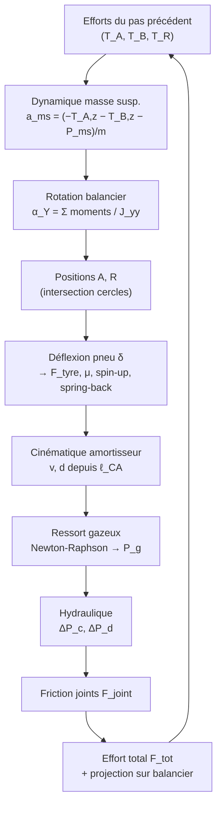

# Modèle scientifique de la simulation de drop test — train à balancier (MLG)

> Document de référence décrivant la physique et les équations implémentées dans
> le moteur de calcul `dropsim`. Il reproduit fidèlement la macro VBA d'origine
> (`DropCalcul`, classe `ClMLG`) du classeur Excel
> *DROSIM_SA61 — Simulation drop test avion complet*.

---

## 1. Objet et principe général

Le simulateur reproduit un **essai de chute** (drop test) d'un atterrisseur
principal (MLG, *Main Landing Gear*) de type **à balancier** (*levered /
trailing-arm*). Une masse représentant la part d'avion supportée par la jambe
tombe d'une hauteur donnée (vitesse verticale d'impact $V_z$) avec une vitesse
horizontale $V_x$ représentant la vitesse avion au toucher des roues. On calcule
l'évolution temporelle des efforts, courses, pressions et accélérations jusqu'à
l'enfoncement maximal et le rebond.

Le modèle couple **quatre sous-systèmes** physiques, intégrés pas à pas par un
schéma d'**Euler explicite** de pas de temps $\Delta t$ :

| Sous-système | Loi physique dominante | Module |
|---|---|---|
| Dynamique masse suspendue + balancier | 2ᵉ loi de Newton, moment cinétique | `engine.py` |
| Ressort gazeux double chambre | Loi polytropique $PV^\gamma=\text{cte}$ | `gas.py` |
| Amortissement hydraulique | Bernoulli / perte de charge, compressibilité | `hydraulic.py`, `metering.py` |
| Pneumatique | Loi d'écrasement, adhérence de Coulomb, spin-up | `tyre.py` |
| Cinématique du mécanisme | Intersection de cercles/sphères (Newton-Raphson) | `geometry.py` |

---

## 2. Notations, abréviations et unités

### 2.1 Convention de repère

Repère train orthonormé $(X, Y, Z)$ :
- $X$ : axe longitudinal avion (sens de roulage) ;
- $Y$ : axe transversal (envergure) ;
- $Z$ : axe vertical (positif vers le haut).

Le moteur travaille **intégralement en unités SI** ; les saisies utilisateur
sont en unités d'affichage (mm, bar, cc, cSt, MPa, °, °C) et converties par
`MLGInputs.to_si()`.

### 2.2 Points géométriques du mécanisme

| Symbole | Description |
|---|---|
| $B$ | Articulation principale du balancier sur la masse suspendue (pivot) |
| $A$ | Point d'attache bas de l'amortisseur (sur le balancier) |
| $C$ | Point d'attache haut de l'amortisseur (sur la masse suspendue) |
| $R$ | Centre de la roue (extrémité du balancier) |
| $S$ | Point de contact pneu / sol |

### 2.3 Grandeurs principales

| Symbole | Grandeur | Unité SI | Unité d'affichage |
|---|---|---|---|
| $m$ | Masse suspendue supportée | kg | kg |
| $M_{ns}$ | Masse non suspendue (roue) | kg | kg |
| $V_z$ | Vitesse verticale d'impact | m·s⁻¹ | m·s⁻¹ |
| $V_x$ | Vitesse horizontale avion | m·s⁻¹ | m·s⁻¹ |
| $L$ | Coefficient de portance (*lift*), $0 \le L \le 1$ | – | – |
| $\Delta t$ | Pas de temps d'intégration | s | s |
| $g$ | Accélération de la pesanteur ($= 9{,}81$) | m·s⁻² | m·s⁻² |
| $d$ | Course de l'amortisseur (enfoncement) | m | mm |
| $v$ | Vitesse de la tige d'amortisseur | m·s⁻¹ | m·s⁻¹ |
| $J_{yy}$ | Inertie du balancier autour de $Y$ | kg·m² | kg·m² |
| $\theta_{aY}$ | Angle du bras $B\!-\!A$ autour de $Y$ | rad | rad |
| $\theta_{rY}$ | Angle du bras $B\!-\!R$ autour de $Y$ | rad | rad |
| $\delta$ | Déflexion (écrasement) du pneu | m | mm |
| $\gamma$ | Exposant polytropique du gaz | – | – |

### 2.4 Géométrie de l'amortisseur

| Symbole | Description | Unité |
|---|---|---|
| $D_{pis}$ | Diamètre du piston | m (mm) |
| $D_{bh}$ | Diamètre de la bague hydraulique (BH) | m (mm) |
| $D_t$ | Diamètre de tige | m (mm) |
| $\text{course}$ | Course totale (SAT, *Stroke At Tail*) | m (mm) |

Sections déduites (propriétés de `MLGParamsSI`) :

$$
S_c = \frac{\pi}{4}\left(D_{pis}^2 - D_{bh}^2\right), \qquad
S_d = \frac{\pi}{4}\left(D_{pis}^2 - D_t^2\right),
$$
$$
S_{bh} = \frac{\pi}{4}\,D_{bh}^2, \qquad
S_t = \frac{\pi}{4}\,D_t^2 .
$$

- $S_c$ : section de **compression** (m²) ;
- $S_d$ : section de **détente** (m²) ;
- $S_{bh}$ : section de la bague hydraulique (m²) ;
- $S_t$ : section de tige (m²).

---

## 3. Dynamique de la masse suspendue

La masse suspendue est soumise à la réaction de l'amortisseur (transmise par les
points $A$ et $B$) et à son poids apparent. La **2ᵉ loi de Newton** projetée sur
$Z$ donne l'accélération $a_{ms}$ (m·s⁻²) :

$$
a_{ms} = \frac{1}{m}\left(-T_{A,z} - T_{B,z} - P_{ms}\right)
$$

où :
- $T_{A,z}, T_{B,z}$ : composantes verticales des efforts aux liaisons $A$ et $B$ (N) ;
- $P_{ms}$ : poids apparent de la masse suspendue, déjà allégé de la portance :

$$
P_{ms} = m\, g \,(1 - L) \quad\text{[N]}
$$

Intégration explicite (vitesse $v_{ms}$ en m·s⁻¹, déplacement $z_{ms}$ en m) :

$$
v_{ms}^{\,k+1} = v_{ms}^{\,k} + a_{ms}\,\Delta t, \qquad
z_{ms}^{\,k+1} = z_{ms}^{\,k} + v_{ms}^{\,k+1}\,\Delta t
$$

La condition initiale impose $v_{ms}^{\,0} = -V_z$ (chute) et $z_{ms}^{\,0}=0$.

---

## 4. Rotation du balancier

Le balancier tourne autour de l'axe $Y$ passant par le pivot $B$. Le **théorème
du moment cinétique** projeté sur $Y$ fournit l'accélération angulaire
$\alpha_Y$ (rad·s⁻²) :

$$
\alpha_Y = \frac{1}{J_{yy}}\Big[
(A_z - B_z)\,T_{A,x} - (A_x - B_x)\,T_{A,z}
+ (R_z - B_z)\,T_{R,x} - (R_x - B_x)\,T_{R,z}
\Big]
$$

où $T_{A,x}, T_{A,z}$ sont les composantes de l'effort d'amortisseur en $A$, et
$T_{R,x}, T_{R,z}$ les composantes de l'effort pneu transmis au centre roue $R$.
Les bras de levier sont les écarts de coordonnées $(A-B)$ et $(R-B)$ (m).

Intégration de la cinématique angulaire (rad·s⁻¹, rad) :

$$
\omega_Y^{\,k+1} = \omega_Y^{\,k} + \alpha_Y\,\Delta t, \qquad
\theta_{aY}^{\,k+1} = \theta_{aY}^{\,k} + \omega_Y^{\,k+1}\,\Delta t
$$

et de même pour $\theta_{rY}$ (les deux bras tournent solidairement autour de $B$).

Positions des points $A$ et $R$ (bras rigides de longueurs planaires $\ell_{AB}$
et $\ell_{RB}$, mesurées dans le plan $X\!-\!Z$) :

$$
R_x = B_x - \ell_{RB}\sin\theta_{rY}, \qquad R_z = B_z - \ell_{RB}\cos\theta_{rY},
$$
$$
A_x = B_x - \ell_{AB}\sin\theta_{aY}, \qquad A_z = B_z - \ell_{AB}\cos\theta_{aY}.
$$

---

## 5. Cinématique de l'amortisseur

La course de l'amortisseur dérive de la distance 3D entre les points $C$ (fixe
sur la masse suspendue) et $A$ (mobile sur le balancier) :

$$
\ell_{CA} = \sqrt{(C_x - A_x)^2 + (C_y - A_y)^2 + (C_z - A_z)^2}\quad\text{[m]}
$$

La **vitesse de tige** $v$ (m·s⁻¹) et la **course** $d$ (m) sont obtenues par
différence finie sur l'entraxe :

$$
v = -\frac{\ell_{CA}^{\,k} - \ell_{CA}^{\,k-1}}{\Delta t}, \qquad
d = \ell_{CA}^{\,0} - \ell_{CA}^{\,k}
$$

avec $\ell_{CA}^{\,0}$ l'entraxe initial. L'écart $C_y - A_y$ (constant) rend
l'amortisseur **oblique** : la projection 3D réduit naturellement la part de
l'effort qui entraîne le balancier.

### 5.1 Localisation des points par intersection de cercles

À chaque pas, $A$ et $R$ sont relocalisés par **intersection de deux contraintes
de distance**, résolue par **Newton-Raphson** (module `geometry.py`). Pour $A$,
intersection de la sphère $(C, \ell_{CA})$ et du cercle $(B, \ell_{AB})$ dans le
plan $X\!-\!Z$ ($A_y$ constant) :

$$
\begin{cases}
\ell_{CA}^2 - (C_x - A_x)^2 - (C_y - A_y)^2 - (C_z - A_z)^2 = 0 \\
\ell_{AB}^2 - (B_x - A_x)^2 - (B_z - A_z)^2 = 0
\end{cases}
$$

La mise à jour de Newton s'écrit $\mathbf{x} \leftarrow \mathbf{x} - \mathbf{J}^{-1}\mathbf{f}$,
où $\mathbf{J}$ est la jacobienne $2\times2$ des résidus.

### 5.2 Attitude (pitch / roll)

L'assiette ($\theta_{pitch}$) et la gîte ($\theta_{roll}$) sont appliquées comme
une **rotation rigide** de tout le train autour du point de contact sol $S$, via
la formule de rotation de **Rodrigues** (matrice $R(\mathbf{u}, c, s)$, avec
$c=\cos$, $s=\sin$). Pour $\theta_{pitch}=\theta_{roll}=0$, la transformation est
l'identité.

---

## 6. Ressort gazeux à double chambre

L'amortisseur oléopneumatique comporte deux chambres de gaz : **basse pression**
(BP) et **haute pression** (HP). Chaque chambre suit une **loi polytropique** :

$$
P\,V^{\gamma} = \text{cte}
$$

avec $\gamma$ l'exposant polytropique (1,4 pour une compression adiabatique de
diatomique). La pression de gaz $P_g$ (Pa) et les variations de volume des deux
chambres ($\Delta V_{bp}, \Delta V_{hp}$) sont les trois inconnues d'un système
non linéaire résolu par **Newton-Raphson** (module `gas.py`).

### 6.1 Système d'équations

Inconnues : $x_0 = \Delta V_{bp}$, $x_1 = \Delta V_{hp}$, $x_2 = P_g$.

**Conservation de volume** (couplée à la compressibilité de l'huile) :

$$
f_0 = d\,S_t - \frac{V_h\,P_{gtamp}}{B} - x_0 - x_1\, \sigma(x_2) = 0
$$

**Lois polytropiques** des deux chambres :

$$
f_1 = x_2\,(V_{g,bp}^{0} - x_0)^{\gamma} - P_{bp}^{0}\,(V_{g,bp}^{0})^{\gamma} = 0
$$
$$
f_2 = x_2\,(V_{g,hp}^{0} - x_1)^{\gamma} - P_{hp}^{0}\,(V_{g,hp}^{0})^{\gamma} = 0
$$

où :
- $V_h$ : volume d'huile (m³) ;
- $B$ : module de compressibilité de l'huile (*bulk modulus*, Pa) ;
- $P_{gtamp}$ : pression tampon (Pa), pression du pas précédent ;
- $V_{g,bp}^{0}, V_{g,hp}^{0}$ : volumes de gaz initiaux BP / HP (m³) ;
- $P_{bp}^{0}, P_{hp}^{0}$ : pressions initiales BP / HP (Pa).

### 6.2 Activation lissée de la chambre HP

La chambre HP ne s'active qu'au-dessus de sa pression de tarage $P_{hp}^{0}$. Le
basculement est lissé par une fonction **arctangente** (interrupteur très raide)
de coefficient $k = 0{,}02$ :

$$
\sigma(P_g) = \frac{1}{\pi}\left[\arctan\!\big(k\,(P_g - P_{hp}^{0})\big) + \frac{\pi}{2}\right] \in [0, 1]
$$

Sa dérivée (utilisée dans la jacobienne) :

$$
\sigma'(P_g) = \frac{k}{1 + \big(k\,(P_g - P_{hp}^{0})\big)^2}
$$

L'**effort de gaz** sur la tige vaut alors :

$$
F_{gas} = S_t\,P_g \quad\text{[N]}
$$

### 6.3 Effet de la température

Avant la simulation, les paramètres de gaz et d'huile saisis à la température de
référence $T_{ref} = 25\,°\text{C}$ sont **recalculés à la température de chute**
$T$ (module `inputs.py`, reproduisant les cellules G41–G45 et O35 du classeur) :

- **loi de Gay-Lussac** (pression à volume quasi constant) :
  $\displaystyle r = \frac{T + 273{,}15}{T_{ref} + 273{,}15}$ ;
- **dilatation thermique de l'huile** : $V_h(T) = V_h\,(1 + 7\times10^{-4}\,(T - T_{ref}))$ ;
- **compensation du volume de gaz BP** : $V_{g,bp}(T) = V_{g,bp} + (V_h - V_h(T))$ ;
- **pression BP** (Gay-Lussac × correction de Boyle) :
  $\displaystyle P_{bp}(T) = P_{bp}\, r \, \frac{V_{g,bp}}{V_{g,bp}(T)}$ ;
- **pression HP** : $P_{hp}(T) = P_{hp}\, r$ ;
- **viscosité** : loi exponentielle $\nu(T) = 20\,e^{-0{,}023\,T}$ (cSt) pour $T>0$.

---

## 7. Amortissement hydraulique

L'amortissement provient de la **perte de charge** de l'huile forcée à travers
des orifices, modélisée par la relation de **Bernoulli** (orifice en paroi
mince) :

$$
\Delta P = \tfrac{1}{2}\,\rho\left(\frac{Q}{S\,C_d}\right)^2 \operatorname{sign}(Q)
$$

où :
- $\rho$ : masse volumique de l'huile (kg·m⁻³) ;
- $Q$ : débit volumique (m³·s⁻¹) ;
- $S$ : section de passage (m²) ;
- $C_d$ : coefficient de décharge (–).

### 7.1 Coefficient de décharge à deux régimes

$C_d$ dépend du nombre de **Reynolds** d'orifice et bascule entre régime
laminaire et turbulent (corrélations du classeur, module `hydraulic.py`) :

$$
C_d =
\begin{cases}
\big(2{,}28 + 64\,s/Re\big)^{-1/2} & \text{si } Re/s < 50 \quad\text{(laminaire)}\\[4pt]
\big(1{,}5 + 13{,}74\,\sqrt{s/Re}\big)^{-1/2} & \text{sinon} \quad\text{(turbulent)}
\end{cases}
$$

avec $Re$ le Reynolds de l'orifice (basé sur le diamètre équivalent) et $s$ un
paramètre d'élancement de l'orifice.

### 7.2 Compression : couplage à la compressibilité de l'huile

En **compression** ($Q_c = S_c\,v > 0$), la perte de charge $\Delta P_c$ à
travers la bague hydraulique est couplée à la compressibilité de l'huile. Le
système 2×2 sur $(P_c, Q_c)$ est résolu par Newton-Raphson (4 itérations fixes,
auto-référencé comme dans le VBA) :

$$
\begin{cases}
f_0 = Q_c - S_c\,v + \kappa\,(P_c - P_c^{ref}) = 0 \\[4pt]
f_1 = (P_c - P_g) - \tfrac{1}{2}\,\rho\,Q_c^{2}\left(\dfrac{1}{S_{bh}\,C_d}\right)^2 \operatorname{sign}(Q_c) = 0
\end{cases}
$$

avec le terme de compressibilité :

$$
\kappa = \frac{S_c\,(\text{course} - d)}{B\,\Delta t}
$$

La pression de compression vaut $P_c = P_g + \Delta P_c$ (Pa).

### 7.3 Détente : trous piston + clapet

En **détente** ($Q_d = S_d\,v < 0$), l'huile traverse à la fois les trous du
piston de détente et le clapet (diaphragme). Les pertes s'additionnent :

$$
\Delta P_d = \tfrac{1}{2}\rho\left(\frac{Q_d}{S_{diap}\,C_{d,diap}}\right)^2\!\operatorname{sign}(Q_d)
+ \tfrac{1}{2}\rho\left(\frac{Q_d}{S_{pis}\,C_{d,pis}}\right)^2\!\operatorname{sign}(Q_d)
$$

En compression du côté détente ($Q_d \ge 0$), seul le terme « piston » subsiste.
La pression de détente vaut $P_d = P_c - \Delta P_d$ (Pa). Les sections d'orifice
sont $S_{pis} = N_{pis}\,\frac{\pi}{4}D_{pis,trou}^2$ et
$S_{diap} = N_{diap}\,\frac{\pi}{4}D_{diap,trou}^2$.

### 7.4 Section variable de la bague hydraulique (metering)

La section de passage $S_{bh}(d)$ varie le long de la course grâce à des
**rainures** usinées dans la bague (module `metering.py`). Pour chaque rainure,
l'aire ouverte est l'**aire d'intersection de deux disques** (« lentille ») de
rayons $r_1$ (bague) et $r_2$ (rainure) distants de $e$ :

$$
A_{lens} = r_1^2 \arccos\!\frac{e^2 + r_1^2 - r_2^2}{2\,e\,r_1}
+ r_2^2 \arccos\!\frac{e^2 + r_2^2 - r_1^2}{2\,e\,r_2}
- \tfrac{1}{2}\sqrt{\Lambda}
$$

avec
$\Lambda = (-e + r_1 + r_2)(e + r_1 - r_2)(e - r_1 + r_2)(e + r_1 + r_2)$.

Une progressivité **linéaire** est appliquée en entrée et en sortie de chaque
rainure (sur une longueur entière $L_{prog}$), et les contributions de toutes les
rainures sont sommées millimètre par millimètre puis interpolées.

---

## 8. Effort de friction des joints

La friction des joints d'étanchéité s'oppose au mouvement de la tige. Elle
combine un terme de **friction sèche** (Coulomb, proportionnel au périmètre de
tige) et un terme **proportionnel à la pression** (la pression plaque la lèvre du
joint contre la tige) :

$$
F_{joint} = \operatorname{sign}(v)\;c_{atte}(v)\left[
f_c\,D_t\,\pi \;+\; f_h\,P_d\,\frac{\pi}{4}\big(A_{seal}^2 - D_t^2\big)
\right]
$$

où :
- $f_c$ : coefficient de friction sèche (N·m⁻¹, saisi en N·mm⁻¹) ;
- $f_h$ : coefficient de friction lié à la pression (–) ;
- $P_d$ : pression de détente vue par le joint (Pa) ;
- $D_t$ : diamètre de tige (m) ;
- $A_{seal}$ : diamètre effectif du joint (m), déduit de la section du tore :
  $A_{seal} = D_t + 2\,\text{tore}$ ;
- $c_{atte}(v)$ : **coefficient d'atténuation** dépendant de la vitesse (effet de
  Stribeck) :

$$
c_{atte}(v) = \frac{1}{\sqrt{0{,}95 + 0{,}28\sqrt{\dfrac{1}{90\,|v|}}}}
$$

Le terme annulaire $\frac{\pi}{4}(A_{seal}^2 - D_t^2)$ représente l'aire de
contact effective du joint sur laquelle agit la pression.

---

## 9. Effort total de l'amortisseur

L'effort axial total transmis par l'amortisseur résulte de la somme des
contributions de pression (compression, détente, gaz) et de friction, avec une
**butée de fin de course** modélisée par un ressort très raide
($K = 10^{8}\ \text{N·m}^{-1}$) hors de l'intervalle $[0, \text{course}]$ :

$$
F_{tot} = S_c\,P_c - S_d\,P_d + S_{bh}\,P_g + F_{joint} + F_{butée}(d)
$$

avec

$$
F_{butée}(d) =
\begin{cases}
d \cdot K & \text{si } d < 0 \\
0 & \text{si } 0 \le d \le \text{course} \\
(d - \text{course})\cdot K & \text{si } d > \text{course}
\end{cases}
$$

L'**effort hydraulique** isolé (sans gaz ni friction) vaut :

$$
F_{hyd} = S_c\,(P_c - P_g) - S_d\,(P_d - P_g) \quad\text{[N]}
$$

### 9.1 Projection sur le balancier

L'effort $F_{tot}$ est projeté sur les trois axes via les cosinus directeurs de
l'amortisseur $C\!-\!A$ (division par l'entraxe réel, d'où la réduction
automatique en configuration oblique) :

$$
T_{A,z} = -F_{tot}\,\frac{C_z - A_z}{\ell_{CA}},\quad
T_{A,y} = -F_{tot}\,\frac{C_y - A_y}{\ell_{CA}},\quad
T_{A,x} = -F_{tot}\,\frac{C_x - A_x}{\ell_{CA}}
$$

Les efforts au pivot $B$ se déduisent de l'équilibre :
$T_{B,x} = -T_{A,x} - T_{R,x}$, etc.

---

## 10. Modèle de pneumatique

### 10.1 Déflexion et effort vertical

La **déflexion** (écrasement) du pneu est l'enfoncement du centre roue $R$ sous
le niveau correspondant au rayon libre :

$$
\delta = R_{0} - (R_z - S_z) \quad\text{[m]}
$$

où $R_0$ est le rayon libre du pneu. L'**effort vertical** $F_{tyre}$ (N) est
interpolé linéairement sur la table expérimentale déflexion → charge :

$$
F_{tyre}(\delta) = L_i + (\delta - \delta_i)\,\frac{L_{i+1} - L_i}{\delta_{i+1} - \delta_i},
\quad \delta_i \le \delta < \delta_{i+1}
$$

Le **rayon effectif** sous charge vaut :

$$
R_{eff} = R_0 - \frac{\delta}{3} \quad\text{[m]}
$$

### 10.2 Adhérence, spin-up et spring-back

Au toucher des roues, la roue immobile est mise en rotation par friction avec le
sol (**spin-up**). Le **taux de glissement** (*slip ratio*) est :

$$
s = \frac{V_x - \Omega\,R_{eff}}{|V_x|}
$$

où $\Omega$ est la vitesse de rotation de la roue (rad·s⁻¹). Le **coefficient
d'adhérence** $\mu$ est interpolé sur la table $\mu(s)$, avec un facteur de
réduction dynamique $0{,}55$ :

$$
\mu(s) = 0{,}55\left[\mu_i + (|s| - s_i)\,\frac{\mu_{i+1} - \mu_i}{s_{i+1} - s_i}\right]
$$

L'**effort de spin-up** (friction longitudinale) vaut :

$$
F_{spin} = \mu(s)\,F_{tyre}\,\operatorname{sign}(s) \quad\text{[N]}
$$

et accélère la roue en rotation (théorème du moment cinétique, inertie polaire
$J$ kg·m²) :

$$
\dot\Omega = \frac{F_{spin}\,(R_0 - \delta)}{J}, \qquad
\Omega^{k+1} = \Omega^{k} + \dot\Omega\,\Delta t
$$

Le **spring-back** (rappel élastique horizontal du pneu après le spin-up) est
modélisé par un système masse–ressort–amortisseur de raideur $k_x$ (N·m⁻¹) et
d'amortissement $c_x$ (N·s·m⁻¹) :

$$
F_x = k_x\,\delta_x + c_x\,\dot\delta_x \quad\text{[N]}
$$

avec la dynamique de la masse roue $M_{roue}$ :

$$
\ddot\delta_x = \frac{-F_x + F_{spin}}{M_{roue}},\qquad
\dot\delta_x^{k+1} = \dot\delta_x^{k} + \ddot\delta_x\,\Delta t,\qquad
\delta_x^{k+1} = \delta_x^{k} + \dot\delta_x^{k+1}\,\Delta t
$$

L'effort horizontal transmis au centre roue est $T_{R,x} = k_x\,\delta_x + c_x\,\dot\delta_x$.

---

## 11. Initialisation : stabilisation statique

Avant la phase dynamique, l'amortisseur est amené à son **équilibre statique**
sous le seul effort de gaz (perte de charge nulle car $v = 0$, donc $F_{joint}=0$).
On recherche la course $d$ telle que :

$$
F_{tot}(d) = S_t\,P_g(d) + F_{butée}(d) \approx 0
$$

par décréments successifs de $d$ ($\Delta d = -10^{-8}$ m), jusqu'à
$|F_{tot}| < 1\ \text{N}$.

---

## 12. Schéma d'intégration temporelle

L'ensemble est intégré par **Euler explicite** de la séquence suivante, répétée
sur $N = \lfloor T_{simu} / \Delta t \rfloor$ pas :

Le pas de temps typique est $\Delta t = 10^{-4}\ \text{s}$ ; la stabilité du
schéma explicite impose un pas suffisamment petit devant les constantes de temps
hydrauliques et de butée.

---

## 13. Grandeurs de synthèse

À l'issue du calcul, les indicateurs caractéristiques (reproduisant l'onglet
*Summary MLG*, plage B46:C61) sont extraits :

| Grandeur | Définition | Unité |
|---|---|---|
| Fx / Fz Spin up | Efforts à l'instant $\arg\max F_x$ | N |
| Fx / Fz Spring back | Efforts à l'instant $\arg\min F_x$ | N |
| Fz Max | Effort vertical pneu maximal | N |
| Stroke … | Course $d$ aux instants ci-dessus | mm |
| Max damper velocity | $\max v$ | m·s⁻¹ |
| Max gas / comp / rebound pressure | $\max P_g$, $\max P_c$, $\max P_d$ | bar |
| Max vertical acc | $\max\lvert a_{ms}\rvert / g$ | g |
| Ground load factor | $\displaystyle \frac{F_{z,max}}{g\,m}$ | – |
| Load factor | $\text{Ground load factor} + L$ | – |

Le **facteur de charge sol** (*ground load factor*) rapporte l'effort vertical
maximal au poids statique ; le **facteur de charge** y ajoute la portance.

---

## 14. Hypothèses et limites du modèle

- **Intégration explicite** : pas de temps borné par la stabilité ; pas
  d'adaptation automatique.
- **Mécanisme plan** : la rotation du balancier est traitée dans le plan
  $X\!-\!Z$ ; l'obliquité en $Y$ est prise en compte uniquement par projection de
  l'effort d'amortisseur.
- **Tables expérimentales** : le pneu (déflexion/charge, $\mu$/glissement) et la
  loi de metering reposent sur des données tabulées interpolées linéairement.
- **Friction des joints** : modèle semi-empirique (Coulomb + pression) calé sur
  le classeur d'origine ; le terme de pression n'est actif que si
  $A_{seal} > D_t$.
- **Compressibilité** : seule l'huile est traitée comme compressible (module
  $B$) ; les parois sont supposées rigides.

---

*Document généré pour le projet SimuLanding — modèle `dropsim`. Les équations
ci-dessus correspondent une à une aux implémentations des modules `engine.py`,
`gas.py`, `hydraulic.py`, `metering.py`, `tyre.py`, `geometry.py` et
`inputs.py`.*
